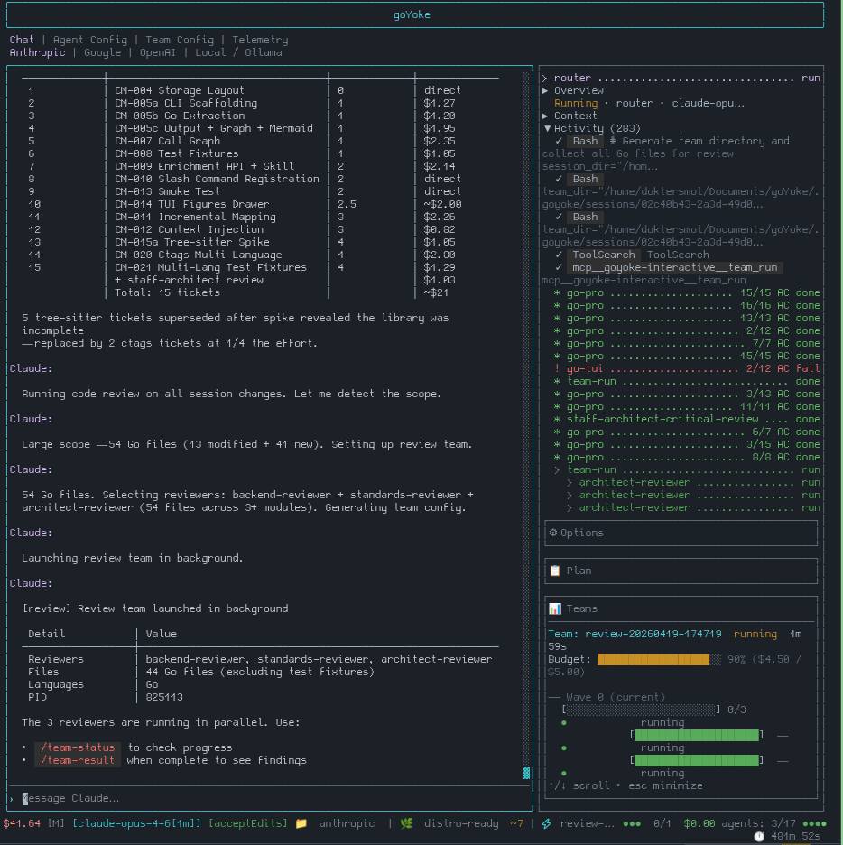

# goYoke

[](https://github.com/Bucket-Chemist/goYoke/actions/workflows/build-test.yml)
[](https://go.dev/)
[](LICENSE)
[]()

**Plan first. Route deliberately. Ship reviewed code.**

goYoke is a single Go binary that wraps Claude Code with runtime enforcement, typed agent contracts, multi-agent workflows, and a terminal UI for tracking sessions, dispatch, progress, and cost.

It is built for people who use AI coding tools for real software work and want less chat drift, fewer unreviewed one-shot changes, and clearer evidence that work was planned, delegated, checked, and completed. That premise lines up with recent findings that experienced developers value agents as productivity tools, but retain control over design and implementation because software quality still matters [1].

> Built for Claude Code at launch. Multi-provider support is planned.

## Why goYoke?

Claude Code is powerful, but raw chat workflows are easy to misuse:

- exploratory work turns into implementation before the scope is known
- expensive frontier models get used for simple search or boilerplate
- reviewers produce prose that is hard to compare between runs
- long sessions accumulate context noise and hidden assumptions
- handoffs between "planner", "reviewer", and "worker" roles are informal

goYoke puts a structured harness around that work. It encourages a scout -> plan -> review -> implement loop, routes tasks to appropriate model tiers, and uses JSON-schema-validated contracts so agents produce comparable outputs instead of freeform theatre. This follows the same basic architectural direction as production agent guidance: prefer simple, composable workflows, explicit routing, parallelization, and evaluator-style review where those patterns fit the task [2].

In practice, that means:

- reviewers report structured findings with severity, file, impact, and recommendation
- workers report which acceptance criteria were met, with evidence
- architects produce implementation plans with dependencies and testable criteria
- team workflows run with explicit topology, budgets, and recorded outputs, matching the broader multi-agent pattern of assigning role-specific agents to staged collaborative workflows [3]
- sessions preserve enough history to understand what happened later

This project represents an attempt to deviate from documentation theatre as much as possible. goYoke uses numerous compiled Go binaries that intercept model events at runtime. They validate routing, track failures, enforce delegation, and capture sharp edges. Enforcement happens in code, not in text instructions that degrade over long conversations.

<p align="center">
  
  <br>
  <em>A typical long implementation session in goYoke</em>
</p>

## Quick Start

Prerequisite: [Claude Code](https://docs.anthropic.com/en/docs/claude-code) installed and authenticated.

### Homebrew

```bash
brew install Bucket-Chemist/tap/goyoke
goyoke
```

### Arch Linux

```bash
paru -S goyoke-bin
goyoke
```

### Go Install

```bash
go install github.com/Bucket-Chemist/goYoke/cmd/goyoke@latest
goyoke
```

Standalone binaries are available from [Releases](../../releases).

See [INSTALL.md](INSTALL.md) for platform details and authentication setup.

## What You Can Do

Run `goyoke` in a project directory, then ask for work in the TUI.

| Request | What goYoke does | Typical cost |
| --- | --- | --- |
| `fix the login bug` | Routes to the relevant implementation agent | ~$0.10 |
| `/explore "how does auth work?"` | Scouts the codebase, then asks an architect to analyze scope | ~$0.20 |
| `/review` | Runs specialist reviewers in parallel and synthesizes findings | ~$0.30 |
| `/review-plan` | Applies a critical architecture review to an implementation plan | ~$0.25 |
| `/braintrust "Redis vs DB cache?"` | Runs a deeper multi-perspective analysis workflow | ~$1.00 |
| `/plan-tickets "notifications"` | Produces a plan, review, refinement, and ticket breakdown | ~$3.00 |
| `/implement` | Plans the work, then dispatches background implementation workers | ~$2.00 |
| `/cleanup` | Runs code hygiene reviewers across duplication, types, dead code, dependencies, and error handling | ~$0.50 |

Costs are approximate and depend on model pricing, codebase size, and task scope. The point is not perfect prediction; the point is that work is routed and measured instead of treated as an opaque chat session.

## How It Works

goYoke wraps Claude Code as a subprocess and injects its own hooks, agents, conventions, MCP tools, and settings at runtime.

Your Claude Code installation stays clean:

- no permanent agent files added to your native `~/.claude/`
- no project `.claude/` configuration rewritten by default
- no MCP servers left registered after exit
- embedded defaults are applied ephemerally for the session

Close goYoke and Claude Code is still your Claude Code.

### Runtime Boundary

Claude Code can spawn subagents directly, but those spawns bypass goYoke's enforcement layer. goYoke therefore provides its own `spawn_agent` tool through an MCP server.

Within goYoke-routed workflows, agent spawning goes through that MCP boundary. The server validates tier selection, injects identity and conventions, checks parent-child authorization, and logs telemetry before the agent starts.

### Typed Contracts

Multi-agent workflows use typed stdin/stdout contracts. Team configs define role-specific agents, ordered collaboration steps, and intermediate artifacts rather than relying on one undifferentiated chat loop [3]:

- workflow type
- budget ceiling
- ordered waves
- participating agents
- input and output schema paths
- timeout and retry policy

That gives each workflow a repeatable shape. A review run always produces review-shaped output. An implementation worker always reports acceptance criteria and evidence. A synthesis agent always receives structured upstream results.

### System Shape

```text
You -> goYoke TUI -> Router
                       |
                       +-> MCP spawn_agent -> Agent -> Your codebase
                       |      validates tier
                       |      injects identity and conventions
                       |      records telemetry
                       |
                       +-> Go hooks on Claude Code events
                              validate, track, enforce, capture
```

For deeper internals, see [docs/ARCHITECTURE.md](docs/ARCHITECTURE.md).

## What goYoke Is Not

goYoke is not a replacement for judgment. It cannot make model output deterministic, prove code is correct by itself, or remove the need to review generated changes.

It is a harness: a way to make agentic coding work more explicit, more constrained, more inspectable, and easier to improve over time.

It is also currently Claude Code-first. The architecture is intended to generalize, and provider adapters for Codex, local models, and other runtimes are on the roadmap.

## Language Support

goYoke auto-loads coding conventions based on project and file context.

| Language | Agents | Conventions |
| --- | --- | --- |
| Go | `go-pro`, `go-cli`, `go-tui`, `go-api`, `go-concurrent` | Cobra, Bubbletea |
| Python | `python-pro`, `python-ux` | general Python, UI patterns |
| TypeScript | `typescript-pro`, `react-pro` | React |
| Rust | `rust-pro` | general Rust |
| R | `r-pro`, `r-shiny-pro` | Shiny, Golem |

Custom agents, skills, schemas, and conventions can be added by extending the embedded/default configuration. See [CONTRIBUTING.md](CONTRIBUTING.md).

## Documentation

- [Workflow Guide](docs/WORKFLOWS.md): examples, costs, team orchestration, contracts, and anti-patterns
- [Installation](INSTALL.md): platform setup and authentication
- [Architecture](docs/ARCHITECTURE.md): hooks, MCP boundary, TUI, teams, and telemetry
- [Roadmap](ROADMAP.md): provider adapters, benchmarking, TUI configuration, and graph memory
- [Contributing](CONTRIBUTING.md): agents, team configs, conventions, and skills

## Why I Built This

I write software for an ISO-compliant mass spectrometry facility. In that world, black boxes are a liability: measurements need to be transparent, reproducible, and defensible.

AI coding tools are useful enough that they deserve the same pressure. Model providers change behavior, throttle capacity, shift quality between releases, and expose users to a moving target. If you care about sitting down tomorrow and getting the same class of work you got today, agentic workflows need structure around them.

goYoke is my attempt to make that structure concrete: enforceable runtime boundaries, typed handoffs, measurable cost, reviewable outputs, and conventions that live outside a model's short-term memory.

## Status

goYoke is under active development. The initial release targets Claude Code and a single-binary distribution model. Multi-provider support, Codex integration, local model adapters, benchmarks, and richer telemetry are tracked in [ROADMAP.md](ROADMAP.md).

## References

[1] R. Huang, A. Reyna, S. Lerner, H. Xia, and B. Hempel, "Professional Software Developers Don't Vibe, They Control: AI Agent Use for Coding in 2025," arXiv:2512.14012 [cs.SE], 2025. https://doi.org/10.48550/arXiv.2512.14012

[2] Anthropic, "Building effective agents," Dec. 19, 2024. https://www.anthropic.com/engineering/building-effective-agents

[3] S. Hong et al., "MetaGPT: Meta Programming for A Multi-Agent Collaborative Framework," arXiv:2308.00352 [cs.AI], 2023. https://doi.org/10.48550/arXiv.2308.00352

## License

[MIT](LICENSE)

## Author

Created by [Dokter Smol](https://github.com/Bucket-Chemist).
