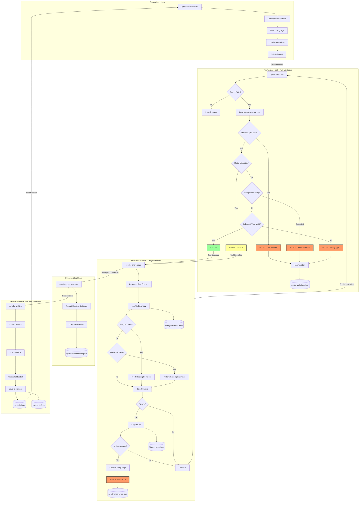

# goYoke

**Programmatically Enforced Agentic Cooperation**

**Status:** Production Ready
**Version:** 2.0.0-rc1
**Schema:** routing-schema v2.5.0 | handoff v1.3 | ML telemetry v1.1

---

## Overview

goYoke is a Go-based hook orchestration framework for Claude Code that enforces tiered routing policies, tracks debugging loops, captures ML telemetry, and maintains session continuity through deterministic validation—not LLM instructions.

**Key Insight:** Enforcement via code, not prompts. Text instructions are probabilistic suggestions; runtime hooks are deterministic rules.

### What We Built

A Go-based hook system that intercepts Claude Code tool events (SessionStart, PreToolUse, PostToolUse, SubagentStop, SessionEnd) and applies programmatic validation:

- **Task Validation**: Blocks invalid model/subagent_type pairings, enforces delegation ceilings
- **Sharp-Edge Detection**: Captures debugging loops after 3+ consecutive failures
- **ML Telemetry**: Logs routing decisions and agent collaborations for optimization
- **Session Continuity**: Structured handoff documents preserve context across sessions
- **Orchestrator Guard**: Prevents premature completion when background tasks are running

---

## Quick Start

```bash
# Build and install
cd ~/Documents/goYoke
make build      # Builds Go TUI + all hooks
make install    # Installs hooks to ~/.local/bin

# Run Go TUI (default — single binary)
./goyoke

# Or run Claude with goYoke hooks (CLI only, no TUI)
goclaude
```

See [INSTALL-GUIDE.md](INSTALL-GUIDE.md) for detailed setup instructions.

---

## Architecture

The complete hook enforcement flow, from session initialization through tool validation to archival:



### Hook Binaries

| Event | Binary | Responsibility |
|-------|--------|----------------|
| **SessionStart** | `goyoke-load-context` | Language detection, convention loading, handoff restoration, git context |
| **PreToolUse** | `goyoke-validate` | Task validation, model checking, delegation ceiling, subagent_type enforcement |
| **PostToolUse** | `goyoke-sharp-edge` | Tool counting, routing reminders, failure tracking, ML telemetry, sharp-edge detection |
| **SubagentStop** | `goyoke-agent-endstate` | Decision outcomes, collaboration tracking, ML updates |
| **SubagentStop** | `goyoke-orchestrator-guard` | Background task collection enforcement |
| **SessionEnd** | `goyoke-archive` | Metrics collection, artifact loading, handoff generation |

### Enforcement Guarantees

| Hook | Enforcement Mechanism |
|------|----------------------|
| `goyoke-validate` | Blocks Tool execution via `{"decision": "block"}` response |
| `goyoke-sharp-edge` | Tool counter + failure log → blocks after 3 consecutive failures |
| `goyoke-orchestrator-guard` | Blocks completion when background tasks pending |
| `goyoke-load-context` | Injects context before LLM receives prompt |
| `goyoke-archive` | Writes structured handoff for next session |

**Why this works:** Hooks run **before/after** the LLM, not inside it. Blocking decisions happen in code, not in token predictions.

---

## Package Structure

```
goYoke/
├── cmd/                          # Binaries
│   ├── goyoke/               # Go TUI entry point (ACTIVE)
│   ├── goyoke-mcp/           # Go MCP server (spawned by CLI)
│   ├── goyoke-validate/          # PreToolUse hook
│   ├── goyoke-sharp-edge/        # PostToolUse hook (merged)
│   ├── goyoke-load-context/      # SessionStart hook
│   ├── goyoke-agent-endstate/    # SubagentStop hook
│   ├── goyoke-orchestrator-guard/# Orchestrator completion guard
│   ├── goyoke-archive/           # SessionEnd hook
│   ├── goyoke-ml-export/         # ML telemetry export
│   ├── goyoke-aggregate/         # Session statistics
│   ├── goyoke-capture-intent/    # Manual intent logging
│   └── goyoke-doc-theater/       # Documentation theater detection
├── internal/tui/                 # Go TUI packages (ACTIVE — 23 packages)
│   ├── model/                    # Root AppModel, Elm Architecture
│   ├── cli/                      # CLI subprocess driver, NDJSON parser
│   ├── mcp/                      # MCP server tools + UDS IPC protocol
│   ├── bridge/                   # TUI-side UDS listener
│   ├── config/                   # Theme, keybindings
│   ├── state/                    # AgentRegistry, CostTracker, ProviderState
│   ├── session/                  # Session persistence, history
│   ├── lifecycle/                # Graceful shutdown manager
│   ├── util/                     # Markdown rendering, text helpers
│   └── components/               # Bubbletea UI components
│       ├── banner/               # Session banner
│       ├── tabbar/               # Tab navigation
│       ├── statusline/           # Status line with model/cost/tokens
│       ├── claude/               # Conversation panel with streaming
│       ├── agents/               # Agent tree + detail views
│       ├── modals/               # Modal system + permission flow
│       ├── toast/                # Toast notifications
│       ├── teams/                # Team orchestration display
│       ├── providers/            # Multi-provider tab bar
│       ├── dashboard/            # Session dashboard
│       ├── settings/             # Settings panel
│       ├── telemetry/            # Telemetry viewer
│       ├── planpreview/          # Plan preview via Glamour
│       └── taskboard/            # Task board overlay
├── internal/teamconfig/          # Shared team types (DES-6)
├── internal/lifecycle/           # Shared lifecycle code
├── packages/                     # TypeScript packages (LEGACY)
│   └── tui/                      # TypeScript TUI (being replaced)
│       ├── src/                  # React + Ink components
│       ├── dist/                 # Built output
│       └── bin/                  # Executable wrapper
├── pkg/                          # Core packages (hooks + shared)
│   ├── routing/                  # Schema validation, violations, identity loader
│   ├── session/                  # Handoffs, metrics, artifacts
│   ├── memory/                   # Failure tracking, sharp edges
│   ├── telemetry/                # ML telemetry, cost tracking
│   ├── config/                   # Path resolution, XDG compliance
│   ├── workflow/                 # Orchestrator guard logic
│   └── enforcement/              # Validation orchestration
├── .claude/                      # Claude Code configuration
│   ├── CLAUDE.md                 # Router instructions
│   ├── routing-schema.json       # Source of truth
│   ├── settings.json             # Hook configuration
│   ├── agents/                   # Agent definitions
│   ├── conventions/              # Language conventions
│   ├── rules/                    # Behavioral guidelines
│   └── skills/                   # Slash commands
├── tickets/tui-migration/        # TUI migration planning & tracking
│   ├── tickets/                  # 70 ticket files (TUI-001–TUI-070)
│   ├── spike-results/            # Phase 1 spike findings
│   └── parity-checklist.md       # Feature parity verification
└── test/
    ├── simulation/               # Deterministic fixtures
    └── integration/              # Full lifecycle tests
```

---

## ML Telemetry System

goYoke captures routing decisions and agent collaborations for optimization analysis.

### Data Captured

| Data Type | Written By | Location |
|-----------|------------|----------|
| Routing Decisions | `goyoke-sharp-edge` | `$XDG_DATA_HOME/goyoke/routing-decisions.jsonl` |
| Decision Outcomes | `goyoke-agent-endstate` | `$XDG_DATA_HOME/goyoke/routing-decision-updates.jsonl` |
| Agent Collaborations | `goyoke-agent-endstate` | `$XDG_DATA_HOME/goyoke/agent-collaborations.jsonl` |
| Collaboration Outcomes | `goyoke-agent-endstate` | `$XDG_DATA_HOME/goyoke/agent-collaboration-updates.jsonl` |

### Append-Only Pattern

Initial records are written immediately; outcomes are appended separately (no file rewrites). ML export reconciles at read time:

```go
// Read-time join for training data
decisions := readJSONL("routing-decisions.jsonl")
updates := readJSONL("routing-decision-updates.jsonl")
for _, update := range updates {
    decisions[update.DecisionID].Outcome = update
}
exportTrainingData(decisions)
```

### Export Utilities

```bash
# Export routing decisions with reconciled outcomes
goyoke-ml-export routing-decisions --output=decisions.jsonl

# Export agent collaborations
goyoke-ml-export agent-collaborations --output=collabs.jsonl

# Generate summary statistics
goyoke-ml-export stats

# Validate data consistency
goyoke-ml-export validate --check=orphaned-updates
```

---

## Installation & Usage

### Prerequisites

- Go 1.21+
- Claude Code CLI installed
- `~/.local/bin` in PATH

### Build & Install

```bash
cd ~/Documents/goYoke

# Build Go TUI + all hooks
make build

# Install hooks to ~/.local/bin
make install

# Verify installation
which goyoke-validate goyoke-load-context goyoke-sharp-edge goyoke-archive
```

### Running the TUI

```bash
# Go TUI (default, single binary)
./goyoke

# With flags
./goyoke --config-dir ~/.claude --session-id <prev-session>
./goyoke --resume  # lists sessions to resume

# Or run Claude with hooks only (no TUI)
goclaude
goclaude -p "Explain this codebase"
```

The `goclaude` command:
- Verifies all binaries are installed
- Ensures `~/.claude` symlink points to repo config
- Launches Claude with goYoke hooks active

### Migration from TypeScript to Go TUI

As of TUI-042 (2026-03-24), the Go TUI has reached full feature parity with the TypeScript TUI (18/18 features pass). The Go TUI is now the default frontend.

**Why Go?**
- Single binary distribution (no Node.js dependency)
- Native MCP server (no TS sidecar process)
- Two-process architecture (3 failure modes vs 9 in three-process)
- 0.31ms startup, 91.2% test coverage across 23 packages

**Legacy TypeScript TUI:**
```bash
# Still available at packages/tui/ — will be removable after Phase 10
./packages/tui/bin/goyoke-tui.js
```

### Hook Configuration

Hooks are configured in `~/.claude/settings.json`:

```json
{
  "hooks": {
    "SessionStart": [
      {
        "matcher": "startup|resume",
        "hooks": [
          {"type": "command", "command": "goyoke-load-context", "timeout": 10}
        ]
      }
    ],
    "PreToolUse": [
      {
        "matcher": "Task",
        "hooks": [
          {"type": "command", "command": "goyoke-validate", "timeout": 10}
        ]
      }
    ],
    "PostToolUse": [
      {
        "matcher": "Bash|Edit|Write|Task",
        "hooks": [
          {"type": "command", "command": "goyoke-sharp-edge", "timeout": 5}
        ]
      }
    ],
    "SubagentStop": [
      {
        "hooks": [
          {"type": "command", "command": "goyoke-agent-endstate", "timeout": 15},
          {"type": "command", "command": "goyoke-orchestrator-guard", "timeout": 10}
        ]
      }
    ],
    "SessionEnd": [
      {
        "hooks": [
          {"type": "command", "command": "goyoke-archive", "timeout": 30}
        ]
      }
    ]
  }
}
```

### Testing

```bash
# Run unit tests
go test ./...

# Run with coverage
go test ./... -cover

# Run with race detector
go test -race ./...

# Run simulation suite
./test/simulation/harness sessionstart-suite
```

---

## Data Persistence

All session data stored in JSONL (JSON Lines) format for append-only writes and streaming reads.

### File Locations

```
Project/
├── .claude/
│   ├── memory/
│   │   ├── handoffs.jsonl          # Session history
│   │   ├── user-intents.jsonl      # User preferences
│   │   ├── decisions.jsonl         # Architectural decisions
│   │   ├── preferences.jsonl       # Preference overrides
│   │   ├── performance.jsonl       # Performance metrics
│   │   ├── pending-learnings.jsonl # Unreviewed sharp edges
│   │   └── last-handoff.md         # Human-readable summary
│   └── session-archive/            # Archived session data

~/.goyoke/
├── failure-tracker.jsonl           # Cross-session failure tracking
├── agent-invocations.jsonl         # Invocation telemetry
├── escalations.jsonl               # Tier escalations
└── scout-recommendations.jsonl     # Scout accuracy data

$XDG_DATA_HOME/goyoke/     # ML Telemetry (default: ~/.local/share)
├── routing-decisions.jsonl         # ML training data (initial)
├── routing-decision-updates.jsonl  # ML training data (outcomes)
├── agent-collaborations.jsonl      # Team patterns (initial)
└── agent-collaboration-updates.jsonl # Team patterns (outcomes)

/tmp/
├── claude-routing-violations.jsonl # Current session violations
└── claude-tool-counter-*.log       # Tool call counters
```

### Schema Versions

| Schema | Version | Key Features |
|--------|---------|--------------|
| routing-schema.json | 2.5.0 | agent_subagent_mapping, delegation_ceiling, GO agents, effort levels |
| Handoff | 1.3 | Extended SharpEdge, decisions, preferences, agent_endstates |
| ML Telemetry | 1.0 | Append-only pattern, read-time reconciliation |

---

## Environment Variables

| Variable | Default | Purpose |
|----------|---------|---------|
| `GOYOKE_PROJECT_DIR` | `$PWD` | Project root |
| `GOYOKE_ROUTING_SCHEMA` | `~/.claude/routing-schema.json` | Schema path override |
| `GOYOKE_STORAGE_PATH` | `~/.goyoke/failure-tracker.jsonl` | Failure tracker path |
| `GOYOKE_MAX_FAILURES` | 3 | Sharp-edge threshold |
| `GOYOKE_REMINDER_THRESHOLD` | 10 | Routing reminder frequency |
| `GOYOKE_FLUSH_THRESHOLD` | 20 | Auto-flush frequency |
| `XDG_DATA_HOME` | `~/.local/share` | ML telemetry base path |

---

## CLI Reference

### Hook Binaries

| Binary | Event | Purpose |
|--------|-------|---------|
| `goyoke-load-context` | SessionStart | Context injection |
| `goyoke-validate` | PreToolUse | Task validation |
| `goyoke-sharp-edge` | PostToolUse | Failure tracking + ML telemetry |
| `goyoke-agent-endstate` | SubagentStop | Outcome recording |
| `goyoke-orchestrator-guard` | SubagentStop | Background task enforcement |
| `goyoke-archive` | SessionEnd | Handoff generation |

### Utility Binaries

| Binary | Purpose |
|--------|---------|
| `goyoke-ml-export` | Export ML training data |
| `goyoke-aggregate` | Session statistics |
| `goyoke-capture-intent` | Manual intent logging |
| `goyoke-doc-theater` | Documentation theater detection |

### Archive Query Subcommands

```bash
goyoke-archive list [--since=DATE] [--has-sharp-edges]
goyoke-archive show <session_id>
goyoke-archive stats
goyoke-archive sharp-edges [--file=PATTERN] [--status=pending]
goyoke-archive user-intents [--category=CATEGORY]
goyoke-archive decisions [--since=DATE]
goyoke-archive preferences
goyoke-archive performance
```

---

## Testing Infrastructure

### Test Coverage

| Package | Coverage | Key Functions Tested |
|---------|----------|---------------------|
| `pkg/routing` | ~88% | Schema loading, Task validation, violation logging |
| `pkg/session` | ~85% | Handoff generation, language detection, context injection |
| `pkg/memory` | ~82% | Failure tracking, sharp-edge detection |
| `pkg/telemetry` | ~80% | ML logging, cost calculation, collaboration tracking |
| `pkg/workflow` | ~82% | Transcript analysis, background task detection |

### Simulation Harness

**Location:** `test/simulation/harness`

```bash
# Run single fixture
./harness sessionstart 01_home_startup.json

# Run full suite
./harness sessionstart-suite

# Run with verbose output
./harness sessionstart 03_go_startup.json --verbose
```

### GitHub Actions

Three-tier CI/CD workflow:
1. **Unit tests** - Fast feedback on package changes
2. **Simulation tests** - Validates all deterministic fixtures
3. **Integration tests** - Full Claude Code CLI lifecycle

---

## TUI System (Go/Bubble Tea — v2.0.0-rc1)

A Go-based terminal interface for Claude Code using a **two-process architecture** (Go TUI + Claude Code CLI). Built with Bubble Tea, serving MCP tools natively via the official Go MCP SDK. Single binary, no Node.js dependency.

**Migration status:** 42/42 core tickets COMPLETE. Phase 10 UX Overhaul (28 tickets) pending.
**Tracking:** See [TUI Migration Status](TUI%20Migration%20Status.md) for full details.

### Architecture

```
Go TUI Process (single binary: goyoke)
  |-- Bubble Tea event loop (owns terminal stdin/stdout)
  |-- CLI Driver (manages Claude CLI subprocess via pipes)
  |-- IPC Bridge (UDS listener for MCP server communication)
  |
  +--spawns--> Claude Code CLI (--output-format stream-json)
                  |
                  +--spawns--> goyoke-mcp (Go MCP server, stdio transport)
                                  |
                                  +--connects--> TUI via UDS side channel
```

### Key Features

- **Real-time streaming**: Character-by-character Claude output via NDJSON
- **Agent visualization**: Live delegation tree with Unicode box-drawing (├─/└─) and status icons
- **Multi-provider**: 4 providers (Anthropic, Google, OpenAI, Local) with Shift+Tab switching
- **Modal system**: Permission prompts, plan mode, multi-step ExitPlan flows
- **Session persistence**: Atomic writes, auto-save debounce, `--session-id` resume
- **Graceful shutdown**: 5-phase sequenced shutdown within 10s budget
- **Cost tracking**: Session + per-agent costs, optional budget enforcement
- **Team orchestration**: Real-time team polling with wave-grouped member view
- **Search**: Case-insensitive conversation search (`/`, Ctrl+N/P navigation)
- **Clipboard**: Copy support via atotto/clipboard
- **Toast notifications**: Auto-expiring, level-colored feedback

### Test Coverage

**23 packages, 1067 test functions, 91.2% average coverage.**

| Category | Packages | Avg Coverage |
|----------|----------|--------------|
| Core (model, config, state) | 3 | 94.2% |
| Components | 14 | 93.5% |
| Infrastructure (cli, mcp, bridge) | 3 | 86.1% |
| Utility (util, session, lifecycle) | 3 | 79.6% |

Performance benchmarks (TUI-040): startup 0.31ms, modal 0.002ms, NDJSON 195K lines/sec, view 0.82ms, UDS 0.009ms — all exceed targets by 19–48,000x.

**Legacy TypeScript TUI** (`packages/tui/`): Still available but being replaced. Will be removable after Phase 10 parity verification (TUI-070).

---

## Documentation

| Document | Purpose |
|----------|---------|
| [docs/ARCHITECTURE.md](docs/ARCHITECTURE.md) | Complete system architecture v1.8 with diagrams |
| [TUI Migration Status](TUI%20Migration%20Status.md) | TUI migration progress, design decisions, test coverage |
| [INSTALL-GUIDE.md](INSTALL-GUIDE.md) | Step-by-step installation instructions |
| `.claude/CLAUDE.md` | Router instructions for Claude |
| `.claude/routing-schema.json` | Source of truth for routing rules |
| `.claude/agents/agents-index.json` | Agent definitions with triggers |
| `tickets/tui-migration/tickets/overview.md` | TUI migration plan — 70 tickets, 10 phases |

---

## Development Workflow

### Standards

- **Error Messages:** `[component] What happened. Why it was blocked/failed. How to fix.`
- **XDG Compliance:** Use `$XDG_DATA_HOME`, `$XDG_RUNTIME_DIR`, never hardcoded paths
- **STDIN Timeout:** All hooks implement 5-second timeout on STDIN reads
- **Test Coverage:** Maintain ≥80% coverage per package
- **Append-Only Writes:** Never rewrite JSONL files; use dual-file reconciliation

### Commit Format

```
goYoke-XXX: Title

- Implementation detail 1
- Implementation detail 2
- Test coverage: XX%

Co-Authored-By: Claude <model>@anthropic.com
```

### Workflow

1. Create branch: `goyoke-XXX-description`
2. Implement with tests: `go test ./...`
3. Verify coverage: `go test ./... -cover`
4. Run race detector: `go test -race ./...`
5. CI validates: unit → simulation → integration
6. Merge to master

---

## License

Copyright 2025 William Klare. All rights reserved.

This software and its associated documentation, architecture, and design are proprietary. This work was done entirely on my own initiative, finances, and spare time without any form of compensation. No license is granted to use, copy, modify, or distribute any part of this codebase without explicit written permission from the author.

---

## Project Status

**Status:** Production Ready
**Version:** 2.0.0-rc1
**Implementation:** goYoke-000 through TUI-042 (core), TUI-043–TUI-070 (UX overhaul, pending)
**All hooks:** Complete and operational
**ML Telemetry:** Implemented with append-only pattern + review telemetry (v1.1)
**TUI:** Go/Bubble Tea (default, 42/42 tickets complete), TypeScript/React (legacy)
**Phase 10:** 28 UX overhaul tickets planned, review approved (APPROVE_WITH_CONDITIONS)
