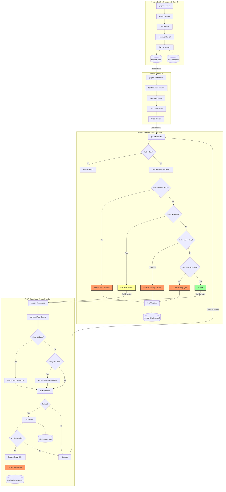

# GOgent Fortress

**Programmatically Enforced Agentic Cooperation**

**Status:** Phase 0 Complete | Orchestrator Guard Active
**Version:** 1.0.0

---

## Overview

GOgent Fortress is a hook orchestration framework for Claude Code that enforces tiered routing policies, tracks debugging loops, and maintains session continuity through deterministic validation—not LLM instructions.

**Key Insight:** Enforcement via code, not prompts. Text instructions are probabilistic suggestions; runtime hooks are deterministic rules.

### What We Built

A Go-based hook system that intercepts Claude Code tool events (SessionStart, PreToolUse, PostToolUse, SessionEnd) and applies programmatic validation:

- **Task Validation**: Blocks invalid model/subagent_type pairings, enforces delegation ceilings
- **Sharp-Edge Detection**: Captures debugging loops after 3+ consecutive failures
- **Session Continuity**: Structured handoff documents preserve context across sessions
- **Orchestrator Guard**: Prevents premature completion when background tasks are running

---

## Architecture

The complete hook enforcement flow, from session initialization through tool validation to archival:



### Enforcement Guarantees

| Hook                  | Responsibility     | Enforcement Mechanism                                      |
| --------------------- | ------------------ | ---------------------------------------------------------- |
| `gogent-load-context` | Context injection  | Reads schema + handoffs before LLM receives prompt         |
| `gogent-validate`     | Task validation    | Blocks Tool execution via `{"decision": "block"}` response |
| `gogent-sharp-edge`   | Failure tracking   | Tool counter + failure log → blocks after threshold        |
| `gogent-archive`      | Session continuity | Writes structured handoff for next session's load-context  |

**Why this works:** Hooks run **before/after** the LLM, not inside it. Blocking decisions happen in code, not in token predictions.

---

## Implementation Status

### Phase 0: Complete ✅

**All hooks implemented and operational:**

| Hook         | CLI Binary            | Status      | Key Features                                                                      |
| ------------ | --------------------- | ----------- | --------------------------------------------------------------------------------- |
| SessionStart | `gogent-load-context` | ✅ Complete | Language detection, convention loading, handoff restoration                       |
| PreToolUse   | `gogent-validate`     | ✅ Complete | Task validation, model checking, delegation ceiling enforcement                   |
| PostToolUse  | `gogent-sharp-edge`   | ✅ Complete | Merged handler: tool counter, routing reminders, auto-flush, sharp-edge detection |
| SessionEnd   | `gogent-archive`      | ✅ Complete | Metrics collection, artifact loading, handoff generation                          |

**Additional Tools:**

- `gogent-capture-intent` - User intent logging
- `gogent-aggregate` - Session statistics and analysis
- `gogent-agent-endstate` - Subagent completion tracking

### Recent Work (GOgent-076 through GOgent-078)

**Orchestrator Guard Implementation:**

- Transcript analysis for background Task tracking
- Detection of uncollected TaskOutput calls
- Blocking response generation when background tasks pending
- Integration tests for guard enforcement

### Package Structure

```
GOgent-Fortress/
├── cmd/                          # CLI entry points
│   ├── gogent-validate/          # PreToolUse hook
│   ├── gogent-archive/           # SessionEnd hook
│   ├── gogent-sharp-edge/        # PostToolUse hook (merged)
│   ├── gogent-load-context/      # SessionStart hook
│   ├── gogent-capture-intent/    # Manual intent logging
│   ├── gogent-aggregate/         # Analysis CLI
│   ├── gogent-agent-endstate/    # Subagent tracking
│   └── ...
├── pkg/                          # Core packages
│   ├── routing/                  # Schema validation
│   ├── session/                  # Handoffs, metrics, queries
│   ├── memory/                   # Failure tracking, sharp edges
│   ├── config/                   # Path resolution, XDG compliance
│   ├── telemetry/               # Cost tracking, invocation metrics
│   ├── workflow/                # Orchestrator guard logic
│   └── enforcement/             # Validation orchestration
└── test/
    ├── simulation/              # Deterministic fixtures
    └── integration/             # Full lifecycle tests
```

---

## Key Features

### Programmatic Enforcement

**Declarative → Programmatic → Reference Architecture:**

1. **Declarative Rules** (`routing-schema.json`)
   - Single source of truth for allowed/blocked behaviors
   - Parsed by hooks at runtime
   - Example: `"task_invocation_blocked": true` for Einstein

2. **Programmatic Enforcement** (Hook CLIs)
   - Run before/after tool execution
   - Can block, warn, or modify behavior
   - Example: `gogent-validate` checks schema and emits `{"decision": "block"}`

3. **Reference Documentation** (`CLAUDE.md`)
   - Points to enforcement mechanisms
   - Provides context, not enforcement
   - Example: "Blocked by validate-routing line 87"

**Why this matters:** Text instructions ("MUST NOT", "NEVER") are probabilistic suggestions. Runtime hooks are deterministic rules.

### Orchestrator Guard

Recent implementation (GOgent-076 through GOgent-078) prevents orchestration failures:

**Problem:** Orchestrator spawns background Task() calls, then completes without collecting results via TaskOutput().

**Solution:**

- Transcript analysis detects background task IDs
- Identifies missing TaskOutput calls before completion
- Blocks response generation with specific guidance
- Ensures all parallel work is collected before synthesis

**Enforcement Point:** `gogent-agent-endstate` hook (SubagentStop event)

---

## Installation & Usage

### Prerequisites

- Go 1.23+
- Claude Code CLI installed

### Build & Install

```bash
# Build all binaries
make build-validate build-archive

# Install to ~/.local/bin
make install

# Verify installation
which gogent-validate gogent-archive
```

The `make install` target:

- Builds `gogent-validate`, `gogent-archive`, and supporting CLIs
- Copies to `~/.local/bin/` with execute permissions
- Verifies PATH configuration
- Provides shell setup instructions if needed

### Hook Configuration

Update Claude Code hook configuration (`~/.config/claude/config.toml`):

```toml
[hooks.SessionStart]
command = "gogent-load-context"

[hooks.PreToolUse]
command = "gogent-validate"

[hooks.PostToolUse]
command = "gogent-sharp-edge"

[hooks.SessionEnd]
command = "gogent-archive"

[hooks.SubagentStop]
command = "gogent-agent-endstate"
```

### Testing

```bash
# Run unit tests
go test ./...

# Run with coverage
go test ./... -cover

# Run with race detector
go test -race ./...

# Run simulation suite
./test/simulation/harness sessionstart-suite
```

---

## Data Persistence

All session data stored in JSONL (JSON Lines) format for append-only writes and streaming reads.

### File Locations

```
Project/
├── .claude/
│   ├── memory/
│   │   ├── handoffs.jsonl          # Session history
│   │   ├── user-intents.jsonl      # User preferences
│   │   ├── decisions.jsonl         # Architectural decisions
│   │   ├── preferences.jsonl       # Preference overrides
│   │   ├── performance.jsonl       # Performance metrics
│   │   └── pending-learnings.jsonl # Unreviewed sharp edges
│   └── session-archive/            # Archived session data

~/.gogent/
└── failure-tracker.jsonl           # Cross-session failure tracking

/tmp/
├── claude-routing-violations.jsonl # Current session violations
└── claude-tool-counter-*.log       # Tool call counters
```

### Schema Versions

| Schema              | Version | Key Features                                                   |
| ------------------- | ------- | -------------------------------------------------------------- |
| routing-schema.json | 2.2.0   | agent_subagent_mapping, delegation_ceiling, blocked_patterns   |
| Handoff             | 1.2     | Extended SharpEdge fields, decisions, preferences, performance |

---

## Testing Infrastructure

GOgent-Fortress includes comprehensive testing via deterministic fixtures, simulation harness, and CI/CD workflows.

### Test Coverage

| Package        | Coverage | Key Functions Tested                                      |
| -------------- | -------- | --------------------------------------------------------- |
| `pkg/routing`  | ~90%     | Schema loading, Task validation, violation logging        |
| `pkg/session`  | ~85%     | Handoff generation, language detection, context injection |
| `pkg/memory`   | ~88%     | Failure tracking, sharp-edge detection                    |
| `pkg/workflow` | ~82%     | Transcript analysis, background task detection            |

### Simulation Harness

**Location:** `test/simulation/harness`

```bash
# Run single fixture
./harness sessionstart 01_home_startup.json

# Run full suite
./harness sessionstart-suite

# Run with verbose output
./harness sessionstart 03_go_startup.json --verbose
```

**Fixtures:** 10 deterministic test fixtures per hook covering all initialization scenarios.

### GitHub Actions

Three-tier CI/CD workflow:

1. **Unit tests** - Fast feedback on package changes
2. **Simulation tests** - Validates all deterministic fixtures
3. **Integration tests** - Full Claude Code CLI lifecycle

**Trigger paths:** Any change to `cmd/`, `pkg/`, or `test/simulation/fixtures/`

---

## Documentation

| Document                                | Purpose                                             |
| --------------------------------------- | --------------------------------------------------- |
| `docs/systems-architecture-overview.md` | Complete system architecture with sequence diagrams |
| `CLAUDE.md`                             | Project-level Claude Code configuration             |
| `~/.claude/routing-schema.json`         | Declarative source of truth for routing rules       |
| `migration_plan/`                       | Implementation tickets and migration strategy       |

---

## Debugging

### View Hook Logs

```bash
# Recent errors
tail -n 50 ~/.gogent/hooks.log | jq 'select(.level=="ERROR")'

# Session violations
grep session-abc123 /tmp/claude-routing-violations.jsonl | jq .

# Failure tracking
jq 'select(.file=="path/to/file.py")' ~/.gogent/failure-tracker.jsonl
```

### Environment Variables

| Variable                    | Purpose                    | Default                         |
| --------------------------- | -------------------------- | ------------------------------- |
| `GOGENT_PROJECT_DIR`        | Project root               | `$PWD`                          |
| `GOGENT_ROUTING_SCHEMA`     | Schema path override       | `~/.claude/routing-schema.json` |
| `GOGENT_MAX_FAILURES`       | Sharp-edge threshold       | 3                               |
| `GOGENT_REMINDER_THRESHOLD` | Routing reminder frequency | 10                              |
| `GOGENT_FLUSH_THRESHOLD`    | Auto-flush frequency       | 20                              |

---

## Development Workflow

### Standards

- **Error Messages:** `[component] What happened. Why it was blocked/failed. How to fix.`
- **XDG Compliance:** Use `$XDG_RUNTIME_DIR` or `$XDG_CACHE_HOME`, never hardcoded `/tmp`
- **STDIN Timeout:** All hooks implement 5-second timeout on STDIN reads
- **Test Coverage:** Maintain ≥80% coverage per package
- **Commit Format:**

  ```
  GOgent-XXX: Title

  - Implementation detail 1
  - Implementation detail 2
  - Test coverage: XX%

  Co-Authored-By: Claude Sonnet 4.5 <noreply@anthropic.com>
  ```

### Workflow

1. Create branch: `gogent-XXX-description`
2. Implement with tests: `go test ./...`
3. Verify coverage: `go test ./... -cover`
4. Run race detector: `go test -race ./...`
5. Commit and push
6. CI validates: unit tests → simulation tests → integration tests
7. Merge to master

---

## License

Copyright © 2025 William Klare. All rights reserved.

This software and its associated documentation, architecture, and design are proprietary. This work was done entirely on my own initiative, finances, spare time
and without any form of compensation.
No license is granted to use, copy, modify, or distribute any part of this codebase without
explicit written permission from the author.

---

## Project Status

**Phase 0:** Complete ✅
**Current Work:** Orchestrator guard (GOgent-076 through GOgent-078)
**Implementation Progress:** GOgent-000 through GOgent-078
**Version:** 1.0.0
