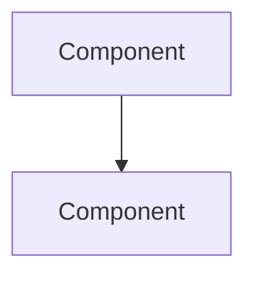

### Project documentation template

```markdown
---
created: <% tp.file.creation_date("YYYY-MM-DD") %>
type: project
status: <% await tp.system.suggester(["active", "planning", "on-hold", "completed"], ["active", "planning", "on-hold", "completed"]) %>
priority: <% await tp.system.suggester(["high", "medium", "low"], ["high", "medium", "low"]) %>
tags: [project]
---

# <% tp.file.title %>

**Start date:** <% tp.date.now("YYYY-MM-DD") %>
**Target completion:** 
**Repository:** 
**Tech stack:** 

## Overview


## Architecture


## Key decisions
| Decision | Rationale | Date |
|----------|-----------|------|
| | | |

## Development phases
### Phase 1: Setup
- [ ] Initialize repository
- [ ] Configure CI/CD
- [ ] Set up dev environment

## Changelog
### <% tp.date.now("YYYY-MM-DD") %>
- Project initiated
```