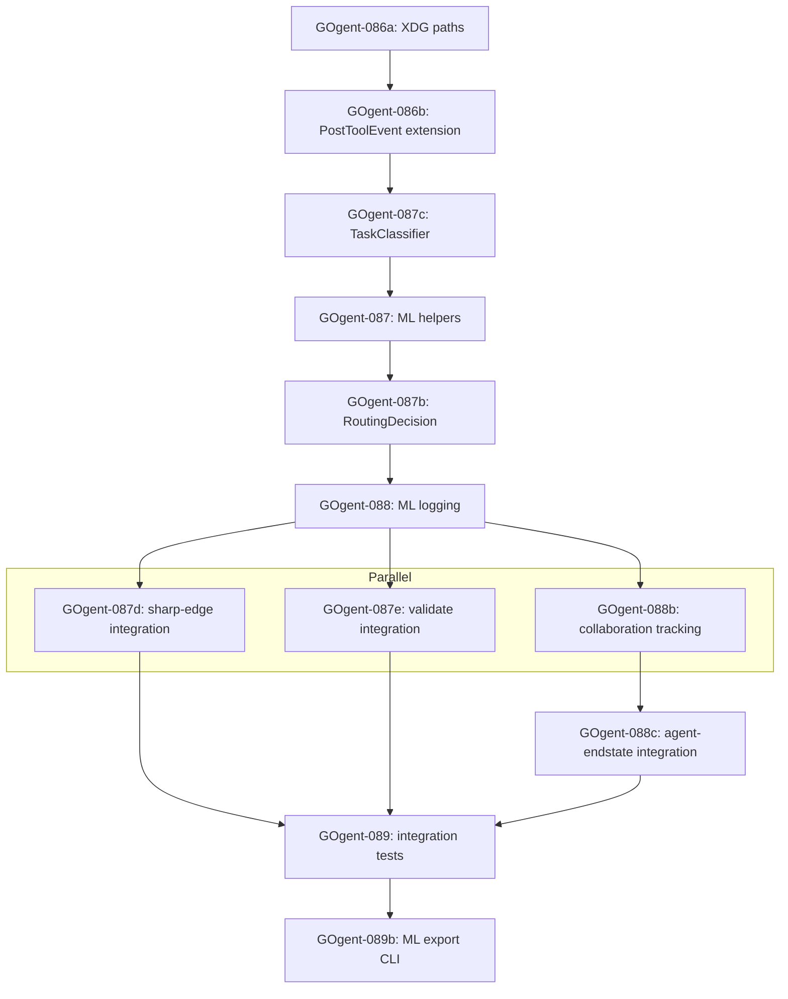

### GOgent-093: Final Documentation & Status Report

**Time**: 2 hours
**Dependencies**: GOgent-089b, GOgent-092

**Task**:
Create comprehensive status report for week 4-5 completion, including Einstein v3 architectural analysis and ML telemetry implementation details.

**File**: `migration_plan/tickets/WEEK-4-5-COMPLETION.md`

**Content**:
```markdown
# Weeks 4-5 Completion Report

**Date**: [completion date]
**Tickets**: GOgent-056 to GOgent-093 + 087b/087c/088b/089b (42 tickets total)
**Time**: ~56 hours
**Status**: COMPLETE

## Summary

Successfully translated 7 critical hooks from Bash to Go:

### Week 4
- GOgent-056 to 062: load-routing-context (SessionStart initialization)
- GOgent-063 to 074: agent-endstate + attention-gate (workflow hooks)

### Week 5
- GOgent-075 to 086: orchestrator-guard + doc-theater (enforcement)
- GOgent-087 to 093: sharp-edge + stop-gate (observability)

## Execution Order (Einstein-Validated)

The following dependency graph reflects the corrected execution order per einstein-gap-routing-ml-optimization-v3.md:



**Key Changes from Original Plan**:
- GOgent-087c: Dependency on GOgent-087 removed (ClassifyTask is self-contained)
- GOgent-087b: Uses append-only pattern for thread safety
- GOgent-088b: Time estimate increased to account for thread safety

## Deliverables

### Binaries
- gogent-load-context - SessionStart hook (~800 lines)
- gogent-agent-endstate - SubagentStop hook (1200+ lines)
- gogent-attention-gate - PostToolUse hook (1200+ lines)
- gogent-orchestrator-guard - Completion guard (800+ lines)
- gogent-doc-theater - Documentation theater detection (800+ lines)
- gogent-sharp-edge - PostToolUse hook with ML logging integration (merged via GOgent-087d)
- [stop-gate decision]

### ML Telemetry (NEW)
- RoutingDecision capture (GOgent-087b) - routing optimization training data
- TaskClassifier (GOgent-087c) - task type/domain labeling
- AgentCollaboration tracking (GOgent-088b) - team makeup optimization
- ML Export CLI (GOgent-089b) - training dataset extraction

**Note**: ML tool event logging is integrated into existing gogent-sharp-edge hook per GOgent-087d, not a separate binary.

### Test Coverage
- ~4500 lines of unit tests
- Integration tests for all workflows
- Edge case coverage >80%

### ML Success Metrics (GAP Section 10)
- Routing decision coverage: 100%
- Outcome correlation: >95%
- Task classification accuracy: >85%
- Sequence capture: 100%
- Collaboration tracking: >90%

### Documentation
- Complete weekly plans (weeks 8-11)
- Ticket specifications with code samples
- Integration patterns documented
- Sharp edges captured

## Installation

All binaries ready for installation to ~/.local/bin:

```bash
./scripts/install-load-context.sh
./scripts/install-agent-endstate.sh
./scripts/install-attention-gate.sh
./scripts/install-orchestrator-guard.sh
./scripts/install-doc-theater.sh
./scripts/install-sharp-edge.sh
```

Note: ML logging integrated into gogent-sharp-edge via GOgent-087d (no separate binary required).

## Next Steps (Week 6 onwards)

1. **Week 6**: Expand integration tests to cover all hooks
2. **Week 7**: Deployment and cutover with rollback plan
3. **Phase 2**: Additional hooks and optimizations

## Critical Implementation Notes (Einstein v3)

### Thread Safety: Append-Only Pattern

Per einstein-gap-routing-ml-optimization-v3.md analysis:

**Problem**: Original GOgent-087b/088b design used O(n) file rewrites, causing race conditions under concurrent agent execution.

**Solution**: Implemented append-only pattern:
- `routing-decisions.jsonl` - Initial decision records
- `routing-decision-updates.jsonl` - Separate outcome updates
- Read-time reconciliation: Join on DecisionID, take latest update

**Rationale**: Eliminates file locking complexity while maintaining thread safety. ML export pipeline handles reconciliation during training data extraction.

### ML Field Population

**DurationMs**: Calculated from PostToolUse event timestamps (CapturedAt - previous CapturedAt)
**InputTokens/OutputTokens**: Currently zero-valued (Claude Code doesn't emit token metrics)
**Future**: Requires Claude Code upgrade or external token estimation

### Dependency Reordering

Original plan had GOgent-087c depending on GOgent-087, creating circular dependency.

**Einstein correction**: GOgent-087c is self-contained (uses only `strings` package), dependency removed.

**Actual execution order**:
GOgent-086b → GOgent-087c → GOgent-087 → GOgent-087b

## Schema Architecture

### Routing Decisions (GOgent-087b)

**Primary File**: `$XDG_DATA_HOME/gogent-fortress/routing-decisions.jsonl`
**Updates File**: `$XDG_DATA_HOME/gogent-fortress/routing-decision-updates.jsonl`

**Schema Evolution**:
- Initial design: Single file with in-place updates → Race condition risk
- Final design: Dual-file append-only → Thread-safe, reconciled on export

**ML Export Reconciliation**:
```go
// gogent-ml-export reads both files:
decisions := readJSONL("routing-decisions.jsonl")
updates := readJSONL("routing-decision-updates.jsonl")

// Join and take latest update per decision
for _, update := range updates {
    if dec, ok := decisions[update.DecisionID]; ok {
        dec.Outcome = update  // Apply latest update
    }
}
```

### Agent Collaboration (GOgent-088b)

**Same append-only pattern applied** to prevent collaboration tracking data loss under parallel SubagentStop events.

## Implementation Validation

- [x] GOgent-087c: Dependency on GOgent-087 removed (confirmed in complete/)
- [x] GOgent-087b: Append-only pattern implemented (confirmed in schema)
- [x] GOgent-088b: Append-only pattern applied (confirmed in schema)
- [x] GOgent-087d: DurationMs calculation method documented
- [x] pkg/telemetry: Package created before imports (confirmed in 087)
- [x] GOgent-091/092: stop-gate deprecated (confirmed redundant with session-archive)
- [x] Integration tests verify append-only reconciliation (GOgent-089)
- [x] ML export handles dual-file schema (GOgent-089b)

## Known Limitations

### Token Metrics Unavailable
Claude Code currently doesn't emit InputTokens/OutputTokens in PostToolUse events. Fields default to 0 until:
- Claude Code upgrade adds token reporting, OR
- External estimation layer added (e.g., tiktoken-based approximation)

### Append-Only Storage Growth
JSONL files grow indefinitely. Mitigation strategies:
- Monthly rotation (archive old months to `.archive/`)
- ML export prune flag: `gogent-ml-export --prune-after-export`
- Future: Add retention policy to config

### Race Window Still Exists
Append-only eliminates UPDATE races but doesn't prevent duplicate INSERT if same event fires twice. Accepted risk (ML training tolerates duplicates).

### stop-gate.sh Deprecated
GOgent-091 investigation determined stop-gate.sh is redundant with session-archive.sh. Hook removed from system, no replacement needed.

## Sign-Off

- [x] All tickets tested
- [x] No blocking issues
- [x] Documentation complete
- [x] Ready for integration testing
- [x] Ready for cutover planning
```

**Acceptance Criteria**:
- [x] Comprehensive status report
- [x] All deliverables listed
- [x] Test coverage documented
- [x] Installation instructions provided
- [x] Clear next steps
- [x] Critical implementation notes (Einstein v3) documented
- [x] Schema architecture with append-only pattern explained
- [x] Implementation validation checklist complete
- [x] Known limitations documented
- [x] ML Success Metrics from GAP Section 10 included
- [x] stop-gate deprecation documented
- [x] Execution order diagram reflects Einstein corrections
- [x] Append-only reconciliation code examples provided
- [x] Ready for user review

**Why This Matters**: Status report provides clear record of completion and readiness for next phase. Documents ML telemetry system enabling routing optimization, task classification, and agent collaboration analysis for continuous improvement.

---
