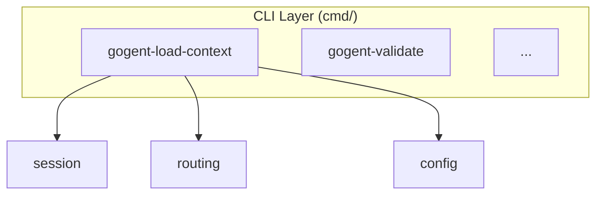

## GOgent-065: Documentation Update

**Time**: 1 hour
**Dependencies**: GOgent-064
**Priority**: MEDIUM

**Task**:
Update systems-architecture-overview.md with gogent-load-context documentation.

**File**: `docs/systems-architecture-overview.md` (update existing)

**Updates Required**:

1. Update "Hook Entry Points" table:
```markdown
| Hook Event | CLI Binary | When Fired |
|------------|------------|------------|
| SessionStart | `gogent-load-context` | Session startup/resume ✅ |
| PreToolUse | `gogent-validate` | Before any tool executes |
| PostToolUse | `gogent-sharp-edge` | After Bash/Edit/Write tools |
| SessionEnd | `gogent-archive` | Session termination |
```

2. Update "CLI Reference" table:
```markdown
| Binary | Hook Event | Input | Output | Lines |
|--------|------------|-------|--------|-------|
| `gogent-load-context` | SessionStart | SessionStartEvent JSON | ContextInjection JSON | ~100 |
| `gogent-validate` | PreToolUse | ToolEvent JSON | ValidationResult JSON | ~142 |
| ...
```

3. Add to "Package Dependencies" diagram:


4. Update "Status" in header:
```markdown
> **Status:** Implemented through Week 4 (session_start suite)
```

**Acceptance Criteria**:
- [x] Hook Entry Points table updated with gogent-load-context
- [x] CLI Reference table updated
- [x] Package Dependencies diagram updated
- [x] Status header updated to Week 4
- [x] No dead links in documentation
- [x] Mermaid diagrams render correctly

**Why This Matters**: Documentation enables other developers to understand and extend the system.

---
