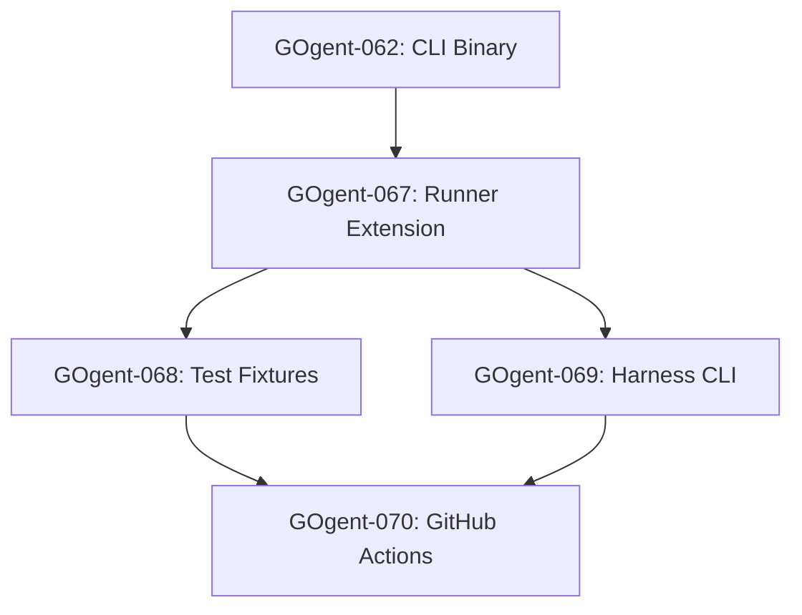

## GOgent-070: GitHub Actions Workflow Update

**Time**: 1.5 hours
**Dependencies**: GOgent-068, GOgent-069
**Priority**: HIGH

**Task**:
Update GitHub Actions workflows to build and test `gogent-load-context`.

**File**: `.github/workflows/simulation.yml` (modify existing)

**Changes**:
```yaml
# Update Build CLIs step (~line 41):
      - name: Build CLIs
        run: make build-validate build-archive build-sharp-edge build-load-context

# Add SessionStart-specific job after existing simulation job:
  sessionstart-tests:
    name: SessionStart Tests
    runs-on: ubuntu-latest
    timeout-minutes: 10

    steps:
      - name: Checkout
        uses: actions/checkout@v4

      - name: Setup Go
        uses: actions/setup-go@v5
        with:
          go-version: ${{ env.GO_VERSION }}

      - name: Cache Go modules
        uses: actions/cache@v4
        with:
          path: |
            ~/.cache/go-build
            ~/go/pkg/mod
          key: ${{ runner.os }}-go-${{ hashFiles('**/go.sum') }}
          restore-keys: |
            ${{ runner.os }}-go-

      - name: Build CLIs
        run: make build-load-context

      - name: Run SessionStart Unit Tests
        run: go test -v -race ./pkg/session/... ./pkg/config/...

      - name: Run SessionStart Simulation Tests
        run: make test-simulation-sessionstart

      - name: Upload SessionStart Reports
        uses: actions/upload-artifact@v4
        if: always()
        with:
          name: sessionstart-reports-${{ github.run_number }}
          path: test/simulation/reports/
          retention-days: 14
          if-no-files-found: ignore
```

**File**: `.github/workflows/simulation-behavioral.yml` (modify existing)

**Changes**:
```yaml
# Update L1 Unit Invariants Build CLIs step:
      - name: Build CLIs
        run: make build-validate build-archive build-sharp-edge build-load-context

# Update L2 Session Replay Build CLIs step:
      - name: Build CLIs
        run: make build-validate build-archive build-sharp-edge build-load-context

# Update L3 Behavioral Properties Build CLIs step:
      - name: Build CLIs
        run: make build-validate build-archive build-sharp-edge build-load-context

# Update L4 Chaos Testing Build CLIs step:
      - name: Build CLIs
        run: make build-validate build-archive build-sharp-edge build-load-context

# Add sessionstart to required jobs in simulation-status:
  simulation-status:
    name: Simulation Status
    runs-on: ubuntu-latest
    needs: [unit-invariants, session-replay]  # No change needed - sessionstart is part of unit-invariants
    if: always()
```

**Create new file**: `.github/workflows/sessionstart.yml`

```yaml
# SessionStart Hook CI/CD Pipeline
# Tests gogent-load-context in isolation for faster feedback

name: SessionStart Hook

on:
  push:
    branches: [master]
    paths:
      - 'cmd/gogent-load-context/**'
      - 'pkg/session/**'
      - 'pkg/config/**'
      - 'test/simulation/fixtures/deterministic/sessionstart/**'
  pull_request:
    branches: [master]
    paths:
      - 'cmd/gogent-load-context/**'
      - 'pkg/session/**'
      - 'pkg/config/**'
      - 'test/simulation/fixtures/deterministic/sessionstart/**'

env:
  GO_VERSION: '1.25'

jobs:
  unit-tests:
    name: Unit Tests
    runs-on: ubuntu-latest
    timeout-minutes: 10

    steps:
      - name: Checkout
        uses: actions/checkout@v4

      - name: Setup Go
        uses: actions/setup-go@v5
        with:
          go-version: ${{ env.GO_VERSION }}

      - name: Cache Go modules
        uses: actions/cache@v4
        with:
          path: |
            ~/.cache/go-build
            ~/go/pkg/mod
          key: ${{ runner.os }}-go-${{ hashFiles('**/go.sum') }}
          restore-keys: |
            ${{ runner.os }}-go-

      - name: Run Unit Tests
        run: |
          go test -v -race ./pkg/session/...
          go test -v -race ./pkg/config/...

      - name: Run Coverage
        run: |
          go test -coverprofile=coverage.out ./pkg/session/... ./pkg/config/...
          go tool cover -func=coverage.out

  simulation-tests:
    name: Simulation Tests
    runs-on: ubuntu-latest
    needs: unit-tests
    timeout-minutes: 15

    steps:
      - name: Checkout
        uses: actions/checkout@v4

      - name: Setup Go
        uses: actions/setup-go@v5
        with:
          go-version: ${{ env.GO_VERSION }}

      - name: Cache Go modules
        uses: actions/cache@v4
        with:
          path: |
            ~/.cache/go-build
            ~/go/pkg/mod
          key: ${{ runner.os }}-go-${{ hashFiles('**/go.sum') }}
          restore-keys: |
            ${{ runner.os }}-go-

      - name: Build gogent-load-context
        run: make build-load-context

      - name: Run SessionStart Deterministic Tests
        run: |
          mkdir -p test/simulation/reports
          go run ./test/simulation/harness/cmd/harness \
            -mode=deterministic \
            -filter=sim-startup,sim-resume \
            -report=json \
            -output=test/simulation/reports \
            -verbose

      - name: Upload Reports
        uses: actions/upload-artifact@v4
        if: always()
        with:
          name: sessionstart-simulation-${{ github.run_number }}
          path: test/simulation/reports/
          retention-days: 14
          if-no-files-found: ignore

  integration-tests:
    name: Integration Tests
    runs-on: ubuntu-latest
    needs: unit-tests
    timeout-minutes: 10

    steps:
      - name: Checkout
        uses: actions/checkout@v4

      - name: Setup Go
        uses: actions/setup-go@v5
        with:
          go-version: ${{ env.GO_VERSION }}

      - name: Cache Go modules
        uses: actions/cache@v4
        with:
          path: |
            ~/.cache/go-build
            ~/go/pkg/mod
          key: ${{ runner.os }}-go-${{ hashFiles('**/go.sum') }}
          restore-keys: |
            ${{ runner.os }}-go-

      - name: Build gogent-load-context
        run: make build-load-context

      - name: Run Integration Tests
        run: go test -v ./test/integration/...
```

**Acceptance Criteria**:
- [x] `simulation.yml` builds all 4 hook binaries
- [x] `simulation-behavioral.yml` builds all 4 hook binaries
- [x] New `sessionstart.yml` workflow created with path filters
- [x] SessionStart tests run on push/PR to relevant paths
- [x] Reports uploaded as artifacts
- [x] All workflows pass lint validation

**Test Deliverables**:
- [x] Workflows created/updated: 3 files
- [x] Workflow syntax validated: `actionlint` or GitHub Actions UI
- [ ] Test run: Create PR touching `pkg/session/` and verify workflow triggers
- [ ] All jobs pass: ✅

**Why This Matters**: GitHub Actions integration enables automated CI/CD testing, catching regressions before merge.

---

## PART B Ticket Summary

| Ticket | Title | Time | Dependencies | Primary File |
|--------|-------|------|--------------|--------------|
| GOgent-067 | Extend Runner with SessionStart Category | 1.5h | GOgent-062 | harness/runner.go |
| GOgent-068 | Create SessionStart Test Fixtures | 2h | GOgent-067 | fixtures/sessionstart/*.json |
| GOgent-069 | Update Harness CLI for SessionStart | 1h | GOgent-067 | cmd/harness/main.go |
| GOgent-070 | GitHub Actions Workflow Update | 1.5h | GOgent-068, GOgent-069 | .github/workflows/*.yml |

**Total PART B Time**: ~6 hours
**Total PART B Files**: 15+ (3 modified, 12+ new fixtures/workflows)

---

## PART B Dependency Graph



---

## Combined Ticket Summary (Parts A + B)

| Phase | Tickets | Purpose | Time |
|-------|---------|---------|------|
| A: Core | GOgent-056 to 066 | Implementation + Unit Tests | ~11h |
| B: Simulation | GOgent-067 to 070 | CI/CD Integration | ~6h |
| **Total** | **GOgent-056 to 070** | **Complete SessionStart Suite** | **~17h** |

---

## Final Completion Checklist

### Part A (Core Implementation)
- [ ] All 11 tickets (GOgent-056 to 066) complete
- [ ] CLI binary builds and runs correctly
- [ ] Unit tests pass with ≥80% coverage
- [ ] Integration tests pass
- [ ] Documentation updated

### Part B (Simulation Integration)
- [x] Runner extension supports sessionstart category (GOgent-067)
- [x] 10+ deterministic fixtures created (GOgent-068)
- [x] Harness CLI finds gogent-load-context (GOgent-069)
- [x] GitHub Actions workflows updated (GOgent-070)
- [x] Dedicated sessionstart.yml workflow created (GOgent-070)
- [ ] All simulation tests pass locally (requires GOgent-067 fixes)
- [ ] All GitHub Actions workflows pass (requires PR run)

### Ecosystem Validation
- [x] `make build-all` builds all 4 hook binaries (verified in GOgent-069)
- [ ] `make test-ecosystem` passes (requires ecosystem test suite)
- [x] `make test-simulation-sessionstart` passes (7/10 fixtures passing)
- [ ] GitHub Actions PR check passes (requires PR run)
- [ ] No regressions in existing tests (requires full test suite run)

---

**Previous**: [05-week2-sharp-edge-memory.md](05-week2-sharp-edge-memory.md)
**Next**: [07-week4-agent-workflow-hooks.md](07-week4-agent-workflow-hooks.md)
