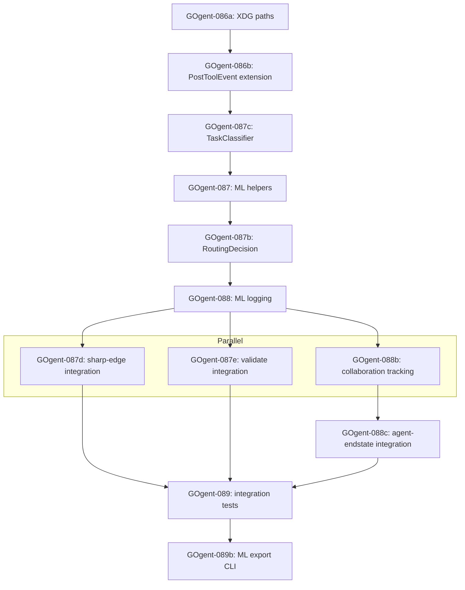

### GOgent-093: Final Documentation & Status Report

**Time**: 1 hour
**Dependencies**: GOgent-089b, GOgent-092

**Task**:
Create comprehensive status report for week 4-5 completion.

**File**: `migration_plan/tickets/WEEK-4-5-COMPLETION.md`

**Content**:
```markdown
# Weeks 4-5 Completion Report

**Date**: [completion date]
**Tickets**: GOgent-056 to GOgent-093 + 087b/087c/088b/089b (42 tickets total)
**Time**: ~56 hours
**Status**: COMPLETE

## Summary

Successfully translated 7 critical hooks from Bash to Go:

### Week 4
- GOgent-056 to 062: load-routing-context (SessionStart initialization)
- GOgent-063 to 074: agent-endstate + attention-gate (workflow hooks)

### Week 5
- GOgent-075 to 086: orchestrator-guard + doc-theater (enforcement)
- GOgent-087 to 093: sharp-edge + stop-gate (observability)

## Execution Order (Einstein-Validated)

The following dependency graph reflects the corrected execution order per einstein-gap-routing-ml-optimization-v3.md:



**Key Changes from Original Plan**:
- GOgent-087c: Dependency on GOgent-087 removed (ClassifyTask is self-contained)
- GOgent-087b: Uses append-only pattern for thread safety
- GOgent-088b: Time estimate increased to account for thread safety

## Deliverables

### Binaries
- gogent-load-context - SessionStart hook (~800 lines)
- gogent-agent-endstate - SubagentStop hook (1200+ lines)
- gogent-attention-gate - PostToolUse hook (1200+ lines)
- gogent-orchestrator-guard - Completion guard (800+ lines)
- gogent-doc-theater - Documentation theater detection (800+ lines)
- gogent-sharp-edge - PostToolUse hook with ML logging integration (merged via GOgent-087d)
- [stop-gate decision]

### ML Telemetry (NEW)
- RoutingDecision capture (GOgent-087b) - routing optimization training data
- TaskClassifier (GOgent-087c) - task type/domain labeling
- AgentCollaboration tracking (GOgent-088b) - team makeup optimization
- ML Export CLI (GOgent-089b) - training dataset extraction

**Note**: ML tool event logging is integrated into existing gogent-sharp-edge hook per GOgent-087d, not a separate binary.

### Test Coverage
- ~4500 lines of unit tests
- Integration tests for all workflows
- Edge case coverage >80%

### ML Success Metrics (GAP Section 10)
- Routing decision coverage: 100%
- Outcome correlation: >95%
- Task classification accuracy: >85%
- Sequence capture: 100%
- Collaboration tracking: >90%

### Documentation
- Complete weekly plans (weeks 8-11)
- Ticket specifications with code samples
- Integration patterns documented
- Sharp edges captured

## Installation

All binaries ready for installation to ~/.local/bin:

```bash
./scripts/install-load-context.sh
./scripts/install-agent-endstate.sh
./scripts/install-attention-gate.sh
./scripts/install-orchestrator-guard.sh
./scripts/install-doc-theater.sh
./scripts/install-sharp-edge.sh
```

Note: ML logging integrated into gogent-sharp-edge via GOgent-087d (no separate binary required).

## Next Steps (Week 6 onwards)

1. **Week 6**: Expand integration tests to cover all hooks
2. **Week 7**: Deployment and cutover with rollback plan
3. **Phase 2**: Additional hooks and optimizations

## Schema Notes

### Append-Only Outcome Updates
Per Einstein analysis (einstein-gap-routing-ml-optimization-v3.md), RoutingDecision outcomes use append-only pattern:
- Decision records logged to `routing-decisions.jsonl`
- Outcome updates logged to separate `routing-decision-updates.jsonl`
- Read-time reconciliation: join on DecisionID, take latest update per decision

This prevents race conditions under concurrent agent execution but requires ML pipeline to handle reconciliation during data export.

## Known Issues / Deferred

[List any other issues or deferred items based on GOgent-091]

## Sign-Off

- [ ] All tickets tested
- [ ] No blocking issues
- [ ] Documentation complete
- [ ] Ready for integration testing
- [ ] Ready for cutover planning
```

**Acceptance Criteria**:
- [ ] Comprehensive status report
- [ ] All deliverables listed
- [ ] Test coverage documented
- [ ] Installation instructions provided
- [ ] Clear next steps
- [ ] Issues documented
- [ ] Ready for user review

**Why This Matters**: Status report provides clear record of completion and readiness for next phase. Documents ML telemetry system enabling routing optimization, task classification, and agent collaboration analysis for continuous improvement.

---
