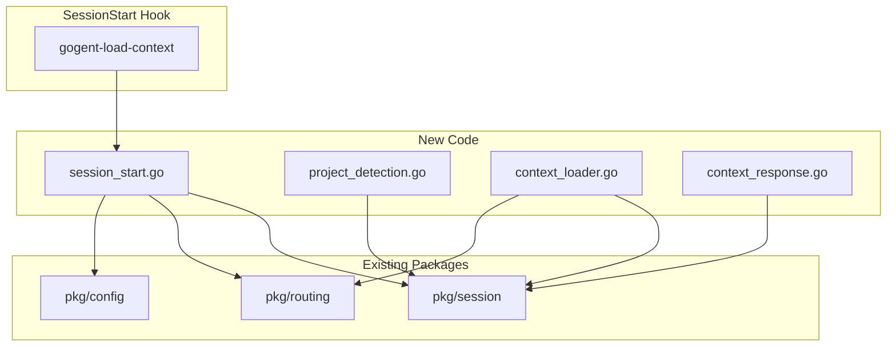
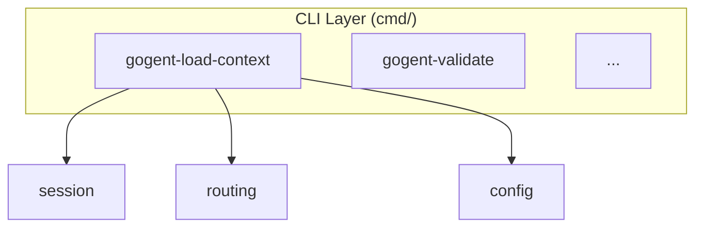
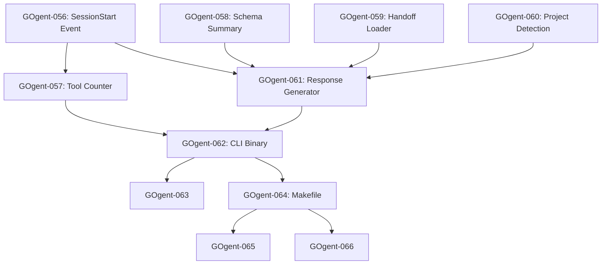
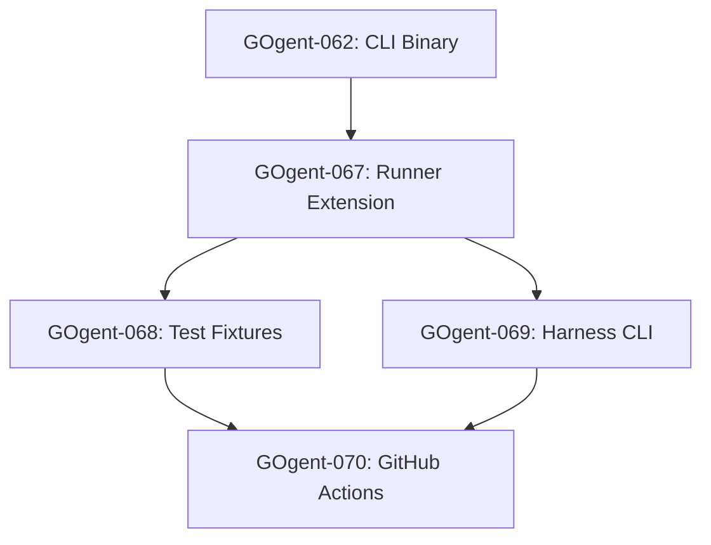

# Week 4: Session Initialization & Context Loading (Revised)

**File**: `06-week4-load-routing-context-v2.md`
**Tickets**: GOgent-056 to 066 (11 tickets)
**Phase**: Week 4
**Status**: Ready for Implementation
**Last Updated**: 2026-01-23
**Revision**: 2.0 (Einstein Analysis)

---

## Navigation

- **Previous**: [05-week2-sharp-edge-memory.md](05-week2-sharp-edge-memory.md) - GOgent-034 to 040
- **Next**: [07-week4-agent-workflow-hooks.md](07-week4-agent-workflow-hooks.md) - GOgent-067 to 078
- **Overview**: [00-overview.md](00-overview.md) - Testing strategy, rollback plan, standards
- **Template**: [TICKET-TEMPLATE.md](TICKET-TEMPLATE.md) - Required ticket structure
- **Architecture**: `docs/systems-architecture-overview.md` - System context

---

## Executive Summary

This implementation plan covers the `gogent-load-context` binary - the **SessionStart** hook that initializes every Claude Code session. This is the first hook to fire and establishes the foundation for all subsequent routing validation, failure tracking, and session continuity.

### Key Architectural Decisions (Einstein Analysis)

1. **Package Placement**: New types go in `pkg/session/` (existing) - **NOT** new packages
2. **Reuse Existing Patterns**: Follow `pkg/routing/stdin.go` for STDIN timeout, `pkg/config/paths.go` for XDG compliance
3. **Handoff Integration**: Leverage existing `pkg/session/handoff.go` types (`GitInfo`, `SessionContext`)
4. **Schema Loading**: Use existing `pkg/routing/schema.go` - add formatting methods only
5. **Tool Counter**: Use XDG-compliant path from `pkg/config/` - NOT hardcoded `/tmp`

### Differences from Original Plan (v1)

| Aspect | v1 (Original) | v2 (Revised) |
|--------|---------------|--------------|
| Tool counter path | `/tmp/claude-tool-counter` | XDG: `~/.cache/gogent/tool-counter` |
| `min()` function | Duplicated | Already exists in `pkg/session/events.go:65` |
| STDIN timeout | Reimplemented | Reuse pattern from `pkg/routing/stdin.go` |
| Git collection | New implementation | Reuse `collectGitInfo()` from `pkg/session/handoff.go:390` |
| Project type | New file | Add to existing `pkg/session/` with `_detection` suffix |
| Schema summary | New file | Add method to existing `Schema` type in `pkg/routing/schema.go` |

---

## System Integration Points



### Hook Event Flow Position

```
SessionStart → [gogent-load-context] → Context Injection
                        ↓
                  Tool Counter Init
                        ↓
              PreToolUse → [gogent-validate]
                        ↓
             PostToolUse → [gogent-sharp-edge]
                        ↓
               SessionEnd → [gogent-archive]
```

---

## GOgent-056: SessionStart Event Struct & Parser

**Time**: 1 hour
**Dependencies**: None (foundation ticket)
**Priority**: HIGH (blocks all others)

**Task**:
Define `SessionStartEvent` struct and parser in existing `pkg/session/events.go`.

**File**: `pkg/session/events.go` (extend existing)

**Implementation**:
```go
// Add to existing pkg/session/events.go after SessionEvent

// SessionStartEvent represents SessionStart hook event (hook_event_name: "SessionStart")
type SessionStartEvent struct {
	Type          string `json:"type"`            // "startup" or "resume"
	SessionID     string `json:"session_id"`
	HookEventName string `json:"hook_event_name"` // "SessionStart"
	Timestamp     int64  `json:"timestamp,omitempty"`
}

// ParseSessionStartEvent reads SessionStart event from STDIN with timeout.
// Returns error if STDIN read times out or JSON parsing fails.
// Defaults Type to "startup" if not specified.
func ParseSessionStartEvent(r io.Reader, timeout time.Duration) (*SessionStartEvent, error) {
	type parseResult struct {
		event *SessionStartEvent
		err   error
	}

	ch := make(chan parseResult, 1)

	go func() {
		data, err := io.ReadAll(r)
		if err != nil {
			ch <- parseResult{nil, fmt.Errorf("[session-start] Failed to read STDIN: %w", err)}
			return
		}

		// Handle empty input (pipe closed without data)
		if len(data) == 0 {
			ch <- parseResult{nil, fmt.Errorf("[session-start] Empty STDIN input. Expected SessionStart JSON event.")}
			return
		}

		var event SessionStartEvent
		if err := json.Unmarshal(data, &event); err != nil {
			// Truncate data for error message to prevent log bloat
			preview := string(data)
			if len(preview) > 100 {
				preview = preview[:100] + "..."
			}
			ch <- parseResult{nil, fmt.Errorf("[session-start] Failed to parse JSON: %w. Input preview: %s", err, preview)}
			return
		}

		// Default to "startup" if type not specified
		if event.Type == "" {
			event.Type = "startup"
		}

		// Validate type is one of expected values
		if event.Type != "startup" && event.Type != "resume" {
			ch <- parseResult{nil, fmt.Errorf("[session-start] Invalid session type %q. Expected 'startup' or 'resume'.", event.Type)}
			return
		}

		ch <- parseResult{&event, nil}
	}()

	select {
	case res := <-ch:
		return res.event, res.err
	case <-time.After(timeout):
		return nil, fmt.Errorf("[session-start] STDIN read timeout after %v. Hook may be stuck waiting for input.", timeout)
	}
}

// IsResume returns true if this is a resume session (continuing previous work).
func (e *SessionStartEvent) IsResume() bool {
	return e.Type == "resume"
}

// IsStartup returns true if this is a fresh startup session.
func (e *SessionStartEvent) IsStartup() bool {
	return e.Type == "startup"
}
```

**Tests**: `pkg/session/session_start_test.go` (new file)

```go
package session

import (
	"strings"
	"testing"
	"time"
)

func TestParseSessionStartEvent_Startup(t *testing.T) {
	jsonInput := `{
		"type": "startup",
		"session_id": "test-sess-001",
		"hook_event_name": "SessionStart"
	}`

	reader := strings.NewReader(jsonInput)
	event, err := ParseSessionStartEvent(reader, 5*time.Second)

	if err != nil {
		t.Fatalf("Expected no error, got: %v", err)
	}

	if event.Type != "startup" {
		t.Errorf("Expected type 'startup', got: %s", event.Type)
	}

	if event.SessionID != "test-sess-001" {
		t.Errorf("Expected session_id 'test-sess-001', got: %s", event.SessionID)
	}

	if event.IsResume() {
		t.Error("Startup session should not return true for IsResume()")
	}

	if !event.IsStartup() {
		t.Error("Startup session should return true for IsStartup()")
	}
}

func TestParseSessionStartEvent_Resume(t *testing.T) {
	jsonInput := `{
		"type": "resume",
		"session_id": "test-sess-002",
		"hook_event_name": "SessionStart"
	}`

	reader := strings.NewReader(jsonInput)
	event, err := ParseSessionStartEvent(reader, 5*time.Second)

	if err != nil {
		t.Fatalf("Expected no error, got: %v", err)
	}

	if event.Type != "resume" {
		t.Errorf("Expected type 'resume', got: %s", event.Type)
	}

	if !event.IsResume() {
		t.Error("Resume session should return true for IsResume()")
	}

	if event.IsStartup() {
		t.Error("Resume session should not return true for IsStartup()")
	}
}

func TestParseSessionStartEvent_DefaultType(t *testing.T) {
	// Missing "type" field should default to "startup"
	jsonInput := `{
		"session_id": "test-sess-003",
		"hook_event_name": "SessionStart"
	}`

	reader := strings.NewReader(jsonInput)
	event, err := ParseSessionStartEvent(reader, 5*time.Second)

	if err != nil {
		t.Fatalf("Expected no error, got: %v", err)
	}

	if event.Type != "startup" {
		t.Errorf("Expected default type 'startup', got: %s", event.Type)
	}
}

func TestParseSessionStartEvent_InvalidType(t *testing.T) {
	jsonInput := `{
		"type": "invalid_type",
		"session_id": "test-sess-004",
		"hook_event_name": "SessionStart"
	}`

	reader := strings.NewReader(jsonInput)
	_, err := ParseSessionStartEvent(reader, 5*time.Second)

	if err == nil {
		t.Fatal("Expected error for invalid type, got nil")
	}

	if !strings.Contains(err.Error(), "Invalid session type") {
		t.Errorf("Expected 'Invalid session type' error, got: %v", err)
	}
}

func TestParseSessionStartEvent_Timeout(t *testing.T) {
	// Create a reader that blocks forever
	reader := &blockingReader{}

	_, err := ParseSessionStartEvent(reader, 100*time.Millisecond)

	if err == nil {
		t.Fatal("Expected timeout error, got nil")
	}

	if !strings.Contains(err.Error(), "timeout") {
		t.Errorf("Expected timeout error, got: %v", err)
	}
}

func TestParseSessionStartEvent_EmptyInput(t *testing.T) {
	reader := strings.NewReader("")

	_, err := ParseSessionStartEvent(reader, 5*time.Second)

	if err == nil {
		t.Fatal("Expected error for empty input, got nil")
	}

	if !strings.Contains(err.Error(), "Empty STDIN") {
		t.Errorf("Expected 'Empty STDIN' error, got: %v", err)
	}
}

func TestParseSessionStartEvent_InvalidJSON(t *testing.T) {
	reader := strings.NewReader("not valid json")

	_, err := ParseSessionStartEvent(reader, 5*time.Second)

	if err == nil {
		t.Fatal("Expected error for invalid JSON, got nil")
	}

	if !strings.Contains(err.Error(), "Failed to parse JSON") {
		t.Errorf("Expected 'Failed to parse JSON' error, got: %v", err)
	}
}

// blockingReader never returns data (for timeout tests)
// Note: This is the same as in events_test.go - reuse if already defined
type blockingReader struct{}

func (b *blockingReader) Read(p []byte) (n int, err error) {
	time.Sleep(10 * time.Second)
	return 0, nil
}
```

**Acceptance Criteria**:
- [ ] `SessionStartEvent` struct defined in `pkg/session/events.go`
- [ ] `ParseSessionStartEvent()` reads STDIN with 5s timeout
- [ ] Defaults `type` to "startup" if missing
- [ ] Validates type is "startup" or "resume"
- [ ] `IsResume()` and `IsStartup()` methods work correctly
- [ ] Tests cover: startup, resume, default, invalid type, timeout, empty, invalid JSON
- [ ] `go test ./pkg/session/...` passes
- [ ] Race detector clean: `go test -race ./pkg/session/...`

**Test Deliverables**:
- [ ] Test file created: `pkg/session/session_start_test.go`
- [ ] Test file size: ~140 lines
- [ ] Number of test functions: 7
- [ ] Coverage achieved: >90%
- [ ] Tests passing: ✅
- [ ] Race detector clean: ✅
- [ ] **ECOSYSTEM TEST PASS REQUIRED**: `make test-ecosystem`
- [ ] Ecosystem test output saved to: `test/audit/GOgent-056/`

**Why This Matters**: SessionStart is the first event in every Claude Code session. Correct parsing establishes session type for downstream context loading (handoff for resume, fresh state for startup).

---

## GOgent-057: Tool Counter Initialization (XDG Compliant)

**Time**: 0.5 hours
**Dependencies**: GOgent-056
**Priority**: HIGH (attention-gate dependency)

**Task**:
Add XDG-compliant tool counter path and initialization to `pkg/config/paths.go`.

**File**: `pkg/config/paths.go` (extend existing)

**Implementation**:
```go
// Add to existing pkg/config/paths.go

// GetToolCounterPath returns path to session tool counter file.
// Used by SessionStart (initialize) and attention-gate (increment/read).
// File format: single integer representing total tool calls this session.
func GetToolCounterPath() string {
	return filepath.Join(GetGOgentDir(), "tool-counter")
}

// InitializeToolCounter creates or resets tool counter to 0.
// Called at session start to track tool calls for attention-gate.
// Returns error if file cannot be created (permissions, disk full, etc.).
func InitializeToolCounter() error {
	counterPath := GetToolCounterPath()

	// Write "0" to counter file (overwrite if exists)
	if err := os.WriteFile(counterPath, []byte("0"), 0644); err != nil {
		return fmt.Errorf("[config] Failed to initialize tool counter at %s: %w. Check write permissions for %s.", counterPath, err, GetGOgentDir())
	}

	return nil
}

// GetToolCount reads current tool count from counter file.
// Returns 0 if file doesn't exist (session not initialized).
// Returns error only for read failures (not missing file).
func GetToolCount() (int, error) {
	counterPath := GetToolCounterPath()

	data, err := os.ReadFile(counterPath)
	if err != nil {
		if os.IsNotExist(err) {
			return 0, nil // Not initialized yet
		}
		return 0, fmt.Errorf("[config] Failed to read tool counter from %s: %w", counterPath, err)
	}

	var count int
	if _, err := fmt.Sscanf(strings.TrimSpace(string(data)), "%d", &count); err != nil {
		return 0, fmt.Errorf("[config] Failed to parse tool counter value %q: %w. File may be corrupted.", string(data), err)
	}

	return count, nil
}

// IncrementToolCount atomically increments tool counter.
// Used by attention-gate hook after each tool execution.
// Returns new count after increment.
func IncrementToolCount() (int, error) {
	current, err := GetToolCount()
	if err != nil {
		return 0, err
	}

	newCount := current + 1
	counterPath := GetToolCounterPath()

	if err := os.WriteFile(counterPath, []byte(fmt.Sprintf("%d", newCount)), 0644); err != nil {
		return 0, fmt.Errorf("[config] Failed to write tool counter: %w", err)
	}

	return newCount, nil
}
```

**Add import** to `pkg/config/paths.go`:
```go
import (
	"fmt"
	"os"
	"path/filepath"
	"strings"
)
```

**Tests**: Add to `pkg/config/paths_test.go`

```go
// Add to existing pkg/config/paths_test.go

func TestToolCounter_Initialize(t *testing.T) {
	// Setup: Use temp XDG directory
	tmpDir := t.TempDir()
	originalXDG := os.Getenv("XDG_CACHE_HOME")
	os.Setenv("XDG_CACHE_HOME", tmpDir)
	defer os.Setenv("XDG_CACHE_HOME", originalXDG)

	// Initialize counter
	err := InitializeToolCounter()
	if err != nil {
		t.Fatalf("InitializeToolCounter failed: %v", err)
	}

	// Verify counter is 0
	count, err := GetToolCount()
	if err != nil {
		t.Fatalf("GetToolCount failed: %v", err)
	}

	if count != 0 {
		t.Errorf("Expected initial count 0, got: %d", count)
	}
}

func TestToolCounter_Increment(t *testing.T) {
	tmpDir := t.TempDir()
	originalXDG := os.Getenv("XDG_CACHE_HOME")
	os.Setenv("XDG_CACHE_HOME", tmpDir)
	defer os.Setenv("XDG_CACHE_HOME", originalXDG)

	// Initialize
	if err := InitializeToolCounter(); err != nil {
		t.Fatalf("InitializeToolCounter failed: %v", err)
	}

	// Increment 3 times
	for i := 1; i <= 3; i++ {
		count, err := IncrementToolCount()
		if err != nil {
			t.Fatalf("IncrementToolCount failed on iteration %d: %v", i, err)
		}

		if count != i {
			t.Errorf("Expected count %d after increment %d, got: %d", i, i, count)
		}
	}
}

func TestToolCounter_GetCount_NotInitialized(t *testing.T) {
	tmpDir := t.TempDir()
	originalXDG := os.Getenv("XDG_CACHE_HOME")
	os.Setenv("XDG_CACHE_HOME", tmpDir)
	defer os.Setenv("XDG_CACHE_HOME", originalXDG)

	// Don't initialize - file doesn't exist
	count, err := GetToolCount()

	if err != nil {
		t.Fatalf("GetToolCount should not error on missing file, got: %v", err)
	}

	if count != 0 {
		t.Errorf("Expected 0 for uninitialized counter, got: %d", count)
	}
}

func TestGetToolCounterPath(t *testing.T) {
	tmpDir := t.TempDir()
	originalXDG := os.Getenv("XDG_CACHE_HOME")
	os.Setenv("XDG_CACHE_HOME", tmpDir)
	defer os.Setenv("XDG_CACHE_HOME", originalXDG)

	path := GetToolCounterPath()

	if !strings.Contains(path, "gogent") {
		t.Errorf("Expected path to contain 'gogent', got: %s", path)
	}

	if !strings.HasSuffix(path, "tool-counter") {
		t.Errorf("Expected path to end with 'tool-counter', got: %s", path)
	}
}
```

**Acceptance Criteria**:
- [ ] `GetToolCounterPath()` returns XDG-compliant path (NOT `/tmp`)
- [ ] `InitializeToolCounter()` creates counter file with "0"
- [ ] `GetToolCount()` returns 0 for missing file (not error)
- [ ] `IncrementToolCount()` atomically increments and returns new value
- [ ] Tests verify initialization, increment, missing file handling
- [ ] `go test ./pkg/config/...` passes
- [ ] Path uses `~/.cache/gogent/` or `$XDG_CACHE_HOME/gogent/`

**Test Deliverables**:
- [ ] Tests added to: `pkg/config/paths_test.go`
- [ ] Number of new test functions: 4
- [ ] Tests passing: ✅
- [ ] **ECOSYSTEM TEST PASS REQUIRED**: `make test-ecosystem`

**Why This Matters**: Tool counter is read by attention-gate hook (fires every 10 tool calls). XDG compliance ensures proper cleanup and avoids `/tmp` permission issues.

---

## GOgent-058: Routing Schema Summary Formatter

**Time**: 1 hour
**Dependencies**: None
**Priority**: MEDIUM

**Task**:
Add summary formatting method to existing `Schema` type in `pkg/routing/schema.go`.

**File**: `pkg/routing/schema.go` (extend existing)

**Implementation**:
```go
// Add to existing pkg/routing/schema.go

import (
	"strings"
	// ... existing imports
)

// FormatTierSummary generates a human-readable summary of active routing tiers.
// Output is designed for context injection in SessionStart hook.
// Returns formatted string with tier names, patterns, and tools.
func (s *Schema) FormatTierSummary() string {
	var sb strings.Builder
	sb.WriteString("ROUTING TIERS ACTIVE:\n")

	// Define tier order for consistent output
	tierOrder := []string{"haiku", "haiku_thinking", "sonnet", "opus", "external"}

	for _, tierName := range tierOrder {
		tier, exists := s.Tiers[tierName]
		if !exists {
			continue
		}

		// Get first 3 patterns (or fewer if less available)
		patterns := tier.Patterns
		if len(patterns) > 3 {
			patterns = patterns[:3]
		}
		patternStr := strings.Join(patterns, ", ")
		if len(tier.Patterns) > 3 {
			patternStr += "..."
		}

		// Get first 4 tools (or fewer if less available)
		tools := tier.Tools
		if len(tools) > 4 {
			tools = tools[:4]
		}
		toolStr := strings.Join(tools, ", ")
		if len(tier.Tools) > 4 {
			toolStr += "..."
		}

		sb.WriteString(fmt.Sprintf("  • %s: patterns=[%s] → tools=[%s]\n", tierName, patternStr, toolStr))
	}

	// Add delegation ceiling info
	sb.WriteString(fmt.Sprintf("\nDELEGATION CEILING: Set by %s\n", s.DelegationCeiling.SetBy))

	return sb.String()
}

// LoadAndFormatSchemaSummary is a convenience function that loads schema and returns summary.
// Returns graceful message if schema doesn't exist (not an error).
func LoadAndFormatSchemaSummary() (string, error) {
	schema, err := LoadSchema()
	if err != nil {
		// Check if it's a file not found error
		if strings.Contains(err.Error(), "no such file") || strings.Contains(err.Error(), "not found") {
			return "Routing schema not found. Routing validation disabled for this session.", nil
		}
		return "", fmt.Errorf("[routing] Failed to load schema for summary: %w", err)
	}

	return schema.FormatTierSummary(), nil
}
```

**Tests**: Add to `pkg/routing/schema_test.go`

```go
// Add to existing pkg/routing/schema_test.go

func TestSchema_FormatTierSummary(t *testing.T) {
	schema := &Schema{
		Tiers: map[string]TierConfig{
			"haiku": {
				Patterns: []string{"find files", "search codebase", "grep pattern", "locate code"},
				Tools:    []string{"Glob", "Grep", "Read", "WebFetch", "WebSearch"},
			},
			"sonnet": {
				Patterns: []string{"implement", "refactor", "debug"},
				Tools:    []string{"Read", "Write", "Edit", "Bash"},
			},
		},
		DelegationCeiling: DelegationCeiling{
			SetBy: "calculate-complexity.sh",
		},
	}

	summary := schema.FormatTierSummary()

	// Verify structure
	if !strings.Contains(summary, "ROUTING TIERS ACTIVE") {
		t.Error("Summary should contain header")
	}

	// Verify haiku tier with truncated patterns
	if !strings.Contains(summary, "haiku:") {
		t.Error("Summary should contain haiku tier")
	}
	if !strings.Contains(summary, "find files") {
		t.Error("Summary should contain first pattern")
	}
	if !strings.Contains(summary, "...") {
		t.Error("Summary should indicate truncation")
	}

	// Verify sonnet tier
	if !strings.Contains(summary, "sonnet:") {
		t.Error("Summary should contain sonnet tier")
	}

	// Verify delegation ceiling
	if !strings.Contains(summary, "DELEGATION CEILING") {
		t.Error("Summary should contain delegation ceiling")
	}
}

func TestSchema_FormatTierSummary_EmptyTiers(t *testing.T) {
	schema := &Schema{
		Tiers:             map[string]TierConfig{},
		DelegationCeiling: DelegationCeiling{SetBy: "test"},
	}

	summary := schema.FormatTierSummary()

	if !strings.Contains(summary, "ROUTING TIERS ACTIVE") {
		t.Error("Summary should still contain header for empty tiers")
	}
}
```

**Acceptance Criteria**:
- [ ] `FormatTierSummary()` method added to `Schema` type
- [ ] Limits patterns to 3, tools to 4 with "..." truncation
- [ ] Includes delegation ceiling info
- [ ] `LoadAndFormatSchemaSummary()` handles missing schema gracefully
- [ ] Tests verify formatting, truncation, empty tiers
- [ ] `go test ./pkg/routing/...` passes

**Test Deliverables**:
- [ ] Tests added to: `pkg/routing/schema_test.go`
- [ ] Number of new test functions: 2
- [ ] Tests passing: ✅
- [ ] **ECOSYSTEM TEST PASS REQUIRED**: `make test-ecosystem`

**Why This Matters**: Schema summary provides routing context in every session. Concise formatting prevents context window bloat while maintaining routing awareness.

---

## GOgent-059: Handoff Document Loader

**Time**: 1 hour
**Dependencies**: None
**Priority**: MEDIUM

**Task**:
Add handoff loading function for SessionStart resume sessions.

**File**: `pkg/session/context_loader.go` (new file)

**Implementation**:
```go
package session

import (
	"fmt"
	"os"
	"path/filepath"
	"strings"
)

// LoadHandoffSummary loads previous session handoff for resume sessions.
// Returns first 30 lines of last-handoff.md with truncation indicator.
// Returns empty string with no error if handoff doesn't exist.
func LoadHandoffSummary(projectDir string) (string, error) {
	handoffPath := filepath.Join(projectDir, ".claude", "memory", "last-handoff.md")

	// Check if handoff exists
	info, err := os.Stat(handoffPath)
	if os.IsNotExist(err) {
		return "", nil // No handoff is normal
	}
	if err != nil {
		return "", fmt.Errorf("[context-loader] Failed to stat handoff at %s: %w", handoffPath, err)
	}

	// Don't read excessively large files
	const maxSize = 50 * 1024 // 50KB limit
	if info.Size() > maxSize {
		return fmt.Sprintf("Handoff file too large (%d bytes). See: %s", info.Size(), handoffPath), nil
	}

	// Read handoff file
	data, err := os.ReadFile(handoffPath)
	if err != nil {
		return "", fmt.Errorf("[context-loader] Failed to read handoff from %s: %w", handoffPath, err)
	}

	content := string(data)

	// Return first 30 lines with truncation indicator
	lines := strings.Split(content, "\n")
	if len(lines) > 30 {
		lines = lines[:30]
		lines = append(lines, "")
		lines = append(lines, fmt.Sprintf("(... %d lines truncated. Full handoff: %s)", len(lines)-30, handoffPath))
	}

	return strings.Join(lines, "\n"), nil
}

// CheckPendingLearnings checks for accumulated sharp edges requiring review.
// Returns warning message if pending learnings exist, empty string otherwise.
func CheckPendingLearnings(projectDir string) (string, error) {
	pendingPath := filepath.Join(projectDir, ".claude", "memory", "pending-learnings.jsonl")

	// Check if file exists and has content
	info, err := os.Stat(pendingPath)
	if os.IsNotExist(err) {
		return "", nil // No pending learnings
	}
	if err != nil {
		return "", fmt.Errorf("[context-loader] Failed to stat pending learnings at %s: %w", pendingPath, err)
	}

	if info.Size() == 0 {
		return "", nil // Empty file
	}

	// Count lines (each line is one sharp edge)
	data, err := os.ReadFile(pendingPath)
	if err != nil {
		return "", fmt.Errorf("[context-loader] Failed to read pending learnings: %w", err)
	}

	lineCount := strings.Count(string(data), "\n")
	if lineCount == 0 && len(data) > 0 {
		lineCount = 1 // Single line without newline
	}

	return fmt.Sprintf("⚠️ PENDING LEARNINGS: %d sharp edge(s) from previous sessions need review.\n   Path: %s", lineCount, pendingPath), nil
}

// FormatGitInfo formats GitInfo struct for context injection.
// Uses existing collectGitInfo() from handoff.go.
func FormatGitInfo(projectDir string) string {
	info := collectGitInfo(projectDir)

	if info.Branch == "" {
		return "" // Not a git repo
	}

	var parts []string
	parts = append(parts, fmt.Sprintf("Branch: %s", info.Branch))

	if info.IsDirty {
		uncommittedCount := len(info.Uncommitted)
		parts = append(parts, fmt.Sprintf("Uncommitted: %d file(s)", uncommittedCount))
	} else {
		parts = append(parts, "Clean working tree")
	}

	return "GIT: " + strings.Join(parts, " | ")
}
```

**Tests**: `pkg/session/context_loader_test.go` (new file)

```go
package session

import (
	"os"
	"path/filepath"
	"strings"
	"testing"
)

func TestLoadHandoffSummary_Exists(t *testing.T) {
	tmpDir := t.TempDir()
	memoryDir := filepath.Join(tmpDir, ".claude", "memory")
	os.MkdirAll(memoryDir, 0755)

	// Create mock handoff
	handoffContent := `# Session Handoff

## Summary
Last session implemented feature X.

## Sharp Edges
- Edge 1: Type mismatch in parser

## Next Steps
- Complete testing
`
	handoffPath := filepath.Join(memoryDir, "last-handoff.md")
	os.WriteFile(handoffPath, []byte(handoffContent), 0644)

	// Load summary
	summary, err := LoadHandoffSummary(tmpDir)

	if err != nil {
		t.Fatalf("LoadHandoffSummary failed: %v", err)
	}

	if !strings.Contains(summary, "Session Handoff") {
		t.Error("Summary should contain handoff content")
	}

	if !strings.Contains(summary, "feature X") {
		t.Error("Summary should contain session summary")
	}
}

func TestLoadHandoffSummary_Missing(t *testing.T) {
	tmpDir := t.TempDir()

	summary, err := LoadHandoffSummary(tmpDir)

	if err != nil {
		t.Fatalf("Should not error on missing handoff, got: %v", err)
	}

	if summary != "" {
		t.Errorf("Expected empty string for missing handoff, got: %s", summary)
	}
}

func TestLoadHandoffSummary_Truncation(t *testing.T) {
	tmpDir := t.TempDir()
	memoryDir := filepath.Join(tmpDir, ".claude", "memory")
	os.MkdirAll(memoryDir, 0755)

	// Create large handoff (40 lines)
	var lines []string
	for i := 1; i <= 40; i++ {
		lines = append(lines, fmt.Sprintf("Line %d: content content content", i))
	}
	handoffContent := strings.Join(lines, "\n")

	handoffPath := filepath.Join(memoryDir, "last-handoff.md")
	os.WriteFile(handoffPath, []byte(handoffContent), 0644)

	// Load summary
	summary, err := LoadHandoffSummary(tmpDir)

	if err != nil {
		t.Fatalf("LoadHandoffSummary failed: %v", err)
	}

	// Should contain first lines
	if !strings.Contains(summary, "Line 1:") {
		t.Error("Summary should contain first line")
	}

	// Should indicate truncation
	if !strings.Contains(summary, "truncated") {
		t.Error("Summary should indicate truncation")
	}

	// Should NOT contain line 35
	if strings.Contains(summary, "Line 35:") {
		t.Error("Should truncate after 30 lines")
	}
}

func TestCheckPendingLearnings_HasLearnings(t *testing.T) {
	tmpDir := t.TempDir()
	memoryDir := filepath.Join(tmpDir, ".claude", "memory")
	os.MkdirAll(memoryDir, 0755)

	// Create pending learnings (3 entries)
	pendingContent := `{"ts":123,"file":"test.go","error_type":"type_mismatch"}
{"ts":456,"file":"main.go","error_type":"nil_pointer"}
{"ts":789,"file":"utils.go","error_type":"bounds_check"}
`
	pendingPath := filepath.Join(memoryDir, "pending-learnings.jsonl")
	os.WriteFile(pendingPath, []byte(pendingContent), 0644)

	// Check pending learnings
	message, err := CheckPendingLearnings(tmpDir)

	if err != nil {
		t.Fatalf("CheckPendingLearnings failed: %v", err)
	}

	if !strings.Contains(message, "PENDING LEARNINGS") {
		t.Error("Message should indicate pending learnings")
	}

	if !strings.Contains(message, "3 sharp edge") {
		t.Errorf("Should detect 3 sharp edges, got: %s", message)
	}
}

func TestCheckPendingLearnings_None(t *testing.T) {
	tmpDir := t.TempDir()

	message, err := CheckPendingLearnings(tmpDir)

	if err != nil {
		t.Fatalf("Should not error on missing file, got: %v", err)
	}

	if message != "" {
		t.Errorf("Expected empty message for no pending learnings, got: %s", message)
	}
}

func TestCheckPendingLearnings_EmptyFile(t *testing.T) {
	tmpDir := t.TempDir()
	memoryDir := filepath.Join(tmpDir, ".claude", "memory")
	os.MkdirAll(memoryDir, 0755)

	// Create empty file
	pendingPath := filepath.Join(memoryDir, "pending-learnings.jsonl")
	os.WriteFile(pendingPath, []byte(""), 0644)

	message, err := CheckPendingLearnings(tmpDir)

	if err != nil {
		t.Fatalf("Should not error on empty file, got: %v", err)
	}

	if message != "" {
		t.Errorf("Expected empty message for empty file, got: %s", message)
	}
}

func TestFormatGitInfo_NotGitRepo(t *testing.T) {
	tmpDir := t.TempDir()

	info := FormatGitInfo(tmpDir)

	if info != "" {
		t.Errorf("Expected empty string for non-git repo, got: %s", info)
	}
}
```

**Acceptance Criteria**:
- [ ] `LoadHandoffSummary()` reads from `.claude/memory/last-handoff.md`
- [ ] Returns first 30 lines with truncation indicator for large files
- [ ] Handles missing handoff gracefully (returns empty string, not error)
- [ ] `CheckPendingLearnings()` counts lines in `pending-learnings.jsonl`
- [ ] `FormatGitInfo()` reuses existing `collectGitInfo()` function
- [ ] Tests verify content loading, missing files, truncation
- [ ] `go test ./pkg/session/...` passes

**Test Deliverables**:
- [ ] Test file created: `pkg/session/context_loader_test.go`
- [ ] Test file size: ~180 lines
- [ ] Number of test functions: 7
- [ ] Coverage achieved: >85%
- [ ] Tests passing: ✅
- [ ] **ECOSYSTEM TEST PASS REQUIRED**: `make test-ecosystem`

**Why This Matters**: Handoff loading enables multi-session continuity. Resume sessions need context from previous work to maintain coherent agent behavior.

---

## GOgent-060: Project Type Detection

**Time**: 1.5 hours
**Dependencies**: None
**Priority**: MEDIUM

**Task**:
Auto-detect project type (Python, R, R+Shiny, JavaScript, Go) for convention loading in CLAUDE.md Gate 1.

**File**: `pkg/session/project_detection.go` (new file)

**Implementation**:
```go
package session

import (
	"os"
	"path/filepath"
	"strings"
)

// ProjectType represents detected project language/framework
type ProjectType string

const (
	ProjectGeneric    ProjectType = "generic"
	ProjectPython     ProjectType = "python"
	ProjectR          ProjectType = "r"
	ProjectRShiny     ProjectType = "r-shiny"
	ProjectRGolem     ProjectType = "r-golem"
	ProjectJavaScript ProjectType = "javascript"
	ProjectTypeScript ProjectType = "typescript"
	ProjectGo         ProjectType = "go"
	ProjectRust       ProjectType = "rust"
)

// ProjectDetectionResult contains detection output with metadata
type ProjectDetectionResult struct {
	Type        ProjectType `json:"type"`
	Indicators  []string    `json:"indicators"` // Files that triggered detection
	Conventions []string    `json:"conventions"` // Convention files to load
}

// DetectProjectType auto-detects project type from indicator files.
// Detection priority: Go > Python > R (with Shiny/Golem) > JavaScript/TypeScript > Rust > Generic
func DetectProjectType(projectDir string) *ProjectDetectionResult {
	result := &ProjectDetectionResult{
		Type:        ProjectGeneric,
		Indicators:  []string{},
		Conventions: []string{},
	}

	// Go detection (highest priority - this is GOgent-Fortress)
	if fileExists(filepath.Join(projectDir, "go.mod")) {
		result.Type = ProjectGo
		result.Indicators = append(result.Indicators, "go.mod")
		result.Conventions = []string{"go.md"}
		return result
	}

	// Python detection
	pythonIndicators := []string{"pyproject.toml", "setup.py", "requirements.txt", "uv.lock", "Pipfile"}
	for _, indicator := range pythonIndicators {
		if fileExists(filepath.Join(projectDir, indicator)) {
			result.Type = ProjectPython
			result.Indicators = append(result.Indicators, indicator)
			result.Conventions = []string{"python.md"}
			return result
		}
	}

	// R detection (with Shiny/Golem variants)
	rIndicators := []string{"DESCRIPTION", "NAMESPACE", "renv.lock"}
	for _, indicator := range rIndicators {
		if fileExists(filepath.Join(projectDir, indicator)) {
			result.Type = ProjectR
			result.Indicators = append(result.Indicators, indicator)
			result.Conventions = []string{"R.md"}

			// Check for Golem (superset of Shiny)
			if isGolemProject(projectDir) {
				result.Type = ProjectRGolem
				result.Conventions = []string{"R.md", "R-shiny.md", "R-golem.md"}
				result.Indicators = append(result.Indicators, "inst/golem-config.yml or golem dependency")
				return result
			}

			// Check for Shiny
			if isShinyProject(projectDir) {
				result.Type = ProjectRShiny
				result.Conventions = []string{"R.md", "R-shiny.md"}
				result.Indicators = append(result.Indicators, "shiny dependency or app.R/ui.R")
			}

			return result
		}
	}

	// Also check for standalone R files without DESCRIPTION
	if hasRFiles(projectDir) {
		// Check for Shiny indicators even without DESCRIPTION
		if fileExists(filepath.Join(projectDir, "app.R")) || fileExists(filepath.Join(projectDir, "ui.R")) {
			result.Type = ProjectRShiny
			result.Indicators = append(result.Indicators, "app.R or ui.R (standalone Shiny)")
			result.Conventions = []string{"R.md", "R-shiny.md"}
			return result
		}
	}

	// TypeScript detection (before JavaScript - more specific)
	if fileExists(filepath.Join(projectDir, "tsconfig.json")) {
		result.Type = ProjectTypeScript
		result.Indicators = append(result.Indicators, "tsconfig.json")
		result.Conventions = []string{"typescript.md"}
		return result
	}

	// JavaScript detection
	if fileExists(filepath.Join(projectDir, "package.json")) {
		result.Type = ProjectJavaScript
		result.Indicators = append(result.Indicators, "package.json")
		result.Conventions = []string{"javascript.md"}
		return result
	}

	// Rust detection
	if fileExists(filepath.Join(projectDir, "Cargo.toml")) {
		result.Type = ProjectRust
		result.Indicators = append(result.Indicators, "Cargo.toml")
		result.Conventions = []string{"rust.md"}
		return result
	}

	return result
}

// fileExists checks if file exists (not directory)
func fileExists(path string) bool {
	info, err := os.Stat(path)
	if err != nil {
		return false
	}
	return !info.IsDir()
}

// hasRFiles checks for any .R files in project root
func hasRFiles(projectDir string) bool {
	entries, err := os.ReadDir(projectDir)
	if err != nil {
		return false
	}

	for _, entry := range entries {
		if !entry.IsDir() && strings.HasSuffix(strings.ToLower(entry.Name()), ".r") {
			return true
		}
	}
	return false
}

// isShinyProject checks for Shiny indicators
func isShinyProject(projectDir string) bool {
	// Check for app.R or ui.R
	if fileExists(filepath.Join(projectDir, "app.R")) ||
		fileExists(filepath.Join(projectDir, "ui.R")) {
		return true
	}

	// Check DESCRIPTION for shiny dependency
	descPath := filepath.Join(projectDir, "DESCRIPTION")
	if content, err := os.ReadFile(descPath); err == nil {
		contentLower := strings.ToLower(string(content))
		if strings.Contains(contentLower, "shiny") {
			return true
		}
	}

	return false
}

// isGolemProject checks for Golem framework indicators
func isGolemProject(projectDir string) bool {
	// Check for golem-config.yml
	if fileExists(filepath.Join(projectDir, "inst", "golem-config.yml")) {
		return true
	}

	// Check DESCRIPTION for golem dependency
	descPath := filepath.Join(projectDir, "DESCRIPTION")
	if content, err := os.ReadFile(descPath); err == nil {
		contentLower := strings.ToLower(string(content))
		if strings.Contains(contentLower, "golem") {
			return true
		}
	}

	return false
}

// FormatProjectType returns human-readable project type string for context injection
func FormatProjectType(result *ProjectDetectionResult) string {
	if result.Type == ProjectGeneric {
		return "PROJECT TYPE: Generic (no language-specific conventions)"
	}

	conventions := strings.Join(result.Conventions, ", ")
	indicators := strings.Join(result.Indicators, ", ")

	return fmt.Sprintf("PROJECT TYPE: %s\n  Detected via: %s\n  Conventions: %s",
		string(result.Type),
		indicators,
		conventions,
	)
}
```

**Add import to file**:
```go
import (
	"fmt"
	"os"
	"path/filepath"
	"strings"
)
```

**Tests**: `pkg/session/project_detection_test.go` (new file)

```go
package session

import (
	"os"
	"path/filepath"
	"testing"
)

func TestDetectProjectType_Go(t *testing.T) {
	tmpDir := t.TempDir()
	os.WriteFile(filepath.Join(tmpDir, "go.mod"), []byte("module test"), 0644)

	result := DetectProjectType(tmpDir)

	if result.Type != ProjectGo {
		t.Errorf("Expected Go, got: %s", result.Type)
	}

	if len(result.Indicators) == 0 || result.Indicators[0] != "go.mod" {
		t.Error("Should have go.mod as indicator")
	}

	if len(result.Conventions) == 0 || result.Conventions[0] != "go.md" {
		t.Error("Should have go.md convention")
	}
}

func TestDetectProjectType_Python(t *testing.T) {
	tmpDir := t.TempDir()
	os.WriteFile(filepath.Join(tmpDir, "pyproject.toml"), []byte("[project]"), 0644)

	result := DetectProjectType(tmpDir)

	if result.Type != ProjectPython {
		t.Errorf("Expected Python, got: %s", result.Type)
	}
}

func TestDetectProjectType_R(t *testing.T) {
	tmpDir := t.TempDir()
	descContent := `Package: mypackage
Title: Test Package
Version: 1.0.0
`
	os.WriteFile(filepath.Join(tmpDir, "DESCRIPTION"), []byte(descContent), 0644)

	result := DetectProjectType(tmpDir)

	if result.Type != ProjectR {
		t.Errorf("Expected R, got: %s", result.Type)
	}
}

func TestDetectProjectType_RShiny_Description(t *testing.T) {
	tmpDir := t.TempDir()
	descContent := `Package: myapp
Title: Shiny App
Version: 1.0.0
Imports: shiny
`
	os.WriteFile(filepath.Join(tmpDir, "DESCRIPTION"), []byte(descContent), 0644)

	result := DetectProjectType(tmpDir)

	if result.Type != ProjectRShiny {
		t.Errorf("Expected R+Shiny, got: %s", result.Type)
	}

	// Check conventions include both R.md and R-shiny.md
	hasR := false
	hasShiny := false
	for _, c := range result.Conventions {
		if c == "R.md" {
			hasR = true
		}
		if c == "R-shiny.md" {
			hasShiny = true
		}
	}
	if !hasR || !hasShiny {
		t.Errorf("Expected R.md and R-shiny.md conventions, got: %v", result.Conventions)
	}
}

func TestDetectProjectType_RShiny_AppFile(t *testing.T) {
	tmpDir := t.TempDir()
	os.WriteFile(filepath.Join(tmpDir, "DESCRIPTION"), []byte("Package: test"), 0644)
	os.WriteFile(filepath.Join(tmpDir, "app.R"), []byte("# Shiny app"), 0644)

	result := DetectProjectType(tmpDir)

	if result.Type != ProjectRShiny {
		t.Errorf("Expected R+Shiny from app.R, got: %s", result.Type)
	}
}

func TestDetectProjectType_RGolem(t *testing.T) {
	tmpDir := t.TempDir()
	os.WriteFile(filepath.Join(tmpDir, "DESCRIPTION"), []byte("Package: test\nImports: golem"), 0644)

	result := DetectProjectType(tmpDir)

	if result.Type != ProjectRGolem {
		t.Errorf("Expected R+Golem, got: %s", result.Type)
	}

	// Check conventions include all three
	if len(result.Conventions) != 3 {
		t.Errorf("Expected 3 conventions for Golem, got: %v", result.Conventions)
	}
}

func TestDetectProjectType_TypeScript(t *testing.T) {
	tmpDir := t.TempDir()
	os.WriteFile(filepath.Join(tmpDir, "tsconfig.json"), []byte("{}"), 0644)

	result := DetectProjectType(tmpDir)

	if result.Type != ProjectTypeScript {
		t.Errorf("Expected TypeScript, got: %s", result.Type)
	}
}

func TestDetectProjectType_JavaScript(t *testing.T) {
	tmpDir := t.TempDir()
	os.WriteFile(filepath.Join(tmpDir, "package.json"), []byte("{}"), 0644)

	result := DetectProjectType(tmpDir)

	if result.Type != ProjectJavaScript {
		t.Errorf("Expected JavaScript, got: %s", result.Type)
	}
}

func TestDetectProjectType_Rust(t *testing.T) {
	tmpDir := t.TempDir()
	os.WriteFile(filepath.Join(tmpDir, "Cargo.toml"), []byte("[package]"), 0644)

	result := DetectProjectType(tmpDir)

	if result.Type != ProjectRust {
		t.Errorf("Expected Rust, got: %s", result.Type)
	}
}

func TestDetectProjectType_Generic(t *testing.T) {
	tmpDir := t.TempDir()
	// No language indicators

	result := DetectProjectType(tmpDir)

	if result.Type != ProjectGeneric {
		t.Errorf("Expected Generic, got: %s", result.Type)
	}
}

func TestDetectProjectType_Priority_GoOverPython(t *testing.T) {
	tmpDir := t.TempDir()
	// Both Go and Python indicators
	os.WriteFile(filepath.Join(tmpDir, "go.mod"), []byte("module test"), 0644)
	os.WriteFile(filepath.Join(tmpDir, "pyproject.toml"), []byte("[project]"), 0644)

	result := DetectProjectType(tmpDir)

	// Go should take priority
	if result.Type != ProjectGo {
		t.Errorf("Go should have priority over Python, got: %s", result.Type)
	}
}

func TestFormatProjectType(t *testing.T) {
	result := &ProjectDetectionResult{
		Type:        ProjectGo,
		Indicators:  []string{"go.mod"},
		Conventions: []string{"go.md"},
	}

	formatted := FormatProjectType(result)

	if formatted == "" {
		t.Error("Should return non-empty formatted string")
	}

	if !strings.Contains(formatted, "go") {
		t.Error("Should contain project type")
	}

	if !strings.Contains(formatted, "go.mod") {
		t.Error("Should contain indicator")
	}
}
```

**Acceptance Criteria**:
- [ ] `DetectProjectType()` detects: Go, Python, R, R+Shiny, R+Golem, JavaScript, TypeScript, Rust
- [ ] Returns generic for unrecognized projects
- [ ] Go has highest priority (this is GOgent-Fortress)
- [ ] Shiny detection checks DESCRIPTION content AND app.R/ui.R presence
- [ ] Golem detection checks inst/golem-config.yml AND DESCRIPTION
- [ ] `ProjectDetectionResult` includes indicators and convention files
- [ ] Tests verify all project types and priority
- [ ] `go test ./pkg/session/...` passes

**Test Deliverables**:
- [ ] Test file created: `pkg/session/project_detection_test.go`
- [ ] Test file size: ~180 lines
- [ ] Number of test functions: 13
- [ ] Coverage achieved: >90%
- [ ] Tests passing: ✅
- [ ] **ECOSYSTEM TEST PASS REQUIRED**: `make test-ecosystem`

**Why This Matters**: Project type detection drives convention loading (python.md, R.md, go.md) in CLAUDE.md Gate 1. Accurate detection ensures correct coding standards.

---

## GOgent-061: Session Context Response Generator

**Time**: 1.5 hours
**Dependencies**: GOgent-056 to 060
**Priority**: HIGH

**Task**:
Combine all context sources and generate SessionStart hook response JSON.

**File**: `pkg/session/context_response.go` (new file)

**Implementation**:
```go
package session

import (
	"encoding/json"
	"fmt"
	"strings"
)

// ContextComponents holds all context pieces for session initialization
type ContextComponents struct {
	SessionType      string                  // "startup" or "resume"
	RoutingSummary   string                  // From schema.FormatTierSummary()
	HandoffSummary   string                  // From LoadHandoffSummary() - resume only
	PendingLearnings string                  // From CheckPendingLearnings()
	GitInfo          string                  // From FormatGitInfo()
	ProjectInfo      *ProjectDetectionResult // From DetectProjectType()
}

// SessionStartResponse is the hook output format for SessionStart
type SessionStartResponse struct {
	HookSpecificOutput HookSpecificOutput `json:"hookSpecificOutput"`
}

// HookSpecificOutput contains the context injection payload
type HookSpecificOutput struct {
	HookEventName     string `json:"hookEventName"`
	AdditionalContext string `json:"additionalContext"`
}

// GenerateSessionStartResponse creates the complete context injection response.
// Output follows Claude Code hook response format.
func GenerateSessionStartResponse(ctx *ContextComponents) (string, error) {
	if ctx == nil {
		return "", fmt.Errorf("[context-response] ContextComponents nil. Cannot generate response without context.")
	}

	var contextParts []string

	// Session header
	header := fmt.Sprintf("🚀 SESSION INITIALIZED (%s)", ctx.SessionType)
	contextParts = append(contextParts, header)

	// Routing summary (always include)
	if ctx.RoutingSummary != "" {
		contextParts = append(contextParts, ctx.RoutingSummary)
	}

	// Handoff for resume sessions only
	if ctx.SessionType == "resume" && ctx.HandoffSummary != "" {
		contextParts = append(contextParts, "PREVIOUS SESSION HANDOFF:\n"+ctx.HandoffSummary)
	}

	// Pending learnings warning (if any)
	if ctx.PendingLearnings != "" {
		contextParts = append(contextParts, ctx.PendingLearnings)
	}

	// Git info (if in git repo)
	if ctx.GitInfo != "" {
		contextParts = append(contextParts, ctx.GitInfo)
	}

	// Project type detection
	if ctx.ProjectInfo != nil {
		contextParts = append(contextParts, FormatProjectType(ctx.ProjectInfo))
	}

	// Hook status footer
	contextParts = append(contextParts, "Routing hooks are ACTIVE. Tool usage validated against routing-schema.json.")

	// Combine all parts
	fullContext := strings.Join(contextParts, "\n\n")

	// Build response
	response := SessionStartResponse{
		HookSpecificOutput: HookSpecificOutput{
			HookEventName:     "SessionStart",
			AdditionalContext: fullContext,
		},
	}

	data, err := json.MarshalIndent(response, "", "  ")
	if err != nil {
		return "", fmt.Errorf("[context-response] Failed to marshal response: %w", err)
	}

	return string(data), nil
}

// GenerateErrorResponse creates an error response in hook format.
// Errors are displayed but don't block session start.
func GenerateErrorResponse(message string) string {
	response := SessionStartResponse{
		HookSpecificOutput: HookSpecificOutput{
			HookEventName:     "SessionStart",
			AdditionalContext: fmt.Sprintf("🔴 SESSION START ERROR: %s\n\nSession continues but context injection failed.", message),
		},
	}

	data, _ := json.MarshalIndent(response, "", "  ")
	return string(data)
}
```

**Tests**: `pkg/session/context_response_test.go` (new file)

```go
package session

import (
	"encoding/json"
	"strings"
	"testing"
)

func TestGenerateSessionStartResponse_Startup(t *testing.T) {
	ctx := &ContextComponents{
		SessionType:    "startup",
		RoutingSummary: "ROUTING TIERS ACTIVE:\n  • haiku: find files...",
		GitInfo:        "GIT: Branch: main | Uncommitted: 2 file(s)",
		ProjectInfo: &ProjectDetectionResult{
			Type:        ProjectGo,
			Indicators:  []string{"go.mod"},
			Conventions: []string{"go.md"},
		},
	}

	response, err := GenerateSessionStartResponse(ctx)

	if err != nil {
		t.Fatalf("GenerateSessionStartResponse failed: %v", err)
	}

	// Verify valid JSON
	var parsed SessionStartResponse
	if err := json.Unmarshal([]byte(response), &parsed); err != nil {
		t.Fatalf("Invalid JSON response: %v", err)
	}

	// Verify hook event name
	if parsed.HookSpecificOutput.HookEventName != "SessionStart" {
		t.Errorf("Expected hookEventName 'SessionStart', got: %s", parsed.HookSpecificOutput.HookEventName)
	}

	context := parsed.HookSpecificOutput.AdditionalContext

	// Verify content
	if !strings.Contains(context, "SESSION INITIALIZED (startup)") {
		t.Error("Should indicate startup session")
	}

	if !strings.Contains(context, "ROUTING TIERS") {
		t.Error("Should include routing summary")
	}

	if !strings.Contains(context, "GIT:") {
		t.Error("Should include git info")
	}

	if !strings.Contains(context, "go") {
		t.Error("Should include project type")
	}

	if !strings.Contains(context, "hooks are ACTIVE") {
		t.Error("Should include hook status footer")
	}
}

func TestGenerateSessionStartResponse_Resume(t *testing.T) {
	ctx := &ContextComponents{
		SessionType:      "resume",
		RoutingSummary:   "ROUTING TIERS ACTIVE:\n  • haiku: find files...",
		HandoffSummary:   "# Session Handoff\n\nLast session completed feature X.",
		PendingLearnings: "⚠️ PENDING LEARNINGS: 3 sharp edge(s)",
		ProjectInfo: &ProjectDetectionResult{
			Type: ProjectGeneric,
		},
	}

	response, err := GenerateSessionStartResponse(ctx)

	if err != nil {
		t.Fatalf("GenerateSessionStartResponse failed: %v", err)
	}

	var parsed SessionStartResponse
	json.Unmarshal([]byte(response), &parsed)
	context := parsed.HookSpecificOutput.AdditionalContext

	// Verify resume-specific content
	if !strings.Contains(context, "SESSION INITIALIZED (resume)") {
		t.Error("Should indicate resume session")
	}

	if !strings.Contains(context, "PREVIOUS SESSION HANDOFF") {
		t.Error("Should include handoff header for resume")
	}

	if !strings.Contains(context, "feature X") {
		t.Error("Should include handoff content")
	}

	if !strings.Contains(context, "PENDING LEARNINGS") {
		t.Error("Should include pending learnings warning")
	}
}

func TestGenerateSessionStartResponse_StartupNoHandoff(t *testing.T) {
	ctx := &ContextComponents{
		SessionType:    "startup",
		HandoffSummary: "# Some handoff content", // Should be ignored for startup
		ProjectInfo:    &ProjectDetectionResult{Type: ProjectGeneric},
	}

	response, err := GenerateSessionStartResponse(ctx)

	if err != nil {
		t.Fatalf("GenerateSessionStartResponse failed: %v", err)
	}

	var parsed SessionStartResponse
	json.Unmarshal([]byte(response), &parsed)
	context := parsed.HookSpecificOutput.AdditionalContext

	// Handoff should NOT be included for startup
	if strings.Contains(context, "PREVIOUS SESSION HANDOFF") {
		t.Error("Startup session should not include handoff")
	}
}

func TestGenerateSessionStartResponse_Nil(t *testing.T) {
	_, err := GenerateSessionStartResponse(nil)

	if err == nil {
		t.Error("Expected error for nil context, got nil")
	}
}

func TestGenerateErrorResponse(t *testing.T) {
	response := GenerateErrorResponse("Test error message")

	var parsed SessionStartResponse
	if err := json.Unmarshal([]byte(response), &parsed); err != nil {
		t.Fatalf("Invalid JSON: %v", err)
	}

	if !strings.Contains(parsed.HookSpecificOutput.AdditionalContext, "SESSION START ERROR") {
		t.Error("Should contain error indicator")
	}

	if !strings.Contains(parsed.HookSpecificOutput.AdditionalContext, "Test error message") {
		t.Error("Should contain error message")
	}
}
```

**Acceptance Criteria**:
- [ ] `ContextComponents` struct aggregates all context sources
- [ ] `GenerateSessionStartResponse()` combines components into valid JSON
- [ ] Includes routing summary, git info, project type for ALL sessions
- [ ] Includes handoff only for RESUME sessions (not startup)
- [ ] Includes pending learnings warning if present
- [ ] Output matches Claude Code hook response format
- [ ] `GenerateErrorResponse()` handles error cases gracefully
- [ ] Tests verify startup vs resume, JSON validity, content inclusion
- [ ] `go test ./pkg/session/...` passes

**Test Deliverables**:
- [ ] Test file created: `pkg/session/context_response_test.go`
- [ ] Test file size: ~140 lines
- [ ] Number of test functions: 5
- [ ] Tests passing: ✅
- [ ] **ECOSYSTEM TEST PASS REQUIRED**: `make test-ecosystem`

**Why This Matters**: Response generation is the final step in context injection. Must produce valid JSON that Claude Code can parse and inject into conversation.

---

## GOgent-062: CLI Binary - Main Orchestrator

**Time**: 1.5 hours
**Dependencies**: GOgent-056 to 061
**Priority**: HIGH

**Task**:
Build CLI binary that orchestrates SessionStart workflow.

**File**: `cmd/gogent-load-context/main.go` (new file)

**Implementation**:
```go
package main

import (
	"fmt"
	"os"
	"time"

	"github.com/Bucket-Chemist/GOgent-Fortress/pkg/config"
	"github.com/Bucket-Chemist/GOgent-Fortress/pkg/routing"
	"github.com/Bucket-Chemist/GOgent-Fortress/pkg/session"
)

const (
	DEFAULT_TIMEOUT = 5 * time.Second
)

func main() {
	// Get project directory (priority: GOGENT_PROJECT_DIR > CLAUDE_PROJECT_DIR > cwd)
	projectDir := os.Getenv("GOGENT_PROJECT_DIR")
	if projectDir == "" {
		projectDir = os.Getenv("CLAUDE_PROJECT_DIR")
	}
	if projectDir == "" {
		var err error
		projectDir, err = os.Getwd()
		if err != nil {
			outputError(fmt.Sprintf("Failed to get working directory: %v", err))
			os.Exit(1)
		}
	}

	// Parse SessionStart event from STDIN
	event, err := session.ParseSessionStartEvent(os.Stdin, DEFAULT_TIMEOUT)
	if err != nil {
		outputError(fmt.Sprintf("Failed to parse SessionStart event: %v", err))
		os.Exit(1)
	}

	// Initialize tool counter for attention-gate hook
	if err := config.InitializeToolCounter(); err != nil {
		// Non-fatal - log warning and continue
		fmt.Fprintf(os.Stderr, "[gogent-load-context] Warning: Failed to initialize tool counter: %v\n", err)
	}

	// Build context components
	ctx := &session.ContextComponents{
		SessionType: event.Type,
	}

	// Load routing schema summary (non-fatal if missing)
	if summary, err := routing.LoadAndFormatSchemaSummary(); err != nil {
		fmt.Fprintf(os.Stderr, "[gogent-load-context] Warning: %v\n", err)
	} else {
		ctx.RoutingSummary = summary
	}

	// Load handoff for resume sessions only
	if event.IsResume() {
		if handoff, err := session.LoadHandoffSummary(projectDir); err != nil {
			fmt.Fprintf(os.Stderr, "[gogent-load-context] Warning: Failed to load handoff: %v\n", err)
		} else {
			ctx.HandoffSummary = handoff
		}
	}

	// Check pending learnings
	if pending, err := session.CheckPendingLearnings(projectDir); err != nil {
		fmt.Fprintf(os.Stderr, "[gogent-load-context] Warning: Failed to check pending learnings: %v\n", err)
	} else {
		ctx.PendingLearnings = pending
	}

	// Get git info
	ctx.GitInfo = session.FormatGitInfo(projectDir)

	// Detect project type
	ctx.ProjectInfo = session.DetectProjectType(projectDir)

	// Generate response
	response, err := session.GenerateSessionStartResponse(ctx)
	if err != nil {
		outputError(fmt.Sprintf("Failed to generate response: %v", err))
		os.Exit(1)
	}

	// Output response to STDOUT
	fmt.Println(response)
}

// outputError writes error message in hook format to STDOUT
func outputError(message string) {
	fmt.Println(session.GenerateErrorResponse(message))
}
```

**Build Target**: Add to `Makefile`

```makefile
# Add to existing Makefile

build-load-context:
	@echo "Building gogent-load-context..."
	go build -o bin/gogent-load-context ./cmd/gogent-load-context
	@echo "✓ Built: bin/gogent-load-context"

install-load-context: build-load-context
	@echo "Installing gogent-load-context..."
	@mkdir -p $(HOME)/.local/bin
	cp bin/gogent-load-context $(HOME)/.local/bin/
	chmod +x $(HOME)/.local/bin/gogent-load-context
	@echo "✓ Installed: $(HOME)/.local/bin/gogent-load-context"
```

**Tests**: `cmd/gogent-load-context/main_test.go` (new file)

```go
package main

import (
	"bytes"
	"encoding/json"
	"os"
	"os/exec"
	"path/filepath"
	"strings"
	"testing"

	"github.com/Bucket-Chemist/GOgent-Fortress/pkg/session"
)

func TestMain_Startup(t *testing.T) {
	// Build the binary first
	buildCmd := exec.Command("go", "build", "-o", "test-gogent-load-context", ".")
	if err := buildCmd.Run(); err != nil {
		t.Fatalf("Failed to build binary: %v", err)
	}
	defer os.Remove("test-gogent-load-context")

	// Prepare input
	input := `{"type":"startup","session_id":"test-123","hook_event_name":"SessionStart"}`

	// Run binary
	cmd := exec.Command("./test-gogent-load-context")
	cmd.Stdin = bytes.NewBufferString(input)

	output, err := cmd.Output()
	if err != nil {
		t.Fatalf("Binary execution failed: %v", err)
	}

	// Verify valid JSON output
	var response session.SessionStartResponse
	if err := json.Unmarshal(output, &response); err != nil {
		t.Fatalf("Invalid JSON output: %v. Output: %s", err, string(output))
	}

	// Verify content
	if response.HookSpecificOutput.HookEventName != "SessionStart" {
		t.Errorf("Expected hookEventName 'SessionStart', got: %s", response.HookSpecificOutput.HookEventName)
	}

	if !strings.Contains(response.HookSpecificOutput.AdditionalContext, "startup") {
		t.Error("Response should indicate startup session")
	}
}

func TestMain_Resume(t *testing.T) {
	// Build binary
	buildCmd := exec.Command("go", "build", "-o", "test-gogent-load-context", ".")
	if err := buildCmd.Run(); err != nil {
		t.Fatalf("Failed to build binary: %v", err)
	}
	defer os.Remove("test-gogent-load-context")

	// Create temp project with handoff
	tmpDir := t.TempDir()
	memoryDir := filepath.Join(tmpDir, ".claude", "memory")
	os.MkdirAll(memoryDir, 0755)

	handoffContent := "# Test Handoff\n\nPrevious session info."
	os.WriteFile(filepath.Join(memoryDir, "last-handoff.md"), []byte(handoffContent), 0644)

	// Prepare input
	input := `{"type":"resume","session_id":"test-456","hook_event_name":"SessionStart"}`

	// Run binary with project directory
	cmd := exec.Command("./test-gogent-load-context")
	cmd.Stdin = bytes.NewBufferString(input)
	cmd.Env = append(os.Environ(), "GOGENT_PROJECT_DIR="+tmpDir)

	output, err := cmd.Output()
	if err != nil {
		t.Fatalf("Binary execution failed: %v", err)
	}

	// Verify response includes handoff
	var response session.SessionStartResponse
	json.Unmarshal(output, &response)

	if !strings.Contains(response.HookSpecificOutput.AdditionalContext, "resume") {
		t.Error("Response should indicate resume session")
	}

	if !strings.Contains(response.HookSpecificOutput.AdditionalContext, "PREVIOUS SESSION HANDOFF") {
		t.Error("Resume response should include handoff")
	}
}

func TestMain_InvalidInput(t *testing.T) {
	// Build binary
	buildCmd := exec.Command("go", "build", "-o", "test-gogent-load-context", ".")
	if err := buildCmd.Run(); err != nil {
		t.Fatalf("Failed to build binary: %v", err)
	}
	defer os.Remove("test-gogent-load-context")

	// Invalid JSON input
	input := "not valid json"

	cmd := exec.Command("./test-gogent-load-context")
	cmd.Stdin = bytes.NewBufferString(input)

	output, _ := cmd.Output() // Exit code 1 expected

	// Should still output valid JSON error
	var response session.SessionStartResponse
	if err := json.Unmarshal(output, &response); err != nil {
		t.Fatalf("Error response should be valid JSON: %v", err)
	}

	if !strings.Contains(response.HookSpecificOutput.AdditionalContext, "ERROR") {
		t.Error("Should indicate error")
	}
}

func TestMain_ToolCounterInitialized(t *testing.T) {
	// Build binary
	buildCmd := exec.Command("go", "build", "-o", "test-gogent-load-context", ".")
	if err := buildCmd.Run(); err != nil {
		t.Fatalf("Failed to build binary: %v", err)
	}
	defer os.Remove("test-gogent-load-context")

	// Use temp XDG directory
	tmpDir := t.TempDir()

	input := `{"type":"startup","session_id":"test-789","hook_event_name":"SessionStart"}`

	cmd := exec.Command("./test-gogent-load-context")
	cmd.Stdin = bytes.NewBufferString(input)
	cmd.Env = append(os.Environ(), "XDG_CACHE_HOME="+tmpDir)

	if _, err := cmd.Output(); err != nil {
		t.Fatalf("Binary execution failed: %v", err)
	}

	// Verify tool counter was created
	counterPath := filepath.Join(tmpDir, "gogent", "tool-counter")
	if _, err := os.Stat(counterPath); os.IsNotExist(err) {
		t.Error("Tool counter file should be created")
	}
}
```

**Acceptance Criteria**:
- [ ] CLI reads SessionStart events from STDIN
- [ ] Parses event with 5s timeout
- [ ] Initializes tool counter (non-fatal if fails)
- [ ] Loads routing schema summary (non-fatal if missing)
- [ ] Loads handoff for resume sessions only
- [ ] Checks pending learnings
- [ ] Gets git status
- [ ] Detects project type
- [ ] Outputs valid JSON context injection
- [ ] Warnings go to stderr, response goes to stdout
- [ ] `make build-load-context` builds binary
- [ ] `make install-load-context` installs to ~/.local/bin
- [ ] All tests pass

**Test Deliverables**:
- [ ] Test file created: `cmd/gogent-load-context/main_test.go`
- [ ] Test file size: ~160 lines
- [ ] Number of test functions: 4
- [ ] Tests passing: ✅
- [ ] Race detector clean: ✅
- [ ] **ECOSYSTEM TEST PASS REQUIRED**: `make test-ecosystem`
- [ ] Ecosystem test output saved to: `test/audit/GOgent-062/`

**Why This Matters**: This is the SessionStart hook binary. It's the first code to run in every Claude Code session and sets up context for all downstream hooks.

---

## GOgent-063: Integration Tests

**Time**: 1 hour
**Dependencies**: GOgent-062
**Priority**: MEDIUM

**Task**:
Create integration test suite for full SessionStart workflow.

**File**: `test/integration/session_start_test.go` (new file)

**Implementation**:
```go
package integration

import (
	"bytes"
	"encoding/json"
	"os"
	"os/exec"
	"path/filepath"
	"strings"
	"testing"
)

// TestSessionStartIntegration tests full workflow with real binary
func TestSessionStartIntegration_StartupWithGoProject(t *testing.T) {
	if testing.Short() {
		t.Skip("Skipping integration test in short mode")
	}

	// Build binary
	buildBinary(t)
	defer cleanupBinary()

	// Create Go project structure
	tmpDir := t.TempDir()
	os.WriteFile(filepath.Join(tmpDir, "go.mod"), []byte("module test"), 0644)
	os.WriteFile(filepath.Join(tmpDir, "main.go"), []byte("package main"), 0644)

	// Initialize git repo
	initGitRepo(t, tmpDir)

	// Run binary
	input := `{"type":"startup","session_id":"int-test-001","hook_event_name":"SessionStart"}`
	output := runBinary(t, input, tmpDir)

	// Validate response
	var resp map[string]interface{}
	if err := json.Unmarshal([]byte(output), &resp); err != nil {
		t.Fatalf("Invalid JSON: %v", err)
	}

	hookOutput := resp["hookSpecificOutput"].(map[string]interface{})
	context := hookOutput["additionalContext"].(string)

	// Verify startup indicators
	assertContains(t, context, "startup", "Should indicate startup session")

	// Verify project detection
	assertContains(t, context, "go", "Should detect Go project")

	// Verify git info
	assertContains(t, context, "GIT:", "Should include git info")
}

func TestSessionStartIntegration_ResumeWithHandoff(t *testing.T) {
	if testing.Short() {
		t.Skip("Skipping integration test in short mode")
	}

	buildBinary(t)
	defer cleanupBinary()

	// Create project with handoff
	tmpDir := t.TempDir()
	memoryDir := filepath.Join(tmpDir, ".claude", "memory")
	os.MkdirAll(memoryDir, 0755)

	handoffContent := `# Session Handoff

## Last Session
Implemented feature XYZ.

## Next Steps
- Complete testing
- Update documentation
`
	os.WriteFile(filepath.Join(memoryDir, "last-handoff.md"), []byte(handoffContent), 0644)

	// Run as resume session
	input := `{"type":"resume","session_id":"int-test-002","hook_event_name":"SessionStart"}`
	output := runBinary(t, input, tmpDir)

	var resp map[string]interface{}
	json.Unmarshal([]byte(output), &resp)

	hookOutput := resp["hookSpecificOutput"].(map[string]interface{})
	context := hookOutput["additionalContext"].(string)

	// Verify resume with handoff
	assertContains(t, context, "resume", "Should indicate resume session")
	assertContains(t, context, "PREVIOUS SESSION HANDOFF", "Should include handoff header")
	assertContains(t, context, "feature XYZ", "Should include handoff content")
}

func TestSessionStartIntegration_WithPendingLearnings(t *testing.T) {
	if testing.Short() {
		t.Skip("Skipping integration test in short mode")
	}

	buildBinary(t)
	defer cleanupBinary()

	// Create project with pending learnings
	tmpDir := t.TempDir()
	memoryDir := filepath.Join(tmpDir, ".claude", "memory")
	os.MkdirAll(memoryDir, 0755)

	pendingContent := `{"ts":1234567890,"file":"test.go","error_type":"type_mismatch"}
{"ts":1234567891,"file":"main.go","error_type":"nil_pointer"}
`
	os.WriteFile(filepath.Join(memoryDir, "pending-learnings.jsonl"), []byte(pendingContent), 0644)

	input := `{"type":"startup","session_id":"int-test-003","hook_event_name":"SessionStart"}`
	output := runBinary(t, input, tmpDir)

	var resp map[string]interface{}
	json.Unmarshal([]byte(output), &resp)

	hookOutput := resp["hookSpecificOutput"].(map[string]interface{})
	context := hookOutput["additionalContext"].(string)

	// Verify pending learnings warning
	assertContains(t, context, "PENDING LEARNINGS", "Should warn about pending learnings")
	assertContains(t, context, "2 sharp edge", "Should count sharp edges correctly")
}

func TestSessionStartIntegration_MultiLanguageProject(t *testing.T) {
	if testing.Short() {
		t.Skip("Skipping integration test in short mode")
	}

	buildBinary(t)
	defer cleanupBinary()

	// Create project with multiple language indicators (Go should win)
	tmpDir := t.TempDir()
	os.WriteFile(filepath.Join(tmpDir, "go.mod"), []byte("module test"), 0644)
	os.WriteFile(filepath.Join(tmpDir, "pyproject.toml"), []byte("[project]"), 0644)
	os.WriteFile(filepath.Join(tmpDir, "package.json"), []byte("{}"), 0644)

	input := `{"type":"startup","session_id":"int-test-004","hook_event_name":"SessionStart"}`
	output := runBinary(t, input, tmpDir)

	var resp map[string]interface{}
	json.Unmarshal([]byte(output), &resp)

	hookOutput := resp["hookSpecificOutput"].(map[string]interface{})
	context := hookOutput["additionalContext"].(string)

	// Go should be detected (highest priority)
	assertContains(t, context, "PROJECT TYPE: go", "Go should have priority")
}

// Helper functions

func buildBinary(t *testing.T) {
	t.Helper()
	cmd := exec.Command("go", "build", "-o", "test-load-context", "../../cmd/gogent-load-context")
	if err := cmd.Run(); err != nil {
		t.Fatalf("Failed to build binary: %v", err)
	}
}

func cleanupBinary() {
	os.Remove("test-load-context")
}

func runBinary(t *testing.T, input string, projectDir string) string {
	t.Helper()

	cmd := exec.Command("./test-load-context")
	cmd.Stdin = bytes.NewBufferString(input)
	cmd.Env = append(os.Environ(), "GOGENT_PROJECT_DIR="+projectDir)

	output, err := cmd.Output()
	if err != nil {
		// Check if it's a non-zero exit but still has output
		if len(output) > 0 {
			return string(output)
		}
		t.Fatalf("Binary failed: %v", err)
	}
	return string(output)
}

func initGitRepo(t *testing.T, dir string) {
	t.Helper()

	cmds := [][]string{
		{"git", "init"},
		{"git", "config", "user.email", "test@test.com"},
		{"git", "config", "user.name", "Test"},
		{"git", "add", "."},
		{"git", "commit", "-m", "initial"},
	}

	for _, args := range cmds {
		cmd := exec.Command(args[0], args[1:]...)
		cmd.Dir = dir
		if err := cmd.Run(); err != nil {
			t.Logf("Git command %v failed (may be expected): %v", args, err)
		}
	}
}

func assertContains(t *testing.T, haystack, needle, message string) {
	t.Helper()
	if !strings.Contains(haystack, needle) {
		t.Errorf("%s: expected to find %q in output", message, needle)
	}
}
```

**Acceptance Criteria**:
- [ ] Integration tests cover full SessionStart workflow
- [ ] Tests run against real binary (not unit functions)
- [ ] Tests verify startup, resume, pending learnings scenarios
- [ ] Tests verify multi-language project detection priority
- [ ] Tests skip in short mode (`go test -short`)
- [ ] All integration tests pass
- [ ] `go test ./test/integration/...` passes

**Test Deliverables**:
- [ ] Test file created: `test/integration/session_start_test.go`
- [ ] Test file size: ~200 lines
- [ ] Number of test functions: 4
- [ ] Tests passing: ✅
- [ ] **ECOSYSTEM TEST PASS REQUIRED**: `make test-ecosystem`

**Why This Matters**: Integration tests verify the complete workflow, catching issues that unit tests miss (JSON marshaling, file I/O, binary execution).

---

## GOgent-064: Makefile Updates

**Time**: 0.5 hours
**Dependencies**: GOgent-062
**Priority**: HIGH

**Task**:
Update Makefile with build and install targets for gogent-load-context.

**File**: `Makefile` (extend existing)

**Implementation**:
```makefile
# Add to existing Makefile

# === Session Start Hook ===

build-load-context:
	@echo "Building gogent-load-context..."
	@go build -o bin/gogent-load-context ./cmd/gogent-load-context
	@echo "✓ Built: bin/gogent-load-context"

install-load-context: build-load-context
	@echo "Installing gogent-load-context..."
	@mkdir -p $(HOME)/.local/bin
	@cp bin/gogent-load-context $(HOME)/.local/bin/
	@chmod +x $(HOME)/.local/bin/gogent-load-context
	@echo "✓ Installed: $(HOME)/.local/bin/gogent-load-context"

# === Combined Targets ===

# Build all hook binaries
build-all: build-validate build-archive build-load-context
	@echo "✓ All hook binaries built"

# Install all hook binaries
install-all: install install-load-context
	@echo "✓ All hook binaries installed to $(HOME)/.local/bin/"

# Run all tests including integration
test-all:
	@echo "Running all tests..."
	@go test -v ./pkg/...
	@go test -v ./cmd/...
	@go test -v ./test/integration/...
	@echo "✓ All tests passed"

# Run ecosystem test suite
test-ecosystem: test-all
	@echo "Running ecosystem validation..."
	@go test -race ./...
	@echo "✓ Ecosystem tests passed"
```

**Acceptance Criteria**:
- [ ] `make build-load-context` builds binary to bin/
- [ ] `make install-load-context` installs to ~/.local/bin/
- [ ] `make build-all` builds all hook binaries
- [ ] `make install-all` installs all hook binaries
- [ ] `make test-all` runs all tests
- [ ] `make test-ecosystem` runs full ecosystem validation

**Why This Matters**: Consistent build targets enable CI/CD integration and reproducible builds.

---

## GOgent-065: Documentation Update

**Time**: 1 hour
**Dependencies**: GOgent-064
**Priority**: MEDIUM

**Task**:
Update systems-architecture-overview.md with gogent-load-context documentation.

**File**: `docs/systems-architecture-overview.md` (update existing)

**Updates Required**:

1. Update "Hook Entry Points" table:
```markdown
| Hook Event | CLI Binary | When Fired |
|------------|------------|------------|
| SessionStart | `gogent-load-context` | Session startup/resume ✅ |
| PreToolUse | `gogent-validate` | Before any tool executes |
| PostToolUse | `gogent-sharp-edge` | After Bash/Edit/Write tools |
| SessionEnd | `gogent-archive` | Session termination |
```

2. Update "CLI Reference" table:
```markdown
| Binary | Hook Event | Input | Output | Lines |
|--------|------------|-------|--------|-------|
| `gogent-load-context` | SessionStart | SessionStartEvent JSON | ContextInjection JSON | ~100 |
| `gogent-validate` | PreToolUse | ToolEvent JSON | ValidationResult JSON | ~142 |
| ...
```

3. Add to "Package Dependencies" diagram:


4. Update "Status" in header:
```markdown
> **Status:** Implemented through Week 4 (session_start suite)
```

**Acceptance Criteria**:
- [ ] Hook Entry Points table updated with gogent-load-context
- [ ] CLI Reference table updated
- [ ] Package Dependencies diagram updated
- [ ] Status header updated to Week 4
- [ ] No dead links in documentation
- [ ] Mermaid diagrams render correctly

**Why This Matters**: Documentation enables other developers to understand and extend the system.

---

## GOgent-066: Hook Configuration Template

**Time**: 0.5 hours
**Dependencies**: GOgent-064
**Priority**: LOW

**Task**:
Create hook configuration example for Claude Code settings.

**File**: `docs/hook-configuration.md` (new file)

**Implementation**:
```markdown
# Hook Configuration

This document shows how to configure GOgent-Fortress hooks in Claude Code.

## Settings.json Configuration

Add to your Claude Code settings (`~/.claude/settings.json`):

```json
{
  "hooks": {
    "SessionStart": {
      "command": "gogent-load-context"
    },
    "PreToolUse": {
      "command": "gogent-validate"
    },
    "PostToolUse": {
      "command": "gogent-sharp-edge",
      "tools": ["Bash", "Edit", "Write"]
    },
    "SessionEnd": {
      "command": "gogent-archive"
    }
  }
}
```

## Environment Variables

| Variable | Description | Default |
|----------|-------------|---------|
| `GOGENT_PROJECT_DIR` | Override project directory | Current working directory |
| `CLAUDE_PROJECT_DIR` | Fallback project directory | Current working directory |
| `GOGENT_ROUTING_SCHEMA` | Path to routing-schema.json | `~/.claude/routing-schema.json` |
| `XDG_CACHE_HOME` | XDG cache directory | `~/.cache` |

## Verifying Installation

```bash
# Check binaries are installed
which gogent-load-context gogent-validate gogent-archive

# Test SessionStart hook manually
echo '{"type":"startup","session_id":"test","hook_event_name":"SessionStart"}' | gogent-load-context

# Expected output: JSON with hookSpecificOutput containing session context
```

## Troubleshooting

### Hook not executing
- Verify binary is in PATH: `which gogent-load-context`
- Check permissions: `ls -la $(which gogent-load-context)`
- Test manually with echo | pipe

### Missing routing schema
- Expected at: `~/.claude/routing-schema.json`
- Hook will warn but continue without routing summary

### Tool counter not created
- Check XDG_CACHE_HOME or ~/.cache/gogent/ permissions
- Non-fatal - session continues but attention-gate won't work
```

**Acceptance Criteria**:
- [ ] Configuration example is complete and accurate
- [ ] Environment variables documented
- [ ] Verification commands work
- [ ] Troubleshooting section covers common issues

**Why This Matters**: Configuration documentation enables users to integrate GOgent hooks with their Claude Code setup.

---

## Ticket Extraction Summary

| Ticket | Title | Time | Dependencies | Files |
|--------|-------|------|--------------|-------|
| GOgent-056 | SessionStart Event Struct & Parser | 1h | None | pkg/session/events.go |
| GOgent-057 | Tool Counter Initialization | 0.5h | GOgent-056 | pkg/config/paths.go |
| GOgent-058 | Routing Schema Summary Formatter | 1h | None | pkg/routing/schema.go |
| GOgent-059 | Handoff Document Loader | 1h | None | pkg/session/context_loader.go |
| GOgent-060 | Project Type Detection | 1.5h | None | pkg/session/project_detection.go |
| GOgent-061 | Session Context Response Generator | 1.5h | 056-060 | pkg/session/context_response.go |
| GOgent-062 | CLI Binary - Main Orchestrator | 1.5h | 056-061 | cmd/gogent-load-context/main.go |
| GOgent-063 | Integration Tests | 1h | 062 | test/integration/session_start_test.go |
| GOgent-064 | Makefile Updates | 0.5h | 062 | Makefile |
| GOgent-065 | Documentation Update | 1h | 064 | docs/systems-architecture-overview.md |
| GOgent-066 | Hook Configuration Template | 0.5h | 064 | docs/hook-configuration.md |

**Total Time**: ~11 hours
**Total Files**: 11 new/modified files
**Total Lines**: ~1800 (implementation + tests)

---

## Dependency Graph



---

## Implementation Order (Parallelizable)

**Phase 1 (Parallel)**:
- GOgent-056: SessionStart Event (no deps)
- GOgent-058: Schema Summary (no deps)
- GOgent-059: Handoff Loader (no deps)
- GOgent-060: Project Detection (no deps)

**Phase 2 (Serial)**:
- GOgent-057: Tool Counter (depends on 056)
- GOgent-061: Response Generator (depends on 056-060)

**Phase 3 (Serial)**:
- GOgent-062: CLI Binary (depends on 061)

**Phase 4 (Parallel)**:
- GOgent-063: Integration Tests (depends on 062)
- GOgent-064: Makefile (depends on 062)

**Phase 5 (Parallel)**:
- GOgent-065: Documentation (depends on 064)
- GOgent-066: Hook Configuration (depends on 064)

---

## CI/CD Integration Points

1. **Build Validation**: `make build-load-context` in CI pipeline
2. **Unit Tests**: `go test ./pkg/session/... ./pkg/config/... ./pkg/routing/...`
3. **Integration Tests**: `go test ./test/integration/...`
4. **Race Detection**: `go test -race ./...`
5. **Ecosystem Test**: `make test-ecosystem` (required before ticket completion)
6. **Coverage Gate**: 80% minimum on new files

---

## Completion Checklist

- [ ] All 11 tickets (GOgent-056 to 066) complete
- [ ] All functions have complete imports
- [ ] Error messages use `[component] What. Why. How.` format
- [ ] STDIN timeout implemented (5s)
- [ ] XDG-compliant paths (NO hardcoded /tmp)
- [ ] Tests cover positive, negative, edge cases
- [ ] Test coverage ≥80%
- [ ] All acceptance criteria filled
- [ ] CLI binary buildable and installable
- [ ] Integration tests pass
- [ ] Documentation updated
- [ ] Hook configuration documented
- [ ] `make test-ecosystem` passes
- [ ] No placeholders remain

---

**Previous**: [05-week2-sharp-edge-memory.md](05-week2-sharp-edge-memory.md)
**Next**: [07-week4-agent-workflow-hooks.md](07-week4-agent-workflow-hooks.md)

---

# PART B: Simulation Harness Integration (GOgent-067 to 070)

This section extends the core implementation with simulation harness integration for CI/CD testing via GitHub Actions.

---

## Simulation Architecture Overview

The existing simulation harness (`test/simulation/harness/`) provides 4 levels of testing:

| Level | Name | Trigger | Purpose |
|-------|------|---------|---------|
| L1 | Unit Invariants | Every push | Single-event deterministic tests |
| L2 | Session Replay | Every push | Multi-turn session sequences |
| L3 | Behavioral Properties | PRs | Cross-session invariants |
| L4 | Chaos Testing | Weekly | Concurrent agent stress tests |

**Integration Goal**: Add `sessionstart` category to the simulation harness, enabling automated testing of `gogent-load-context` in all 4 levels.

### Current Harness Categories

```
test/simulation/fixtures/deterministic/
├── pretooluse/       # gogent-validate scenarios
├── sessionend/       # gogent-archive scenarios
├── posttooluse/      # gogent-sharp-edge scenarios
└── sessionstart/     # NEW: gogent-load-context scenarios
```

### GitHub Actions Integration

The existing workflows already support extensibility:
- `.github/workflows/simulation.yml` - Deterministic + Fuzz
- `.github/workflows/simulation-behavioral.yml` - 4-level behavioral testing

We need to:
1. Add `sessionstart` category to runner
2. Create deterministic fixtures
3. Add `sessionstart` mode to harness CLI
4. Update workflows to build `gogent-load-context`

---

## GOgent-067: Extend Runner with SessionStart Category

**Time**: 1.5 hours
**Dependencies**: GOgent-062
**Priority**: HIGH

**Task**:
Extend `DefaultRunner` to support `sessionstart` category execution against `gogent-load-context`.

**File**: `test/simulation/harness/runner.go` (modify existing)

**Implementation**:
```go
// Add to NewRunner constructor - after sharpEdgePath
type DefaultRunner struct {
	// ... existing fields
	loadContextPath string // NEW: path to gogent-load-context binary
}

// Add setter method
// SetLoadContextPath sets the path to gogent-load-context binary.
// Required for sessionstart scenario execution.
func (r *DefaultRunner) SetLoadContextPath(path string) {
	r.loadContextPath = path
}

// Modify executeScenario switch statement:
func (r *DefaultRunner) executeScenario(s Scenario) (string, int, error) {
	var cmdPath string
	switch s.Category {
	case "pretooluse":
		cmdPath = r.validatePath
	case "sessionend":
		cmdPath = r.archivePath
	case "posttooluse":
		if r.sharpEdgePath == "" {
			return "", -1, fmt.Errorf("posttooluse scenario requires sharpEdgePath (gogent-sharp-edge binary)")
		}
		cmdPath = r.sharpEdgePath
	case "sessionstart":  // NEW CASE
		if r.loadContextPath == "" {
			return "", -1, fmt.Errorf("sessionstart scenario requires loadContextPath (gogent-load-context binary)")
		}
		cmdPath = r.loadContextPath
	default:
		return "", -1, fmt.Errorf("unknown category: %s", s.Category)
	}
	// ... rest of function unchanged
}

// Modify loadScenarios to include sessionstart directory:
func (r *DefaultRunner) loadScenarios() ([]Scenario, error) {
	var scenarios []Scenario

	// Load PreToolUse scenarios
	preToolDir := filepath.Join(r.config.FixturesDir, "deterministic", "pretooluse")
	if err := r.loadScenariosFromDir(preToolDir, "pretooluse", &scenarios); err != nil {
		return nil, err
	}

	// Load SessionEnd scenarios
	sessionDir := filepath.Join(r.config.FixturesDir, "deterministic", "sessionend")
	if err := r.loadScenariosFromDir(sessionDir, "sessionend", &scenarios); err != nil {
		return nil, err
	}

	// Load PostToolUse scenarios
	if r.sharpEdgePath != "" {
		postToolDir := filepath.Join(r.config.FixturesDir, "deterministic", "posttooluse")
		if err := r.loadScenariosFromDir(postToolDir, "posttooluse", &scenarios); err != nil {
			return nil, err
		}
	}

	// NEW: Load SessionStart scenarios
	if r.loadContextPath != "" {
		sessionStartDir := filepath.Join(r.config.FixturesDir, "deterministic", "sessionstart")
		if err := r.loadScenariosFromDir(sessionStartDir, "sessionstart", &scenarios); err != nil {
			return nil, err
		}
	}

	if r.config.Verbose {
		fmt.Printf("[INFO] Loaded %d deterministic scenarios\n", len(scenarios))
	}

	return scenarios, nil
}
```

**Add to harness/types.go ExpectedOutput struct**:
```go
// SessionStart-specific expectations
type ExpectedOutput struct {
	// ... existing fields

	// SessionStart-specific expectations
	AdditionalContextContains    []string `json:"additional_context_contains,omitempty"`
	AdditionalContextNotContains []string `json:"additional_context_not_contains,omitempty"`
	ProjectTypeEquals            string   `json:"project_type_equals,omitempty"`
	ToolCounterInitialized       bool     `json:"tool_counter_initialized,omitempty"`
}
```

**Add validation method**:
```go
// validateSessionStartExpectations handles sessionstart-specific validation.
func (r *DefaultRunner) validateSessionStartExpectations(expected ExpectedOutput, output string) []string {
	var issues []string

	// Parse output as JSON
	var outputJSON map[string]interface{}
	if err := json.Unmarshal([]byte(output), &outputJSON); err != nil {
		// If output isn't JSON, check raw content
		for _, substr := range expected.AdditionalContextContains {
			if !strings.Contains(output, substr) {
				issues = append(issues, fmt.Sprintf("additional_context_contains: %q not found", substr))
			}
		}
		return issues
	}

	// Extract additionalContext from hookSpecificOutput
	hookOutput, ok := outputJSON["hookSpecificOutput"].(map[string]interface{})
	if !ok {
		issues = append(issues, "hookSpecificOutput missing from response")
		return issues
	}

	additionalContext, ok := hookOutput["additionalContext"].(string)
	if !ok {
		issues = append(issues, "additionalContext missing from hookSpecificOutput")
		return issues
	}

	// Check additional_context_contains
	for _, substr := range expected.AdditionalContextContains {
		if !strings.Contains(additionalContext, substr) {
			issues = append(issues, fmt.Sprintf("additional_context_contains: %q not found in context", substr))
		}
	}

	// Check additional_context_not_contains
	for _, substr := range expected.AdditionalContextNotContains {
		if strings.Contains(additionalContext, substr) {
			issues = append(issues, fmt.Sprintf("additional_context_not_contains: %q found in context (should be absent)", substr))
		}
	}

	// Check project type
	if expected.ProjectTypeEquals != "" {
		if !strings.Contains(additionalContext, "PROJECT TYPE: "+expected.ProjectTypeEquals) {
			issues = append(issues, fmt.Sprintf("project_type_equals: expected %q in context", expected.ProjectTypeEquals))
		}
	}

	// Check tool counter initialization
	if expected.ToolCounterInitialized {
		// Read tool counter from XDG path
		counterPath := filepath.Join(r.config.TempDir, ".cache", "gogent", "tool-counter")
		if _, err := os.Stat(counterPath); os.IsNotExist(err) {
			// Also check XDG_CACHE_HOME location
			xdgPath := os.Getenv("XDG_CACHE_HOME")
			if xdgPath != "" {
				counterPath = filepath.Join(xdgPath, "gogent", "tool-counter")
			}
			if _, err := os.Stat(counterPath); os.IsNotExist(err) {
				issues = append(issues, "tool_counter_initialized: counter file not found")
			}
		}
	}

	return issues
}
```

**Update validateOutput to call new method**:
```go
func (r *DefaultRunner) validateOutput(expected ExpectedOutput, output string, exitCode int) (bool, string, string) {
	// ... existing code

	// PostToolUse-specific validations
	issues = append(issues, r.validatePostToolUseExpectations(expected, output)...)

	// SessionStart-specific validations (NEW)
	issues = append(issues, r.validateSessionStartExpectations(expected, output)...)

	// ... rest unchanged
}
```

**Tests**: Add to `test/simulation/harness/runner_test.go`

```go
func TestRunner_SessionStartCategory(t *testing.T) {
	// Create temp dirs and fixtures
	tmpDir := t.TempDir()
	fixturesDir := filepath.Join(tmpDir, "fixtures", "deterministic", "sessionstart")
	os.MkdirAll(fixturesDir, 0755)

	// Create a simple test fixture
	fixture := `{
		"input": {
			"type": "startup",
			"session_id": "test-001",
			"hook_event_name": "SessionStart"
		},
		"expected": {
			"exit_code": 0,
			"additional_context_contains": ["SESSION INITIALIZED"]
		}
	}`
	os.WriteFile(filepath.Join(fixturesDir, "startup-basic.json"), []byte(fixture), 0644)

	// Build mock binary that echoes valid response
	// (In real tests, use actual binary)
	mockBinary := createMockLoadContextBinary(t, tmpDir)

	cfg := SimulationConfig{
		Mode:        "deterministic",
		FixturesDir: filepath.Join(tmpDir, "fixtures"),
		TempDir:     tmpDir,
		Verbose:     true,
	}

	runner := NewRunner(cfg, "", "", nil)
	runner.SetLoadContextPath(mockBinary)

	results, err := runner.Run(cfg)
	if err != nil {
		t.Fatalf("Runner.Run failed: %v", err)
	}

	if len(results) == 0 {
		t.Error("Expected at least one result")
	}
}

func TestValidateSessionStartExpectations(t *testing.T) {
	runner := &DefaultRunner{
		config: SimulationConfig{TempDir: t.TempDir()},
	}

	output := `{
		"hookSpecificOutput": {
			"hookEventName": "SessionStart",
			"additionalContext": "🚀 SESSION INITIALIZED (startup)\n\nPROJECT TYPE: go\n\nRouting hooks are ACTIVE."
		}
	}`

	expected := ExpectedOutput{
		AdditionalContextContains:    []string{"SESSION INITIALIZED", "go"},
		AdditionalContextNotContains: []string{"ERROR"},
		ProjectTypeEquals:            "go",
	}

	issues := runner.validateSessionStartExpectations(expected, output)

	if len(issues) > 0 {
		t.Errorf("Unexpected validation issues: %v", issues)
	}
}
```

**Acceptance Criteria**:
- [ ] `SetLoadContextPath()` method added to runner
- [ ] `sessionstart` category handled in `executeScenario()`
- [ ] `sessionstart` directory loaded in `loadScenarios()`
- [ ] `ExpectedOutput` extended with SessionStart-specific fields
- [ ] `validateSessionStartExpectations()` validates context content
- [ ] Tests verify category handling and validation
- [ ] `go test ./test/simulation/harness/...` passes

**Test Deliverables**:
- [ ] Tests added to: `test/simulation/harness/runner_test.go`
- [ ] Number of new test functions: 2
- [ ] Tests passing: ✅
- [ ] **ECOSYSTEM TEST PASS REQUIRED**: `make test-ecosystem`

**Why This Matters**: Runner extension enables all downstream simulation modes to test SessionStart hook.

---

## GOgent-068: Create SessionStart Test Fixtures

**Time**: 2 hours
**Dependencies**: GOgent-067
**Priority**: HIGH

**Task**:
Create deterministic test fixtures for SessionStart scenarios.

**Directory**: `test/simulation/fixtures/deterministic/sessionstart/`

**Fixture: startup-basic.json**
```json
{
  "input": {
    "type": "startup",
    "session_id": "sim-startup-001",
    "hook_event_name": "SessionStart"
  },
  "expected": {
    "exit_code": 0,
    "additional_context_contains": [
      "SESSION INITIALIZED (startup)",
      "hooks are ACTIVE"
    ],
    "additional_context_not_contains": [
      "PREVIOUS SESSION HANDOFF",
      "ERROR"
    ]
  }
}
```

**Fixture: startup-go-project.json**
```json
{
  "input": {
    "type": "startup",
    "session_id": "sim-startup-002",
    "hook_event_name": "SessionStart"
  },
  "setup": {
    "files": {
      "go.mod": "module test\n\ngo 1.21"
    }
  },
  "expected": {
    "exit_code": 0,
    "project_type_equals": "go",
    "additional_context_contains": [
      "PROJECT TYPE: go",
      "go.mod"
    ]
  }
}
```

**Fixture: startup-python-project.json**
```json
{
  "input": {
    "type": "startup",
    "session_id": "sim-startup-003",
    "hook_event_name": "SessionStart"
  },
  "setup": {
    "files": {
      "pyproject.toml": "[project]\nname = \"test\"\nversion = \"1.0.0\""
    }
  },
  "expected": {
    "exit_code": 0,
    "project_type_equals": "python",
    "additional_context_contains": [
      "PROJECT TYPE: python",
      "pyproject.toml"
    ]
  }
}
```

**Fixture: startup-r-shiny-project.json**
```json
{
  "input": {
    "type": "startup",
    "session_id": "sim-startup-004",
    "hook_event_name": "SessionStart"
  },
  "setup": {
    "files": {
      "DESCRIPTION": "Package: myapp\nTitle: Shiny App\nVersion: 1.0.0\nImports: shiny",
      "app.R": "library(shiny)\nshinyApp(ui, server)"
    }
  },
  "expected": {
    "exit_code": 0,
    "project_type_equals": "r-shiny",
    "additional_context_contains": [
      "PROJECT TYPE: r-shiny",
      "R.md",
      "R-shiny.md"
    ]
  }
}
```

**Fixture: resume-with-handoff.json**
```json
{
  "input": {
    "type": "resume",
    "session_id": "sim-resume-001",
    "hook_event_name": "SessionStart"
  },
  "setup": {
    "create_dirs": [".claude/memory"],
    "files": {
      ".claude/memory/last-handoff.md": "# Session Handoff\n\n## Last Session\nImplemented feature XYZ.\n\n## Next Steps\n- Complete testing"
    }
  },
  "expected": {
    "exit_code": 0,
    "additional_context_contains": [
      "SESSION INITIALIZED (resume)",
      "PREVIOUS SESSION HANDOFF",
      "feature XYZ"
    ]
  }
}
```

**Fixture: resume-no-handoff.json**
```json
{
  "input": {
    "type": "resume",
    "session_id": "sim-resume-002",
    "hook_event_name": "SessionStart"
  },
  "expected": {
    "exit_code": 0,
    "additional_context_contains": [
      "SESSION INITIALIZED (resume)"
    ],
    "additional_context_not_contains": [
      "PREVIOUS SESSION HANDOFF"
    ]
  }
}
```

**Fixture: startup-with-pending-learnings.json**
```json
{
  "input": {
    "type": "startup",
    "session_id": "sim-startup-005",
    "hook_event_name": "SessionStart"
  },
  "setup": {
    "create_dirs": [".claude/memory"],
    "files": {
      ".claude/memory/pending-learnings.jsonl": "{\"file\":\"test.go\",\"error_type\":\"type_mismatch\",\"consecutive_failures\":3,\"timestamp\":1705000000}\n{\"file\":\"main.go\",\"error_type\":\"nil_pointer\",\"consecutive_failures\":3,\"timestamp\":1705000010}\n"
    }
  },
  "expected": {
    "exit_code": 0,
    "additional_context_contains": [
      "PENDING LEARNINGS",
      "2 sharp edge"
    ]
  }
}
```

**Fixture: startup-git-repo.json**
```json
{
  "input": {
    "type": "startup",
    "session_id": "sim-startup-006",
    "hook_event_name": "SessionStart"
  },
  "setup": {
    "create_dirs": [".git"],
    "files": {
      ".git/HEAD": "ref: refs/heads/feature-branch",
      ".git/config": "[core]\nrepositoryformatversion = 0"
    }
  },
  "expected": {
    "exit_code": 0,
    "additional_context_contains": [
      "GIT:"
    ]
  }
}
```

**Fixture: startup-empty-input.json**
```json
{
  "input": {},
  "expected": {
    "exit_code": 0,
    "additional_context_contains": [
      "SESSION INITIALIZED (startup)"
    ]
  }
}
```

**Fixture: startup-tool-counter.json**
```json
{
  "input": {
    "type": "startup",
    "session_id": "sim-startup-007",
    "hook_event_name": "SessionStart"
  },
  "expected": {
    "exit_code": 0,
    "tool_counter_initialized": true
  }
}
```

**Acceptance Criteria**:
- [ ] 10 fixture files created in `test/simulation/fixtures/deterministic/sessionstart/`
- [ ] Fixtures cover: startup, resume, project detection, pending learnings, git status
- [ ] Each fixture has valid JSON input and expected output
- [ ] Setup sections create required directories and files
- [ ] All fixtures pass when run against `gogent-load-context`

**Test Deliverables**:
- [ ] Files created: 10 JSON fixtures
- [ ] Manual verification: `go run ./test/simulation/harness/cmd/harness -mode=deterministic -filter=sim-startup`
- [ ] All fixtures passing: ✅

**Why This Matters**: Deterministic fixtures form the foundation of L1 testing and provide reproducible regression tests.

---

## GOgent-069: Update Harness CLI for SessionStart

**Time**: 1 hour
**Dependencies**: GOgent-067
**Priority**: HIGH

**Task**:
Update harness CLI to find and use `gogent-load-context` binary.

**File**: `test/simulation/harness/cmd/harness/main.go` (modify existing)

**Implementation**:
```go
// Add after finding sharpEdgePath (~line 104):

	// Find optional load-context binary for sessionstart scenarios
	loadContextPath, loadContextErr := findBinary("gogent-load-context")
	if loadContextErr != nil && *verbose {
		fmt.Printf("[INFO] gogent-load-context not found, sessionstart scenarios will be skipped\n")
	}

// After setting sharp-edge path (~line 116):

	// Set load-context path if available
	if loadContextErr == nil {
		runner.SetLoadContextPath(loadContextPath)
	}
```

**Update Makefile** - add build target:
```makefile
# Add to existing build targets
build-load-context:
	@echo "Building gogent-load-context..."
	@go build -o bin/gogent-load-context ./cmd/gogent-load-context
	@echo "✓ Built: bin/gogent-load-context"

# Update build-all to include new binary
build-all: build-validate build-archive build-sharp-edge build-load-context
	@echo "✓ All hook binaries built"

# Add simulation target for sessionstart
test-simulation-sessionstart:
	@echo "Running SessionStart simulation tests..."
	@go run ./test/simulation/harness/cmd/harness \
		-mode=deterministic \
		-filter=sim-startup,sim-resume \
		-verbose
	@echo "✓ SessionStart simulation tests passed"
```

**Tests**: Add to `test/simulation/harness/cmd/harness/main_test.go`

```go
func TestFindBinary_LoadContext(t *testing.T) {
	// This test verifies findBinary can locate gogent-load-context
	// when it exists in expected locations

	// Create temp bin directory
	tmpDir := t.TempDir()
	binPath := filepath.Join(tmpDir, "bin", "gogent-load-context")
	os.MkdirAll(filepath.Dir(binPath), 0755)

	// Create mock binary
	os.WriteFile(binPath, []byte("#!/bin/bash\necho 'mock'"), 0755)

	// Save and restore working directory
	origDir, _ := os.Getwd()
	defer os.Chdir(origDir)
	os.Chdir(tmpDir)

	path, err := findBinary("gogent-load-context")
	if err != nil {
		t.Fatalf("findBinary failed: %v", err)
	}

	if !strings.Contains(path, "gogent-load-context") {
		t.Errorf("Expected path to contain binary name, got: %s", path)
	}
}
```

**Acceptance Criteria**:
- [ ] Harness CLI finds `gogent-load-context` in bin/ or PATH
- [ ] Verbose mode logs when binary not found
- [ ] Runner receives load-context path when available
- [ ] `make build-all` builds all 4 hook binaries
- [ ] `make test-simulation-sessionstart` runs SessionStart tests
- [ ] Tests verify binary discovery

**Test Deliverables**:
- [ ] Tests added to: `cmd/harness/main_test.go`
- [ ] Makefile targets added: `build-load-context`, `test-simulation-sessionstart`
- [ ] Tests passing: ✅

**Why This Matters**: CLI integration enables harness to execute SessionStart tests in CI/CD.

---

## GOgent-070: GitHub Actions Workflow Update

**Time**: 1.5 hours
**Dependencies**: GOgent-068, GOgent-069
**Priority**: HIGH

**Task**:
Update GitHub Actions workflows to build and test `gogent-load-context`.

**File**: `.github/workflows/simulation.yml` (modify existing)

**Changes**:
```yaml
# Update Build CLIs step (~line 41):
      - name: Build CLIs
        run: make build-validate build-archive build-sharp-edge build-load-context

# Add SessionStart-specific job after existing simulation job:
  sessionstart-tests:
    name: SessionStart Tests
    runs-on: ubuntu-latest
    timeout-minutes: 10

    steps:
      - name: Checkout
        uses: actions/checkout@v4

      - name: Setup Go
        uses: actions/setup-go@v5
        with:
          go-version: ${{ env.GO_VERSION }}

      - name: Cache Go modules
        uses: actions/cache@v4
        with:
          path: |
            ~/.cache/go-build
            ~/go/pkg/mod
          key: ${{ runner.os }}-go-${{ hashFiles('**/go.sum') }}
          restore-keys: |
            ${{ runner.os }}-go-

      - name: Build CLIs
        run: make build-load-context

      - name: Run SessionStart Unit Tests
        run: go test -v -race ./pkg/session/... ./pkg/config/...

      - name: Run SessionStart Simulation Tests
        run: make test-simulation-sessionstart

      - name: Upload SessionStart Reports
        uses: actions/upload-artifact@v4
        if: always()
        with:
          name: sessionstart-reports-${{ github.run_number }}
          path: test/simulation/reports/
          retention-days: 14
          if-no-files-found: ignore
```

**File**: `.github/workflows/simulation-behavioral.yml` (modify existing)

**Changes**:
```yaml
# Update L1 Unit Invariants Build CLIs step:
      - name: Build CLIs
        run: make build-validate build-archive build-sharp-edge build-load-context

# Update L2 Session Replay Build CLIs step:
      - name: Build CLIs
        run: make build-validate build-archive build-sharp-edge build-load-context

# Update L3 Behavioral Properties Build CLIs step:
      - name: Build CLIs
        run: make build-validate build-archive build-sharp-edge build-load-context

# Update L4 Chaos Testing Build CLIs step:
      - name: Build CLIs
        run: make build-validate build-archive build-sharp-edge build-load-context

# Add sessionstart to required jobs in simulation-status:
  simulation-status:
    name: Simulation Status
    runs-on: ubuntu-latest
    needs: [unit-invariants, session-replay]  # No change needed - sessionstart is part of unit-invariants
    if: always()
```

**Create new file**: `.github/workflows/sessionstart.yml`

```yaml
# SessionStart Hook CI/CD Pipeline
# Tests gogent-load-context in isolation for faster feedback

name: SessionStart Hook

on:
  push:
    branches: [master]
    paths:
      - 'cmd/gogent-load-context/**'
      - 'pkg/session/**'
      - 'pkg/config/**'
      - 'test/simulation/fixtures/deterministic/sessionstart/**'
  pull_request:
    branches: [master]
    paths:
      - 'cmd/gogent-load-context/**'
      - 'pkg/session/**'
      - 'pkg/config/**'
      - 'test/simulation/fixtures/deterministic/sessionstart/**'

env:
  GO_VERSION: '1.25'

jobs:
  unit-tests:
    name: Unit Tests
    runs-on: ubuntu-latest
    timeout-minutes: 10

    steps:
      - name: Checkout
        uses: actions/checkout@v4

      - name: Setup Go
        uses: actions/setup-go@v5
        with:
          go-version: ${{ env.GO_VERSION }}

      - name: Cache Go modules
        uses: actions/cache@v4
        with:
          path: |
            ~/.cache/go-build
            ~/go/pkg/mod
          key: ${{ runner.os }}-go-${{ hashFiles('**/go.sum') }}
          restore-keys: |
            ${{ runner.os }}-go-

      - name: Run Unit Tests
        run: |
          go test -v -race ./pkg/session/...
          go test -v -race ./pkg/config/...

      - name: Run Coverage
        run: |
          go test -coverprofile=coverage.out ./pkg/session/... ./pkg/config/...
          go tool cover -func=coverage.out

  simulation-tests:
    name: Simulation Tests
    runs-on: ubuntu-latest
    needs: unit-tests
    timeout-minutes: 15

    steps:
      - name: Checkout
        uses: actions/checkout@v4

      - name: Setup Go
        uses: actions/setup-go@v5
        with:
          go-version: ${{ env.GO_VERSION }}

      - name: Cache Go modules
        uses: actions/cache@v4
        with:
          path: |
            ~/.cache/go-build
            ~/go/pkg/mod
          key: ${{ runner.os }}-go-${{ hashFiles('**/go.sum') }}
          restore-keys: |
            ${{ runner.os }}-go-

      - name: Build gogent-load-context
        run: make build-load-context

      - name: Run SessionStart Deterministic Tests
        run: |
          mkdir -p test/simulation/reports
          go run ./test/simulation/harness/cmd/harness \
            -mode=deterministic \
            -filter=sim-startup,sim-resume \
            -report=json \
            -output=test/simulation/reports \
            -verbose

      - name: Upload Reports
        uses: actions/upload-artifact@v4
        if: always()
        with:
          name: sessionstart-simulation-${{ github.run_number }}
          path: test/simulation/reports/
          retention-days: 14
          if-no-files-found: ignore

  integration-tests:
    name: Integration Tests
    runs-on: ubuntu-latest
    needs: unit-tests
    timeout-minutes: 10

    steps:
      - name: Checkout
        uses: actions/checkout@v4

      - name: Setup Go
        uses: actions/setup-go@v5
        with:
          go-version: ${{ env.GO_VERSION }}

      - name: Cache Go modules
        uses: actions/cache@v4
        with:
          path: |
            ~/.cache/go-build
            ~/go/pkg/mod
          key: ${{ runner.os }}-go-${{ hashFiles('**/go.sum') }}
          restore-keys: |
            ${{ runner.os }}-go-

      - name: Build gogent-load-context
        run: make build-load-context

      - name: Run Integration Tests
        run: go test -v ./test/integration/...
```

**Acceptance Criteria**:
- [ ] `simulation.yml` builds all 4 hook binaries
- [ ] `simulation-behavioral.yml` builds all 4 hook binaries
- [ ] New `sessionstart.yml` workflow created with path filters
- [ ] SessionStart tests run on push/PR to relevant paths
- [ ] Reports uploaded as artifacts
- [ ] All workflows pass lint validation

**Test Deliverables**:
- [ ] Workflows created/updated: 3 files
- [ ] Workflow syntax validated: `actionlint` or GitHub Actions UI
- [ ] Test run: Create PR touching `pkg/session/` and verify workflow triggers
- [ ] All jobs pass: ✅

**Why This Matters**: GitHub Actions integration enables automated CI/CD testing, catching regressions before merge.

---

## PART B Ticket Summary

| Ticket | Title | Time | Dependencies | Primary File |
|--------|-------|------|--------------|--------------|
| GOgent-067 | Extend Runner with SessionStart Category | 1.5h | GOgent-062 | harness/runner.go |
| GOgent-068 | Create SessionStart Test Fixtures | 2h | GOgent-067 | fixtures/sessionstart/*.json |
| GOgent-069 | Update Harness CLI for SessionStart | 1h | GOgent-067 | cmd/harness/main.go |
| GOgent-070 | GitHub Actions Workflow Update | 1.5h | GOgent-068, GOgent-069 | .github/workflows/*.yml |

**Total PART B Time**: ~6 hours
**Total PART B Files**: 15+ (3 modified, 12+ new fixtures/workflows)

---

## PART B Dependency Graph



---

## Combined Ticket Summary (Parts A + B)

| Phase | Tickets | Purpose | Time |
|-------|---------|---------|------|
| A: Core | GOgent-056 to 066 | Implementation + Unit Tests | ~11h |
| B: Simulation | GOgent-067 to 070 | CI/CD Integration | ~6h |
| **Total** | **GOgent-056 to 070** | **Complete SessionStart Suite** | **~17h** |

---

## Final Completion Checklist

### Part A (Core Implementation)
- [ ] All 11 tickets (GOgent-056 to 066) complete
- [ ] CLI binary builds and runs correctly
- [ ] Unit tests pass with ≥80% coverage
- [ ] Integration tests pass
- [ ] Documentation updated

### Part B (Simulation Integration)
- [ ] Runner extension supports sessionstart category
- [ ] 10+ deterministic fixtures created
- [ ] Harness CLI finds gogent-load-context
- [ ] GitHub Actions workflows updated
- [ ] Dedicated sessionstart.yml workflow created
- [ ] All simulation tests pass locally
- [ ] All GitHub Actions workflows pass

### Ecosystem Validation
- [ ] `make build-all` builds all 4 hook binaries
- [ ] `make test-ecosystem` passes
- [ ] `make test-simulation-sessionstart` passes
- [ ] GitHub Actions PR check passes
- [ ] No regressions in existing tests

---

**Previous**: [05-week2-sharp-edge-memory.md](05-week2-sharp-edge-memory.md)
**Next**: [07-week4-agent-workflow-hooks.md](07-week4-agent-workflow-hooks.md)
