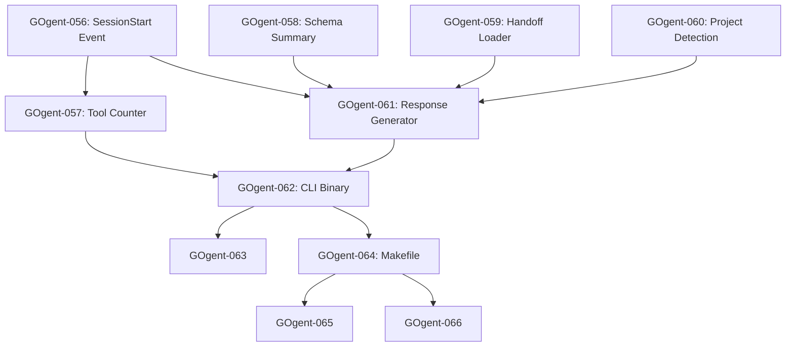

## GOgent-066: Hook Configuration Template

**Time**: 0.5 hours
**Dependencies**: GOgent-064
**Priority**: LOW

**Task**:
Create hook configuration example for Claude Code settings.

**File**: `docs/hook-configuration.md` (new file)

**Implementation**:
```markdown
# Hook Configuration

This document shows how to configure GOgent-Fortress hooks in Claude Code.

## Settings.json Configuration

Add to your Claude Code settings (`~/.claude/settings.json`):

```json
{
  "hooks": {
    "SessionStart": {
      "command": "gogent-load-context"
    },
    "PreToolUse": {
      "command": "gogent-validate"
    },
    "PostToolUse": {
      "command": "gogent-sharp-edge",
      "tools": ["Bash", "Edit", "Write"]
    },
    "SessionEnd": {
      "command": "gogent-archive"
    }
  }
}
```

## Environment Variables

| Variable | Description | Default |
|----------|-------------|---------|
| `GOGENT_PROJECT_DIR` | Override project directory | Current working directory |
| `CLAUDE_PROJECT_DIR` | Fallback project directory | Current working directory |
| `GOGENT_ROUTING_SCHEMA` | Path to routing-schema.json | `~/.claude/routing-schema.json` |
| `XDG_CACHE_HOME` | XDG cache directory | `~/.cache` |

## Verifying Installation

```bash
# Check binaries are installed
which gogent-load-context gogent-validate gogent-archive

# Test SessionStart hook manually
echo '{"type":"startup","session_id":"test","hook_event_name":"SessionStart"}' | gogent-load-context

# Expected output: JSON with hookSpecificOutput containing session context
```

## Troubleshooting

### Hook not executing
- Verify binary is in PATH: `which gogent-load-context`
- Check permissions: `ls -la $(which gogent-load-context)`
- Test manually with echo | pipe

### Missing routing schema
- Expected at: `~/.claude/routing-schema.json`
- Hook will warn but continue without routing summary

### Tool counter not created
- Check XDG_CACHE_HOME or ~/.cache/gogent/ permissions
- Non-fatal - session continues but attention-gate won't work
```

**Acceptance Criteria**:
- [ ] Configuration example is complete and accurate
- [ ] Environment variables documented
- [ ] Verification commands work
- [ ] Troubleshooting section covers common issues

**Why This Matters**: Configuration documentation enables users to integrate GOgent hooks with their Claude Code setup.

---

## Ticket Extraction Summary

| Ticket | Title | Time | Dependencies | Files |
|--------|-------|------|--------------|-------|
| GOgent-056 | SessionStart Event Struct & Parser | 1h | None | pkg/session/events.go |
| GOgent-057 | Tool Counter Initialization | 0.5h | GOgent-056 | pkg/config/paths.go |
| GOgent-058 | Routing Schema Summary Formatter | 1h | None | pkg/routing/schema.go |
| GOgent-059 | Handoff Document Loader | 1h | None | pkg/session/context_loader.go |
| GOgent-060 | Project Type Detection | 1.5h | None | pkg/session/project_detection.go |
| GOgent-061 | Session Context Response Generator | 1.5h | 056-060 | pkg/session/context_response.go |
| GOgent-062 | CLI Binary - Main Orchestrator | 1.5h | 056-061 | cmd/gogent-load-context/main.go |
| GOgent-063 | Integration Tests | 1h | 062 | test/integration/session_start_test.go |
| GOgent-064 | Makefile Updates | 0.5h | 062 | Makefile |
| GOgent-065 | Documentation Update | 1h | 064 | docs/systems-architecture-overview.md |
| GOgent-066 | Hook Configuration Template | 0.5h | 064 | docs/hook-configuration.md |

**Total Time**: ~11 hours
**Total Files**: 11 new/modified files
**Total Lines**: ~1800 (implementation + tests)

---

## Dependency Graph



---

## Implementation Order (Parallelizable)

**Phase 1 (Parallel)**:
- GOgent-056: SessionStart Event (no deps)
- GOgent-058: Schema Summary (no deps)
- GOgent-059: Handoff Loader (no deps)
- GOgent-060: Project Detection (no deps)

**Phase 2 (Serial)**:
- GOgent-057: Tool Counter (depends on 056)
- GOgent-061: Response Generator (depends on 056-060)

**Phase 3 (Serial)**:
- GOgent-062: CLI Binary (depends on 061)

**Phase 4 (Parallel)**:
- GOgent-063: Integration Tests (depends on 062)
- GOgent-064: Makefile (depends on 062)

**Phase 5 (Parallel)**:
- GOgent-065: Documentation (depends on 064)
- GOgent-066: Hook Configuration (depends on 064)

---

## CI/CD Integration Points

1. **Build Validation**: `make build-load-context` in CI pipeline
2. **Unit Tests**: `go test ./pkg/session/... ./pkg/config/... ./pkg/routing/...`
3. **Integration Tests**: `go test ./test/integration/...`
4. **Race Detection**: `go test -race ./...`
5. **Ecosystem Test**: `make test-ecosystem` (required before ticket completion)
6. **Coverage Gate**: 80% minimum on new files

---

## Completion Checklist

- [ ] All 11 tickets (GOgent-056 to 066) complete
- [ ] All functions have complete imports
- [ ] Error messages use `[component] What. Why. How.` format
- [ ] STDIN timeout implemented (5s)
- [ ] XDG-compliant paths (NO hardcoded /tmp)
- [ ] Tests cover positive, negative, edge cases
- [ ] Test coverage ≥80%
- [ ] All acceptance criteria filled
- [ ] CLI binary buildable and installable
- [ ] Integration tests pass
- [ ] Documentation updated
- [ ] Hook configuration documented
- [ ] `make test-ecosystem` passes
- [ ] No placeholders remain

---

**Previous**: [05-week2-sharp-edge-memory.md](05-week2-sharp-edge-memory.md)
**Next**: [07-week4-agent-workflow-hooks.md](07-week4-agent-workflow-hooks.md)

---

# PART B: Simulation Harness Integration (GOgent-067 to 070)

This section extends the core implementation with simulation harness integration for CI/CD testing via GitHub Actions.

---

## Simulation Architecture Overview

The existing simulation harness (`test/simulation/harness/`) provides 4 levels of testing:

| Level | Name | Trigger | Purpose |
|-------|------|---------|---------|
| L1 | Unit Invariants | Every push | Single-event deterministic tests |
| L2 | Session Replay | Every push | Multi-turn session sequences |
| L3 | Behavioral Properties | PRs | Cross-session invariants |
| L4 | Chaos Testing | Weekly | Concurrent agent stress tests |

**Integration Goal**: Add `sessionstart` category to the simulation harness, enabling automated testing of `gogent-load-context` in all 4 levels.

### Current Harness Categories

```
test/simulation/fixtures/deterministic/
├── pretooluse/       # gogent-validate scenarios
├── sessionend/       # gogent-archive scenarios
├── posttooluse/      # gogent-sharp-edge scenarios
└── sessionstart/     # NEW: gogent-load-context scenarios
```

### GitHub Actions Integration

The existing workflows already support extensibility:
- `.github/workflows/simulation.yml` - Deterministic + Fuzz
- `.github/workflows/simulation-behavioral.yml` - 4-level behavioral testing

We need to:
1. Add `sessionstart` category to runner
2. Create deterministic fixtures
3. Add `sessionstart` mode to harness CLI
4. Update workflows to build `gogent-load-context`

---
