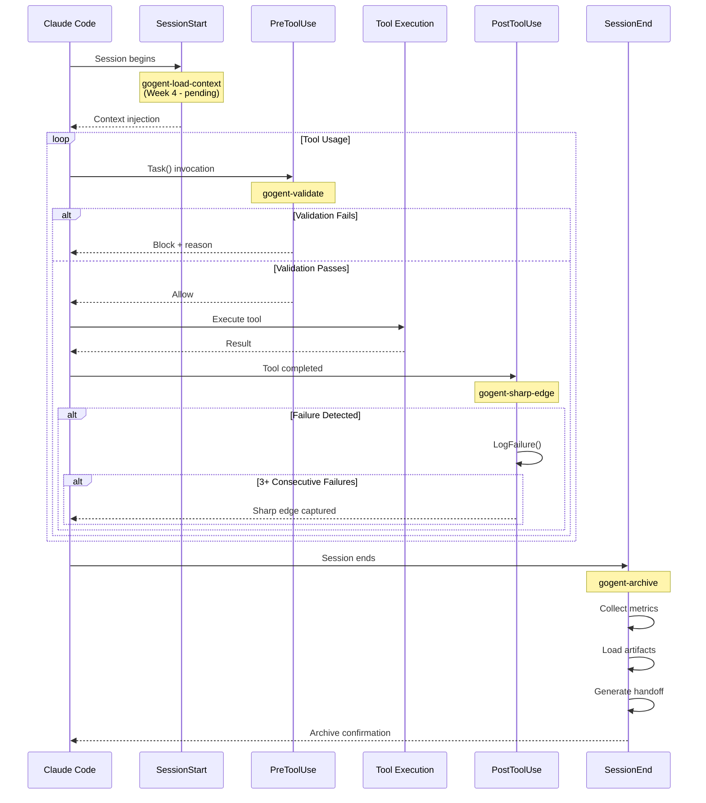
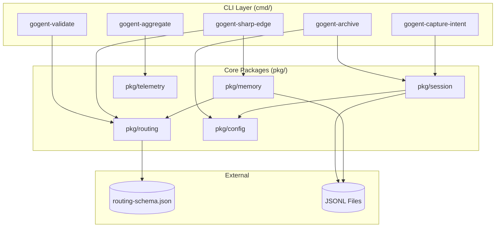
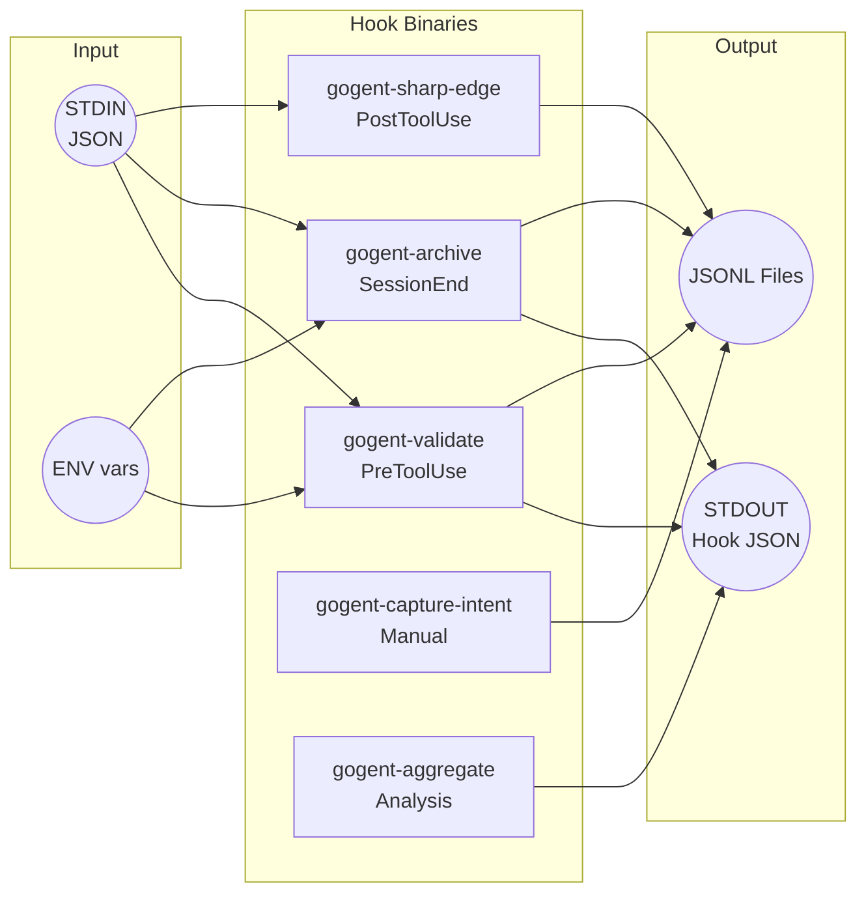
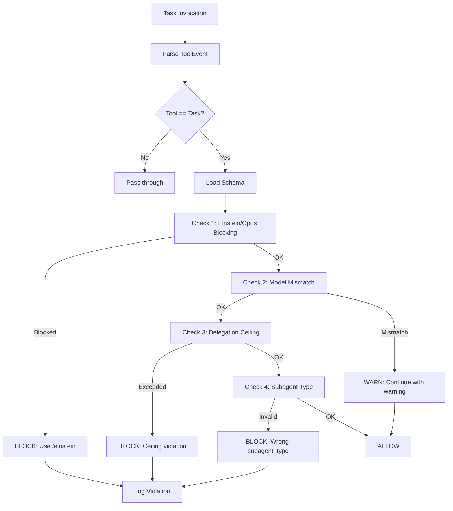
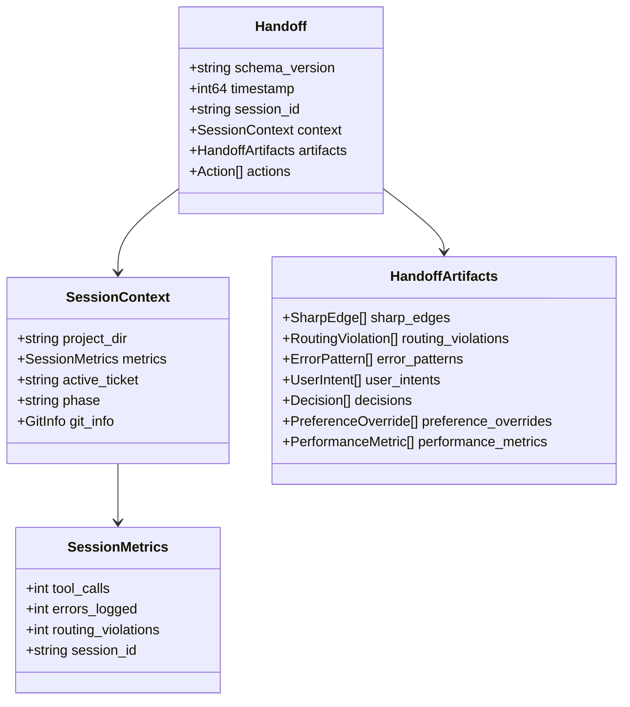

# GOgent-Fortress Systems Architecture

> **Schema Versions:** routing-schema v2.2.0 | handoff v1.2
> **Last Updated:** 2026-01-23
> **Status:** Implemented through Week 3 (session_archive suite)

---

## Overview

GOgent-Fortress is a Go-based hook orchestration framework for Claude Code. It enforces tiered routing policies, tracks debugging loops, captures user intents, and maintains session continuity through structured handoff documents.

The system intercepts Claude Code hook events (PreToolUse, PostToolUse, SessionStart, SessionEnd) and applies validation, failure tracking, and archival logic defined in `routing-schema.json`.

---

## 1. Hook Event Flow

The following diagram shows the complete lifecycle of a Claude Code session from the perspective of GOgent hooks.



### Hook Entry Points

| Hook Event | CLI Binary | When Fired |
|------------|------------|------------|
| SessionStart | `gogent-load-context` | Session startup/resume (pending) |
| PreToolUse | `gogent-validate` | Before any tool executes |
| PostToolUse | `gogent-sharp-edge` | After Bash/Edit/Write tools |
| SessionEnd | `gogent-archive` | Session termination |

---

## 2. Package Dependencies



### Package Responsibilities

| Package | Primary Responsibility | Key Types |
|---------|------------------------|-----------|
| `pkg/routing` | Schema loading, Task validation, violation logging | `Schema`, `ValidationOrchestrator`, `Violation` |
| `pkg/session` | Handoffs, events, metrics, intents, queries | `Handoff`, `SessionMetrics`, `UserIntent`, `Query` |
| `pkg/memory` | Failure tracking, debugging loop detection | `FailureInfo`, `LogFailure()`, `GetFailureCount()` |
| `pkg/telemetry` | Invocation tracking, cost calculation | `AgentInvocation`, `TierPricing`, `SessionCostSummary` |
| `pkg/config` | Path resolution, tier configuration | `GetGOgentDir()`, `GetViolationsLogPath()` |

---

## 3. Data Persistence Layer

All persistence uses JSONL (JSON Lines) format for append-only writes and streaming reads.

```mermaid
flowchart TB
    subgraph "Session Scope"
        violations[/violations.jsonl/]
        counter[/tool-counter.log/]
    end

    subgraph "Project Scope (.claude/memory/)"
        handoffs[/handoffs.jsonl/]
        intents[/user-intents.jsonl/]
        decisions[/decisions.jsonl/]
        prefs[/preferences.jsonl/]
        perf[/performance.jsonl/]
        pending[/pending-learnings.jsonl/]
    end

    subgraph "Global Scope (~/.gogent/)"
        failures[/failure-tracker.jsonl/]
    end

    subgraph "Archive (session-archive/)"
        archived[/learnings-{ts}.jsonl/]
        sessions[/session-{id}.jsonl/]
    end

    validate([gogent-validate]) --> violations
    sharpedge([gogent-sharp-edge]) --> failures
    sharpedge --> pending
    archive([gogent-archive]) --> handoffs
    archive --> archived
    intent([gogent-capture-intent]) --> intents
```

### File Reference

| File | Scope | Written By | Schema |
|------|-------|------------|--------|
| `handoffs.jsonl` | Project | gogent-archive | Handoff v1.2 |
| `user-intents.jsonl` | Project | gogent-capture-intent | UserIntent |
| `decisions.jsonl` | Project | gogent-archive | Decision |
| `preferences.jsonl` | Project | gogent-archive | PreferenceOverride |
| `performance.jsonl` | Project | gogent-archive | PerformanceMetric |
| `pending-learnings.jsonl` | Project | gogent-sharp-edge | SharpEdge |
| `failure-tracker.jsonl` | Global | gogent-sharp-edge | FailureInfo |
| `routing-violations.jsonl` | Temp | gogent-validate | Violation |

---

## 4. CLI Entry Points



### CLI Reference

| Binary | Hook Event | Input | Output | Lines |
|--------|------------|-------|--------|-------|
| `gogent-validate` | PreToolUse | ToolEvent JSON | ValidationResult JSON | ~142 |
| `gogent-archive` | SessionEnd | SessionEvent JSON | Confirmation JSON | ~1111 |
| `gogent-sharp-edge` | PostToolUse | ToolEvent JSON | (none) | ~200 |
| `gogent-capture-intent` | Manual | UserIntent JSON | (none) | ~150 |
| `gogent-aggregate` | Manual | (flags) | Summary JSON | ~100 |

### gogent-archive Subcommands

The archive CLI includes query subcommands for inspecting session history:

| Subcommand | Purpose |
|------------|---------|
| `list` | List sessions with filters (--since, --has-sharp-edges) |
| `show <id>` | Display specific session handoff |
| `stats` | Aggregate statistics across sessions |
| `sharp-edges` | Query sharp edges with filters |
| `user-intents` | Query user intents with filters |
| `decisions` | Query architectural decisions |
| `preferences` | Query preference overrides |
| `performance` | Query performance metrics |
| `weekly` | Generate weekly intent summary |

---

## 5. Validation Pipeline

The `gogent-validate` binary orchestrates multiple validation checks for Task tool invocations.



### Validation Checks

| Check | Blocking | Logged | Purpose |
|-------|----------|--------|---------|
| Einstein/Opus | Yes | Yes | Prevent Task(opus) - use /einstein instead |
| Model Mismatch | No | No | Warn if requested model differs from agents-index |
| Delegation Ceiling | Yes | Yes | Enforce max tier from calculate-complexity |
| Subagent Type | Yes | Yes | Ensure agent-subagent_type pairing matches schema |

---

## 6. Handoff Schema

The handoff document captures session state for cross-session continuity.



---

## 7. How to Extend

### Adding a New CLI

1. Create `cmd/gogent-<name>/main.go`
2. Implement STDIN parsing with timeout (see `pkg/routing/stdin.go`)
3. Output hook-compatible JSON to STDOUT
4. Add to `Makefile` build targets
5. Document in this file under "CLI Entry Points"

### Adding a New Package

1. Create `pkg/<name>/` with `doc.go`
2. Define types in dedicated files (one primary type per file)
3. Add `_test.go` files (target 80%+ coverage)
4. Update dependency diagram above
5. Document in "Package Responsibilities" table

### Adding a New Artifact Type

1. Define struct in `pkg/session/` (e.g., `handoff_artifacts.go`)
2. Add to `HandoffArtifacts` struct with `omitempty` tag
3. Update `LoadArtifacts()` in `pkg/session/handoff.go`
4. Add query method to `pkg/session/query.go`
5. Add CLI subcommand to `gogent-archive` if user-queryable
6. Update handoff schema version if breaking change

### Adding a New Validation Check

1. Create validator in `pkg/routing/` (e.g., `new_validation.go`)
2. Add check to `ValidationOrchestrator.ValidateTask()`
3. Define violation type constant
4. Add to violation logging
5. Update "Validation Checks" table above

---

## 8. Schema Version History

### routing-schema.json

| Version | Changes |
|---------|---------|
| 2.2.0 | Current - Added agent_subagent_mapping, blocked_patterns |
| 2.1.0 | Added delegation_ceiling, tier_levels |
| 2.0.0 | Complete restructure for tiered architecture |

### handoff (pkg/session)

| Version | Changes |
|---------|---------|
| 1.2 | Added SharpEdge extended fields (type, tool, code_snippet, status) |
| 1.1 | Added decisions, preference_overrides, performance_metrics |
| 1.0 | Initial schema with sharp_edges, routing_violations, error_patterns |

---

## 9. Quick Reference

### Environment Variables

| Variable | Purpose | Default |
|----------|---------|---------|
| `GOGENT_PROJECT_DIR` | Project root | `$PWD` |
| `GOGENT_ROUTING_SCHEMA` | Schema path override | `~/.claude/routing-schema.json` |
| `GOGENT_STORAGE_PATH` | Failure tracker path | `~/.gogent/failure-tracker.jsonl` |
| `GOGENT_MAX_FAILURES` | Debugging loop threshold | 3 |
| `GOGENT_FAILURE_WINDOW` | Failure window (seconds) | 300 |

### Key File Paths

```
Project/
├── .claude/
│   ├── memory/
│   │   ├── handoffs.jsonl        # Session history
│   │   ├── user-intents.jsonl    # User preferences
│   │   ├── decisions.jsonl       # Architectural decisions
│   │   ├── preferences.jsonl     # Preference overrides
│   │   ├── performance.jsonl     # Performance metrics
│   │   ├── pending-learnings.jsonl  # Unreviewed sharp edges
│   │   └── last-handoff.md       # Human-readable handoff
│   ├── tmp/
│   │   └── einstein-gap-*.md     # Escalation documents
│   └── session-archive/          # Archived session data
│
~/.gogent/
└── failure-tracker.jsonl         # Cross-session failure tracking

/tmp/
├── claude-routing-violations.jsonl  # Current session violations
└── claude-tool-counter-*.log        # Tool call counters
```

---

## 10. Related Documentation

| Document | Purpose |
|----------|---------|
| `CLAUDE.md` | Project-level Claude configuration |
| `~/.claude/CLAUDE.md` | Global Claude configuration with routing gates |
| `~/.claude/routing-schema.json` | Source of truth for tier definitions |
| `dev/will/migration_plan/tickets/` | Implementation tickets |

---

*This document is designed for incremental updates. When adding new components, update the relevant section and diagram rather than rewriting prose.*
