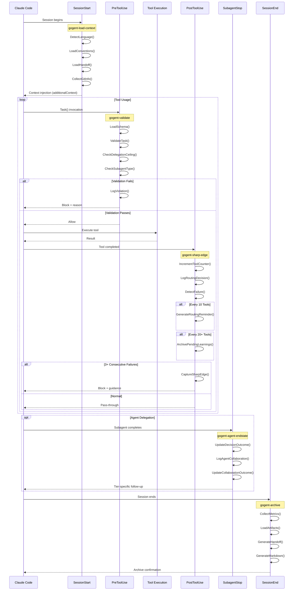
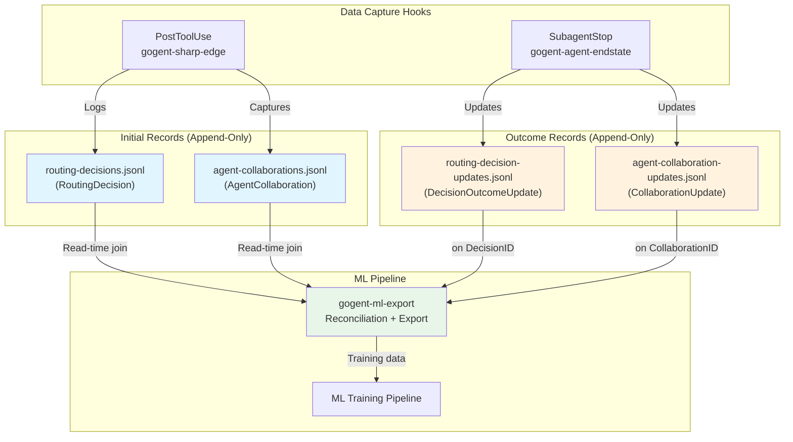
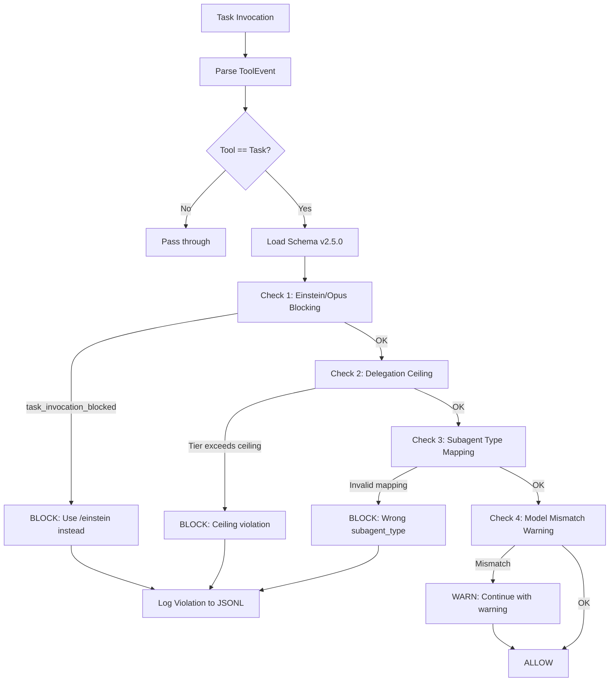
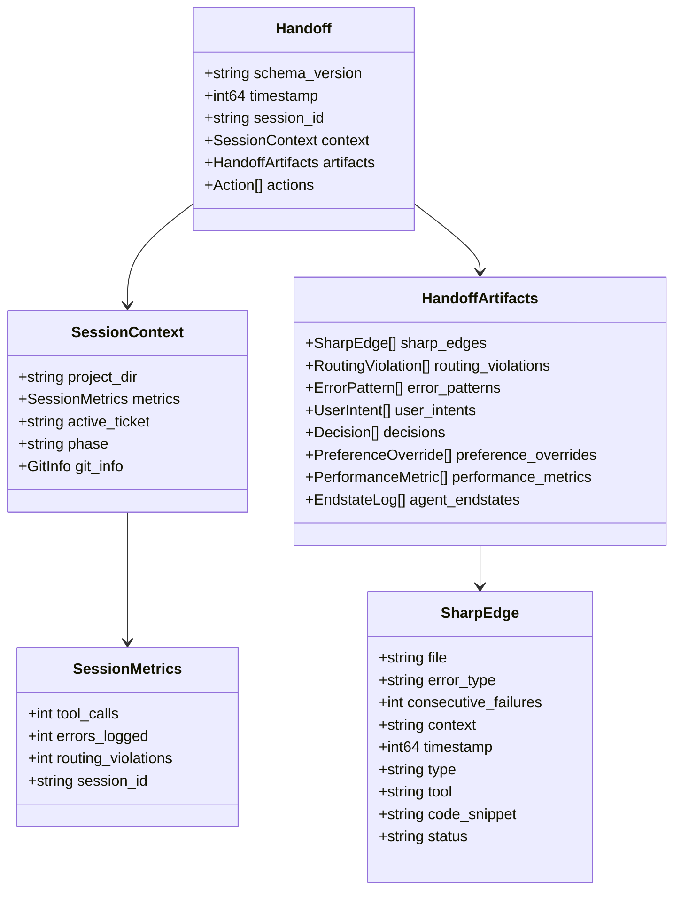

# GOgent-Fortress Systems Architecture v1.0

> **Schema Versions:** routing-schema v2.5.0 | handoff v1.3 | ML telemetry v1.1
> **Last Updated:** 2026-03-24
> **Status:** Production Ready - Complete Implementation (Hooks + Go TUI v2.0.0-rc1)

---

## Overview

GOgent-Fortress is a Go-based hook orchestration framework for Claude Code. It enforces tiered routing policies, tracks debugging loops, captures user intents, manages ML telemetry, and maintains session continuity through structured handoff documents.

The system intercepts Claude Code hook events (SessionStart, PreToolUse, PostToolUse, SubagentStop, SessionEnd) and applies validation, failure tracking, telemetry capture, and archival logic defined in `routing-schema.json`.

---

## 1. System Architecture Diagram

```
┌─────────────────────────────────────────────────────────────────────────────────────────────────────────────────────┐
│                                           GOgent-Fortress Architecture                                               │
│                                              (Production v1.0)                                                       │
├─────────────────────────────────────────────────────────────────────────────────────────────────────────────────────┤
│                                                                                                                      │
│  ┌──────────────────────────────────────────────────────────────────────────────────────────────────────────────┐   │
│  │                                    CLAUDE CODE CLI PROCESS                                                    │   │
│  │                                                                                                               │   │
│  │    ┌─────────────┐    ┌─────────────┐    ┌─────────────┐    ┌─────────────┐    ┌─────────────┐               │   │
│  │    │ SessionStart│───▶│ PreToolUse  │───▶│    Tool     │───▶│ PostToolUse │───▶│ SubagentStop│               │   │
│  │    │   Event     │    │   Event     │    │  Execution  │    │   Event     │    │   Event     │               │   │
│  │    └──────┬──────┘    └──────┬──────┘    └─────────────┘    └──────┬──────┘    └──────┬──────┘               │   │
│  │           │                  │                                     │                  │                       │   │
│  └───────────┼──────────────────┼─────────────────────────────────────┼──────────────────┼───────────────────────┘   │
│              │                  │                                     │                  │                           │
│              │ STDIN/JSON       │ STDIN/JSON                          │ STDIN/JSON       │ STDIN/JSON                │
│              ▼                  ▼                                     ▼                  ▼                           │
│  ┌─────────────────────────────────────────────────────────────────────────────────────────────────────────────┐    │
│  │                                           HOOK BINARIES (Go)                                                 │    │
│  │                                                                                                              │    │
│  │  ┌────────────────────┐  ┌────────────────────┐  ┌────────────────────┐  ┌────────────────────┐             │    │
│  │  │  gogent-load-      │  │   gogent-validate  │  │  gogent-sharp-edge │  │ gogent-agent-      │             │    │
│  │  │  context           │  │                    │  │                    │  │ endstate           │             │    │
│  │  │                    │  │                    │  │                    │  │                    │             │    │
│  │  │ • Language detect  │  │ • Schema validation│  │ • Tool counting    │  │ • Decision outcomes│             │    │
│  │  │ • Convention load  │  │ • Task() checks    │  │ • Failure tracking │  │ • Collab tracking  │             │    │
│  │  │ • Handoff restore  │  │ • Tier enforcement │  │ • ML telemetry     │  │ • ML updates       │             │    │
│  │  │ • Git context      │  │ • Ceiling check    │  │ • Sharp-edge cap   │  │ • Session metrics  │             │    │
│  │  └─────────┬──────────┘  └─────────┬──────────┘  └─────────┬──────────┘  └─────────┬──────────┘             │    │
│  │            │                       │                       │                       │                         │    │
│  └────────────┼───────────────────────┼───────────────────────┼───────────────────────┼─────────────────────────┘    │
│               │                       │                       │                       │                              │
│               ▼                       ▼                       ▼                       ▼                              │
│  ┌─────────────────────────────────────────────────────────────────────────────────────────────────────────────┐    │
│  │                                         GO PACKAGES (pkg/)                                                   │    │
│  │                                                                                                              │    │
│  │  ┌──────────────┐  ┌──────────────┐  ┌──────────────┐  ┌──────────────┐  ┌──────────────┐  ┌──────────────┐ │    │
│  │  │ pkg/routing  │  │ pkg/session  │  │  pkg/memory  │  │pkg/telemetry │  │  pkg/config  │  │ pkg/workflow │ │    │
│  │  │              │  │              │  │              │  │              │  │              │  │              │ │    │
│  │  │ •Schema      │  │ •Handoff     │  │ •Failure     │  │ •Invocations │  │ •Paths       │  │ •Responses   │ │    │
│  │  │ •Validation  │  │ •Events      │  │  Tracking    │  │ •Cost        │  │ •Tier        │  │ •Logging     │ │    │
│  │  │ •Violations  │  │ •Metrics     │  │ •Pattern     │  │ •Escalations │  │ •Environment │  │ •Integration │ │    │
│  │  │ •Orchestrator│  │ •Artifacts   │  │  Matching    │  │ •Scout       │  │              │  │              │ │    │
│  │  │ •Agents      │  │ •UserIntent  │  │ •Responses   │  │              │  │              │  │              │ │    │
│  │  └──────┬───────┘  └──────┬───────┘  └──────┬───────┘  └──────┬───────┘  └──────┬───────┘  └──────┬───────┘ │    │
│  │         │                 │                 │                 │                 │                 │          │    │
│  └─────────┼─────────────────┼─────────────────┼─────────────────┼─────────────────┼─────────────────┼──────────┘    │
│            │                 │                 │                 │                 │                 │               │
│            └────────────────┬┴────────────────┬┴────────────────┬┴────────────────┬┴─────────────────┘               │
│                             │                 │                 │                                                    │
│                             ▼                 ▼                 ▼                                                    │
│  ┌─────────────────────────────────────────────────────────────────────────────────────────────────────────────┐    │
│  │                                        DATA PERSISTENCE LAYER                                                │    │
│  │                                                                                                              │    │
│  │  ┌────────────────────────────────┐  ┌────────────────────────────────┐  ┌────────────────────────────────┐ │    │
│  │  │     SESSION SCOPE (/tmp/)      │  │   PROJECT SCOPE (.claude/)    │  │   ML SCOPE (XDG_DATA_HOME/)    │ │    │
│  │  │                                │  │                                │  │                                │ │    │
│  │  │ • routing-violations.jsonl     │  │ • memory/handoffs.jsonl       │  │ • routing-decisions.jsonl     │ │    │
│  │  │ • tool-counter-{id}.log        │  │ • memory/user-intents.jsonl   │  │ • routing-decision-updates    │ │    │
│  │  │ • error-patterns.jsonl         │  │ • memory/decisions.jsonl      │  │   .jsonl                      │ │    │
│  │  │                                │  │ • memory/pending-learnings    │  │ • agent-collaborations.jsonl  │ │    │
│  │  │                                │  │   .jsonl                      │  │ • agent-collaboration-updates │ │    │
│  │  │                                │  │ • memory/last-handoff.md      │  │   .jsonl                      │ │    │
│  │  │                                │  │ • session-archive/            │  │                                │ │    │
│  │  └────────────────────────────────┘  └────────────────────────────────┘  └────────────────────────────────┘ │    │
│  │                                                                                                              │    │
│  │  ┌────────────────────────────────┐                                                                          │    │
│  │  │     GLOBAL SCOPE (~/.gogent/)  │  ┌────────────────────────────────────────────────────────────────────┐ │    │
│  │  │                                │  │                  CONFIGURATION (~/.claude/)                        │ │    │
│  │  │ • failure-tracker.jsonl        │  │                                                                    │ │    │
│  │  │ • agent-invocations.jsonl      │  │  • routing-schema.json (v2.5.0)    • agents/*.yaml                │ │    │
│  │  │ • escalations.jsonl            │  │  • conventions/*.md                 • skills/*/SKILL.md           │ │    │
│  │  │ • scout-recommendations.jsonl  │  │  • CLAUDE.md                        • rules/*.md                   │ │    │
│  │  │                                │  │                                                                    │ │    │
│  │  └────────────────────────────────┘  └────────────────────────────────────────────────────────────────────┘ │    │
│  │                                                                                                              │    │
│  └──────────────────────────────────────────────────────────────────────────────────────────────────────────────┘    │
│                                                                                                                      │
│                                                                                                                      │
├──────────────────────────────────────────────────────────────────────────────────────────────────────────────────────┤
│                                                                                                                      │
│  ┌──────────────────────────────────────────────────────────────────────────────────────────────────────────────┐   │
│  │                                                                                                               │   │
│  │                                    🖥️  TUI ENDPOINT (Future Integration)                                      │   │
│  │                                                                                                               │   │
│  │  ┌─────────────────────────────────────────────────────────────────────────────────────────────────────────┐ │   │
│  │  │                                           Available Data Streams                                         │ │   │
│  │  ├─────────────────────────────────────────────────────────────────────────────────────────────────────────┤ │   │
│  │  │                                                                                                          │ │   │
│  │  │   📊 Real-Time Metrics              📈 Session Analytics            🎯 Routing Intelligence              │ │   │
│  │  │   ─────────────────────             ──────────────────────          ────────────────────────              │ │   │
│  │  │   • Tool counter (live)             • Total tool calls              • Agent usage patterns               │ │   │
│  │  │   • Current tier                    • Error rate                    • Tier distribution                  │ │   │
│  │  │   • Active agent                    • Session duration              • Scout accuracy                     │ │   │
│  │  │   • Token consumption               • Cost accumulation             • Escalation frequency               │ │   │
│  │  │                                                                                                          │ │   │
│  │  │   🔴 Failure Tracking               📋 Handoff State                💡 ML Telemetry                      │ │   │
│  │  │   ────────────────────              ─────────────────               ─────────────────                     │ │   │
│  │  │   • Consecutive failures            • Sharp edges pending           • Routing decisions/s               │ │   │
│  │  │   • Sharp-edge captures             • Last handoff summary          • Decision outcomes                  │ │   │
│  │  │   • Debug loop detection            • Actions queue                 • Collaboration chains               │ │   │
│  │  │   • Pattern matching                • Git dirty status              • Confidence metrics                 │ │   │
│  │  │                                                                                                          │ │   │
│  │  │   ⚠️ Violations & Blocks           🔄 Agent Lifecycle               📉 Cost Tracking                     │ │   │
│  │  │   ─────────────────────             ──────────────────              ─────────────────                     │ │   │
│  │  │   • Routing violations              • Spawned agents                • Cost by tier                       │ │   │
│  │  │   • Ceiling breaches                • Active subagents              • Cost by agent                      │ │   │
│  │  │   • Blocked Task() calls            • Delegation chains             • Token efficiency                   │ │   │
│  │  │   • Subagent mismatches             • Endstate captures             • Projected session cost             │ │   │
│  │  │                                                                                                          │ │   │
│  │  └─────────────────────────────────────────────────────────────────────────────────────────────────────────┘ │   │
│  │                                                                                                               │   │
│  │  ┌─────────────────────────────────────────────────────────────────────────────────────────────────────────┐ │   │
│  │  │                                        Data Access Methods                                               │ │   │
│  │  ├─────────────────────────────────────────────────────────────────────────────────────────────────────────┤ │   │
│  │  │                                                                                                          │ │   │
│  │  │   File Watchers (JSONL tailing)          CLI Queries                    Programmatic API                 │ │   │
│  │  │   ─────────────────────────────          ───────────────                ─────────────────                 │ │   │
│  │  │   • tail -f routing-decisions.jsonl     • gogent-archive stats         • pkg/telemetry.Load*()          │ │   │
│  │  │   • inotify on handoffs.jsonl           • gogent-archive sharp-edges   • pkg/session.Query*()           │ │   │
│  │  │   • fsnotify for Go integration         • gogent-ml-export stats       • pkg/routing.LoadSchema()       │ │   │
│  │  │                                         • gogent-aggregate             • pkg/memory.GetFailureCount()   │ │   │
│  │  │                                                                                                          │ │   │
│  │  └─────────────────────────────────────────────────────────────────────────────────────────────────────────┘ │   │
│  │                                                                                                               │   │
│  └──────────────────────────────────────────────────────────────────────────────────────────────────────────────┘   │
│                                                                                                                      │
└──────────────────────────────────────────────────────────────────────────────────────────────────────────────────────┘
```

---

## 2. Hook Event Flow

The following sequence diagram shows the complete lifecycle of a Claude Code session from the perspective of GOgent hooks.



### 2.1 Hook Entry Points

| Hook Event | CLI Binary | Primary Responsibilities | Trigger |
|------------|------------|--------------------------|---------|
| SessionStart | `gogent-load-context` | Language detection, convention loading, handoff restoration, git context | Session initialization |
| PreToolUse | `gogent-validate` | Schema validation, Task() checks, tier enforcement, ceiling verification | Every tool call |
| PostToolUse | `gogent-sharp-edge` | Tool counting, failure tracking, ML telemetry, sharp-edge detection, routing reminders | After tool execution |
| SubagentStop | `gogent-agent-endstate` | Decision outcomes, collaboration tracking, ML updates, session metrics | Agent completion |
| SessionEnd | `gogent-archive` | Metrics collection, artifact loading, handoff generation, markdown export | Session termination |

### 2.2 PostToolUse Handler: Merged Responsibilities

The `gogent-sharp-edge` PostToolUse handler consolidates five integrated responsibilities:

#### 1. Tool Counter Management
- **Trigger**: Every tool execution (Bash, Edit, Write, Read, Glob, Grep)
- **Action**: Increments persistent counter in `/tmp/claude-tool-counter-{session_id}.log`
- **Purpose**: Track tool usage frequency for routing reminders and auto-flush

#### 2. Routing Compliance Reminders
- **Trigger**: Every 10 tools (configurable via `GOGENT_REMINDER_THRESHOLD`)
- **Action**: Generates structured reminder injected into `additionalContext`
- **Content**: Reminds agent to verify routing compliance with `routing-schema.json`

#### 3. Pending Learnings Auto-Flush
- **Trigger**: Every 20+ tools (configurable via `GOGENT_FLUSH_THRESHOLD`)
- **Action**: Archives `pending-learnings.jsonl` to `session-archive/`
- **Purpose**: Prevent unbounded growth of pending learnings file

#### 4. ML Tool Event Logging (GOgent-087d)
- **Trigger**: Every tool execution
- **Action**: Logs RoutingDecision to `routing-decisions.jsonl`
- **Fields**: Tool name, duration, input/output tokens, sequence index, model, tier
- **Thread Safety**: Append-only pattern with dual-file reconciliation

#### 5. Sharp-Edge Detection
- **Trigger**: 3+ consecutive failures on same file/error type
- **Action**: Captures learning to `pending-learnings.jsonl`, blocks execution
- **Response**: Returns blocking guidance with pattern matching from `sharp-edges.yaml`

---

## 3. Package Architecture

```mermaid
graph TD
    subgraph "CLI Layer (cmd/)"
        loadcontext[gogent-load-context<br/>SessionStart]
        validate[gogent-validate<br/>PreToolUse]
        sharpedge[gogent-sharp-edge<br/>PostToolUse]
        endstate[gogent-agent-endstate<br/>SubagentStop]
        archive[gogent-archive<br/>SessionEnd]
        intent[gogent-capture-intent<br/>Manual]
        aggregate[gogent-aggregate<br/>Analysis]
        mlexport[gogent-ml-export<br/>ML Pipeline]
        orchguard[gogent-orchestrator-guard<br/>Enforcement]
        doctheater[gogent-doc-theater<br/>Detection]
    end

    subgraph "Core Packages (pkg/)"
        routing[pkg/routing<br/>Schema · Validation · Violations]
        session[pkg/session<br/>Handoff · Events · Metrics · Intents]
        memory[pkg/memory<br/>Failure Tracking · Patterns · Responses]
        telemetry[pkg/telemetry<br/>Invocations · Cost · Escalations · Scout]
        config[pkg/config<br/>Paths · Tier · Environment]
        workflow[pkg/workflow<br/>Responses · Logging · Integration]
        enforcement[pkg/enforcement<br/>Blocking · Patterns · DocTheater]
    end

    subgraph "External Dependencies"
        schema[(routing-schema.json)]
        jsonl[(JSONL Files)]
        conventions[(conventions/*.md)]
    end

    %% CLI to Package mappings
    loadcontext --> session
    loadcontext --> routing
    loadcontext --> config

    validate --> routing
    validate --> config

    sharpedge --> memory
    sharpedge --> routing
    sharpedge --> telemetry
    sharpedge --> session

    endstate --> telemetry
    endstate --> session
    endstate --> config

    archive --> session
    archive --> config
    archive --> telemetry

    intent --> session

    aggregate --> telemetry
    aggregate --> session

    mlexport --> telemetry
    mlexport --> config

    orchguard --> enforcement
    orchguard --> routing

    doctheater --> enforcement
    doctheater --> routing

    %% Package to Data mappings
    routing --> schema
    session --> jsonl
    memory --> jsonl
    telemetry --> jsonl
    config --> conventions
```



### 3.1 Package Responsibilities

| Package | Primary Responsibility | Key Types |
|---------|------------------------|-----------|
| `pkg/routing` | Schema loading, Task validation, violation logging, tier management | `Schema`, `TierConfig`, `Violation`, `AgentSubagentMapping` |
| `pkg/session` | Handoffs, events, metrics, intents, artifact loading, markdown export | `Handoff`, `SessionMetrics`, `UserIntent`, `SharpEdge`, `Action` |
| `pkg/memory` | Failure tracking, debugging loop detection, pattern matching | `FailureInfo`, `LogFailure()`, `GetFailureCount()`, `PatternMatch` |
| `pkg/telemetry` | Invocation tracking, cost calculation, escalations, scout recommendations | `AgentInvocation`, `TierPricing`, `EscalationEvent`, `ScoutRecommendation` |
| `pkg/config` | Path resolution, tier configuration, environment detection | `GetGOgentDir()`, `GetViolationsLogPath()`, `GetCurrentTier()` |
| `pkg/workflow` | Response formatting, logging utilities, integration helpers | `HookResponse`, `BlockResponse`, `PassthroughResponse` |
| `pkg/enforcement` | Blocking responses, pattern detection, documentation theater checks | `BlockingResponse`, `PatternDetector`, `DocTheater` |

---

## 4. ML Telemetry System

The ML telemetry system provides comprehensive observability for routing optimization and agent collaboration learning. All writes use append-only JSONL pattern for thread-safe concurrent execution.

### 4.1 Architecture Overview



### 4.2 Append-Only Pattern (Thread Safety)

The original design used O(n) file rewrites to update decision outcomes, causing race conditions under concurrent agent execution. The current design uses append-only writes with read-time reconciliation:

**Initial Records** (written immediately):
```jsonl
{"decision_id": "d1", "timestamp": 1704067200, "task_id": "t1", "classified_as": "routing", "selected_agent": "python-pro", ...}
{"decision_id": "d2", "timestamp": 1704067205, "task_id": "t2", "classified_as": "planning", "selected_agent": "architect", ...}
```

**Outcome Records** (appended on completion - no file rewrites):
```jsonl
{"decision_id": "d1", "outcome_success": true, "outcome_duration_ms": 150, "outcome_cost": 0.045, "update_timestamp": 1704067350}
{"decision_id": "d2", "outcome_success": false, "outcome_escalation": true, "update_timestamp": 1704067410}
```

**ML Export Reconciliation:**
```go
// Read both files
decisions := readJSONL("routing-decisions.jsonl")
updates := readJSONL("routing-decision-updates.jsonl")

// Join and apply latest update per decision
for _, update := range updates {
    if dec, ok := decisions[update.DecisionID]; ok {
        dec.Outcome = update  // Apply latest
    }
}

// Export enriched training data
exportTrainingData(decisions)
```

**Benefits:**
- Thread-safe: Append-only writes never overwrite existing data
- Atomic: Each record is complete upon write
- Fast: Single-pass appends, no file rewrites
- Recoverable: Partial writes don't corrupt existing data

### 4.3 Telemetry Data Types

#### RoutingDecision (pkg/telemetry)
```go
type RoutingDecision struct {
    DecisionID      string   // UUID for join operations
    SessionID       string   // Cross-session aggregation
    Timestamp       int64    // Unix timestamp
    TaskID          string   // Link to original task
    ClassifiedAs    string   // Task type classification
    SelectedAgent   string   // Which agent was routed to
    SelectedTier    string   // "haiku", "sonnet", "opus"
    InputTokens     int      // From PostToolEvent extension
    OutputTokens    int      // Currently zero-valued
    DurationMs      int64    // Calculated from timestamps
    SequenceIndex   int      // Position in session sequence
    Model           string   // Model used
}
```

#### Task Classification Categories
- **routing**: Tier selection, model validation, schema checks
- **planning**: Architecture, design, multi-file coordination
- **implementation**: Code generation, bug fixes, refactoring
- **research**: Library docs, best practices, external APIs
- **review**: Code review, feedback, analysis
- **testing**: Unit tests, integration tests, verification
- **documentation**: README, guides, API docs
- **observability**: Logging, metrics, telemetry

#### AgentCollaboration (pkg/telemetry)
```go
type AgentCollaboration struct {
    CollaborationID    string    // UUID for join operations
    SessionID          string    // Cross-session aggregation
    Timestamp          int64     // Unix timestamp
    PrimaryAgent       string    // Entry-point agent
    DelegatedAgents    []string  // Secondary agents spawned
    AgentCount         int       // Total agents in collaboration
    CollaborationType  string    // "sequential", "parallel", "fallback"
    SequenceIndex      int       // Position in session sequence
}
```

### 4.4 ML Export CLI

```bash
# Export routing decisions with reconciled outcomes
gogent-ml-export routing-decisions --output=decisions.jsonl [--since=YYYY-MM-DD]

# Export agent collaborations with outcomes
gogent-ml-export agent-collaborations --output=collabs.jsonl

# Export with automatic pruning after export
gogent-ml-export routing-decisions --output=decisions.jsonl --prune-after-export

# Validate reconciliation consistency
gogent-ml-export validate --check=orphaned-updates --check=missing-outcomes

# Generate summary statistics
gogent-ml-export stats
```

---

## 5. Data Persistence Layer

All persistence uses JSONL (JSON Lines) format for append-only writes and streaming reads.

```mermaid
flowchart TB
    subgraph "Session Scope (/tmp/)"
        violations[/routing-violations.jsonl/]
        counter[/tool-counter-{id}.log/]
        patterns[/error-patterns.jsonl/]
    end

    subgraph "Project Scope (.claude/memory/)"
        handoffs[/handoffs.jsonl/]
        intents[/user-intents.jsonl/]
        decisions[/decisions.jsonl/]
        prefs[/preferences.jsonl/]
        pending[/pending-learnings.jsonl/]
        lasthandoff[/last-handoff.md/]
    end

    subgraph "ML Scope ($XDG_DATA_HOME/gogent/)"
        routingdec[/routing-decisions.jsonl/]
        routingupdates[/routing-decision-updates.jsonl/]
        collaborations[/agent-collaborations.jsonl/]
        collabupd[/agent-collaboration-updates.jsonl/]
    end

    subgraph "Global Scope (~/.gogent/)"
        failures[/failure-tracker.jsonl/]
        invocations[/agent-invocations.jsonl/]
        escalations[/escalations.jsonl/]
        scoutrecs[/scout-recommendations.jsonl/]
    end

    subgraph "Archive (session-archive/)"
        archived[/learnings-{ts}.jsonl/]
        sessions[/session-{id}.jsonl/]
    end

    validate([gogent-validate]) --> violations
    sharpedge([gogent-sharp-edge]) --> failures
    sharpedge --> pending
    sharpedge --> routingdec
    endstate([gogent-agent-endstate]) --> routingupdates
    endstate --> collaborations
    endstate --> collabupd
    archive([gogent-archive]) --> handoffs
    archive --> lasthandoff
    archive --> archived
    intent([gogent-capture-intent]) --> intents
    mlexport([gogent-ml-export]) -.->|reads| routingdec
    mlexport -.->|reads| routingupdates
```

### 5.1 File Reference

| File | Scope | Written By | Schema | Purpose |
|------|-------|------------|--------|---------|
| `handoffs.jsonl` | Project | gogent-archive | Handoff v1.3 | Session continuity |
| `user-intents.jsonl` | Project | gogent-capture-intent | UserIntent | User preference tracking |
| `decisions.jsonl` | Project | gogent-archive | Decision | Architectural decisions |
| `preferences.jsonl` | Project | gogent-archive | PreferenceOverride | User overrides |
| `pending-learnings.jsonl` | Project | gogent-sharp-edge | SharpEdge | Unreviewed learnings |
| `last-handoff.md` | Project | gogent-archive | Markdown | Human-readable summary |
| `failure-tracker.jsonl` | Global | gogent-sharp-edge | FailureInfo | Cross-session tracking |
| `agent-invocations.jsonl` | Global | gogent-* | AgentInvocation | Invocation telemetry |
| `escalations.jsonl` | Global | gogent-agent-endstate | EscalationEvent | Tier escalation tracking |
| `scout-recommendations.jsonl` | Global | gogent-validate | ScoutRecommendation | Scout accuracy |
| `routing-violations.jsonl` | Temp | gogent-validate | Violation | Session violations |
| `routing-decisions.jsonl` | ML | gogent-sharp-edge | RoutingDecision | ML training data |
| `routing-decision-updates.jsonl` | ML | gogent-agent-endstate | DecisionOutcome | Outcome updates |
| `agent-collaborations.jsonl` | ML | gogent-agent-endstate | AgentCollaboration | Team patterns |
| `agent-collaboration-updates.jsonl` | ML | gogent-agent-endstate | CollabOutcome | Outcome updates |

---

## 6. Validation Pipeline

The `gogent-validate` binary orchestrates multiple validation checks for Task tool invocations.



### 6.1 Validation Checks

| Check | Blocking | Logged | Purpose |
|-------|----------|--------|---------|
| Einstein/Opus | Yes | Yes | Prevent Task(opus) - use /einstein instead |
| Delegation Ceiling | Yes | Yes | Enforce max tier from calculate-complexity |
| Subagent Type | Yes | Yes | Ensure agent-subagent_type pairing matches schema |
| Model Mismatch | No | No | Warn if requested model differs from agents-index |

### 6.2 Agent-Subagent Mapping (routing-schema v2.5.0)

| Agent | Required subagent_type | Rationale |
|-------|------------------------|-----------|
| codebase-search | Explore | Read-only reconnaissance |
| haiku-scout | Explore | Scope assessment |
| code-reviewer | Explore | Non-destructive analysis |
| librarian | Explore | Research tasks |
| tech-docs-writer | general-purpose | Write permissions for docs |
| scaffolder | general-purpose | Create new files |
| python-pro | general-purpose | Implementation work |
| go-pro | general-purpose | Implementation work |
| orchestrator | Plan | Planning mode coordination |
| architect | Plan | Design and planning |

---

## 7. Cost Tracking & Tier Pricing

The system tracks costs per tier using pricing from `routing-schema.json`:

| Tier | Model | Cost/1K Tokens | Thinking Budget | Use Cases |
|------|-------|----------------|-----------------|-----------|
| haiku | haiku | $0.0005 | 0 | File search, counting, formatting |
| haiku_thinking | haiku | $0.001 | 6K | Scaffolding, documentation, review |
| sonnet | sonnet | $0.009 | 16K | Implementation, refactoring, debugging |
| opus | opus | $0.045 | 32K | Deep analysis (via /einstein only) |
| external | gemini-2.0 | $0.0001 | 0 | Large context (1M+ tokens) |

### 7.1 Cost Calculation

```go
// From pkg/telemetry/cost.go
func CalculateInvocationCost(inv AgentInvocation, pricing TierPricing) InvocationCost {
    totalTokens := inv.InputTokens + inv.OutputTokens + inv.ThinkingTokens
    rate := pricing.GetTierCostRate(inv.Tier)
    cost := float64(totalTokens) * rate / 1000.0

    return InvocationCost{
        Agent:       inv.Agent,
        Tier:        inv.Tier,
        TotalTokens: totalTokens,
        TotalCost:   cost,
    }
}
```

### 7.2 Session Cost Summary

```go
type SessionCostSummary struct {
    SessionID       string                      `json:"session_id"`
    TotalCost       float64                     `json:"total_cost"`
    TotalTokens     int                         `json:"total_tokens"`
    InvocationCount int                         `json:"invocation_count"`
    ByAgent         map[string]*AgentCostSummary `json:"by_agent"`
    ByTier          map[string]*TierCostSummary  `json:"by_tier"`
}
```

---

## 8. Handoff Schema v1.3

The handoff document captures session state for cross-session continuity.



### 8.1 Schema Version History

| Version | Changes |
|---------|---------|
| 1.3 | Added AgentEndstates field for SubagentStop tracking |
| 1.2 | Extended SharpEdge with type, tool, code_snippet, status |
| 1.1 | Added decisions, preference_overrides, performance_metrics |
| 1.0 | Initial schema with sharp_edges, routing_violations, error_patterns |

---

## 9. CLI Reference

### 9.1 Hook Binaries

| Binary | Hook Event | Input | Output | Lines |
|--------|------------|-------|--------|-------|
| `gogent-load-context` | SessionStart | SessionStartEvent JSON | ContextInjection JSON | ~350 |
| `gogent-validate` | PreToolUse | ToolEvent JSON | ValidationResult JSON | ~200 |
| `gogent-sharp-edge` | PostToolUse | ToolEvent JSON | HookResponse JSON | ~500 |
| `gogent-agent-endstate` | SubagentStop | SubagentEvent JSON | HookResponse JSON | ~400 |
| `gogent-archive` | SessionEnd | SessionEvent JSON | Confirmation JSON | ~1200 |

### 9.2 Utility Binaries

| Binary | Purpose | Subcommands |
|--------|---------|-------------|
| `gogent-capture-intent` | Manual user intent logging | (stdin) |
| `gogent-aggregate` | Session statistics | (flags) |
| `gogent-ml-export` | ML training data export | routing-decisions, agent-collaborations, validate, stats |
| `gogent-orchestrator-guard` | Completion enforcement | (integration) |
| `gogent-doc-theater` | Documentation theater detection | (integration) |

### 9.3 Archive Query Subcommands

```bash
gogent-archive list [--since=DATE] [--has-sharp-edges]
gogent-archive show <session_id>
gogent-archive stats
gogent-archive sharp-edges [--file=PATTERN] [--status=pending]
gogent-archive user-intents [--category=CATEGORY]
gogent-archive decisions [--since=DATE]
gogent-archive preferences
gogent-archive performance
gogent-archive weekly
```

---

## 10. Testing Infrastructure

### 10.1 Test Fixtures

**Location:** `test/simulation/fixtures/deterministic/`

| Hook | Fixtures | Purpose |
|------|----------|---------|
| SessionStart | 10 | Language detection, handoff loading, git context |
| PreToolUse | 8 | Validation, blocking, ceiling checks |
| PostToolUse | 6 | Tool counting, failure tracking, ML logging |
| SubagentStop | 5 | Outcome updates, collaboration tracking |

### 10.2 Coverage Metrics

| Package | Coverage | Key Functions |
|---------|----------|---------------|
| `pkg/routing` | ~88% | LoadSchema, ValidateTask, LogViolation |
| `pkg/session` | ~85% | GenerateHandoff, LoadArtifacts, DetectLanguage |
| `pkg/memory` | ~82% | LogFailure, GetFailureCount, PatternMatch |
| `pkg/telemetry` | ~80% | LogInvocation, CalculateCost, ClusterByAgent |
| `pkg/config` | ~90% | GetGOgentDir, GetCurrentTier |

### 10.3 CI/CD Workflows

```yaml
# Primary workflows
sessionstart.yml:      # SessionStart hook tests
pretooluse.yml:        # PreToolUse validation tests
posttooluse.yml:       # PostToolUse handler tests
subagent.yml:          # SubagentStop integration tests
ml-telemetry.yml:      # ML pipeline validation

# Integration
simulation.yml:        # Full simulation harness
benchmark.yml:         # Performance regression
coverage.yml:          # Coverage reporting
```

---

## 11. Environment Variables

| Variable | Purpose | Default |
|----------|---------|---------|
| `GOGENT_PROJECT_DIR` | Project root override | `$PWD` |
| `GOGENT_ROUTING_SCHEMA` | Schema path override | `~/.claude/routing-schema.json` |
| `GOGENT_STORAGE_PATH` | Failure tracker path | `~/.gogent/failure-tracker.jsonl` |
| `GOGENT_MAX_FAILURES` | Debugging loop threshold | 3 |
| `GOGENT_FAILURE_WINDOW` | Failure window (seconds) | 300 |
| `GOGENT_REMINDER_THRESHOLD` | Routing reminder frequency | 10 |
| `GOGENT_FLUSH_THRESHOLD` | Auto-flush threshold | 20 |
| `XDG_DATA_HOME` | ML telemetry base path | `~/.local/share` |

---

## 12. Key File Paths

```
Project/
├── .claude/
│   ├── memory/
│   │   ├── handoffs.jsonl           # Session history
│   │   ├── user-intents.jsonl       # User preferences
│   │   ├── decisions.jsonl          # Architectural decisions
│   │   ├── preferences.jsonl        # Preference overrides
│   │   ├── pending-learnings.jsonl  # Unreviewed sharp edges
│   │   └── last-handoff.md          # Human-readable handoff
│   ├── tmp/
│   │   └── einstein-gap-*.md        # Escalation documents
│   └── session-archive/             # Archived session data
│
~/.gogent/
├── failure-tracker.jsonl            # Cross-session failures
├── agent-invocations.jsonl          # Invocation telemetry
├── escalations.jsonl                # Tier escalations
└── scout-recommendations.jsonl      # Scout accuracy data
│
$XDG_DATA_HOME/gogent/
├── routing-decisions.jsonl          # ML training (initial)
├── routing-decision-updates.jsonl   # ML training (outcomes)
├── agent-collaborations.jsonl       # Team patterns (initial)
└── agent-collaboration-updates.jsonl # Team patterns (outcomes)
│
/tmp/
├── claude-routing-violations.jsonl  # Current session violations
├── claude-tool-counter-*.log        # Tool call counters
└── claude-error-patterns.jsonl      # Session error patterns
│
~/.claude/
├── routing-schema.json              # v2.5.0 - Source of truth
├── CLAUDE.md                        # Global configuration
├── conventions/                     # Language conventions
│   ├── python.md
│   ├── go.md
│   └── R.md
├── agents/                          # Agent definitions
│   └── */agent.yaml
├── skills/                          # Skill definitions
│   └── */SKILL.md
└── rules/                           # Behavioral rules
    ├── LLM-guidelines.md
    └── agent-behavior.md
```

---

## 13. How to Extend

### 13.1 Adding a New CLI

1. Create `cmd/gogent-<name>/main.go`
2. Implement STDIN parsing with timeout (see `pkg/routing/stdin.go`)
3. Output hook-compatible JSON to STDOUT
4. Add to `Makefile` build targets
5. Document in CLI Reference section

### 13.2 Adding a New Package

1. Create `pkg/<name>/` with `doc.go`
2. Define types in dedicated files (one primary type per file)
3. Add `_test.go` files (target 80%+ coverage)
4. Update Package Architecture diagram
5. Document in Package Responsibilities table

### 13.3 Adding a New Artifact Type

1. Define struct in `pkg/session/handoff_artifacts.go`
2. Add to `HandoffArtifacts` struct with `omitempty` tag
3. Update `LoadArtifacts()` in `pkg/session/handoff.go`
4. Add query method to `pkg/session/query.go`
5. Add CLI subcommand if user-queryable
6. Bump handoff schema version if breaking change

### 13.4 Adding ML Telemetry Fields

1. Add field to `RoutingDecision` or `AgentCollaboration`
2. Update logging in appropriate hook handler
3. Update `gogent-ml-export` reconciliation logic
4. Add migration code for existing JSONL files
5. Update training pipeline documentation

---

## 14. Related Documentation

| Document | Purpose |
|----------|---------|
| `CLAUDE.md` (project) | Project-level Claude configuration |
| `~/.claude/CLAUDE.md` | Global Claude configuration with routing gates |
| `~/.claude/routing-schema.json` | Source of truth for tier definitions |
| `~/.claude/docs/agent-reference-table.md` | Complete agent reference |
| `~/.claude/rules/LLM-guidelines.md` | Behavioral guidelines |
| `dev/will/migration_plan/tickets/` | Implementation tickets |

---

## 15. TUI Integration Guide

The following data streams are available for TUI integration:

### 15.1 Real-Time Data (File Watching)

| Data Source | Update Frequency | Access Pattern |
|-------------|------------------|----------------|
| Tool counter | Every tool | `tail -f /tmp/claude-tool-counter-*.log` |
| Routing decisions | Every tool | `tail -f $XDG_DATA_HOME/gogent/routing-decisions.jsonl` |
| Violations | On violation | `tail -f /tmp/claude-routing-violations.jsonl` |
| Pending learnings | On sharp edge | `tail -f .claude/memory/pending-learnings.jsonl` |

### 15.2 Aggregated Data (CLI Queries)

| Metric | CLI Command | Package Function |
|--------|-------------|------------------|
| Session stats | `gogent-archive stats` | `session.CollectMetrics()` |
| Cost breakdown | `gogent-ml-export stats` | `telemetry.CalculateSessionCostSummary()` |
| Agent usage | `gogent-aggregate` | `telemetry.ClusterInvocationsByAgent()` |
| Escalation ROI | (programmatic) | `telemetry.CalculateEscalationROI()` |
| Scout accuracy | (programmatic) | `telemetry.GetScoutPerformanceSummary()` |

### 15.3 Recommended TUI Panels

1. **Status Bar**: Current tier, active agent, tool counter
2. **Cost Tracker**: Session cost, cost by tier, projected total
3. **Agent Panel**: Active agents, delegation chain, success rates
4. **Failure Monitor**: Consecutive failures, sharp edges, debug loops
5. **ML Telemetry**: Decisions/sec, outcome rates, collaboration patterns
6. **Handoff Preview**: Pending actions, sharp edges, violations

---

*This document is designed for incremental updates. When adding new components, update the relevant section and diagram rather than rewriting prose.*

**Version:** 1.0
**Generated:** 2026-01-26
**Maintainer:** GOgent-Fortress Development Team
