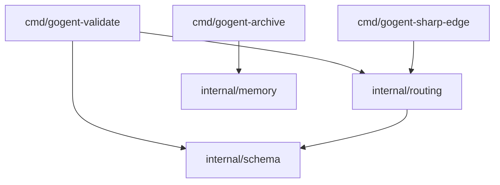
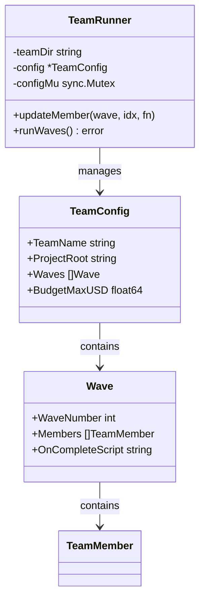
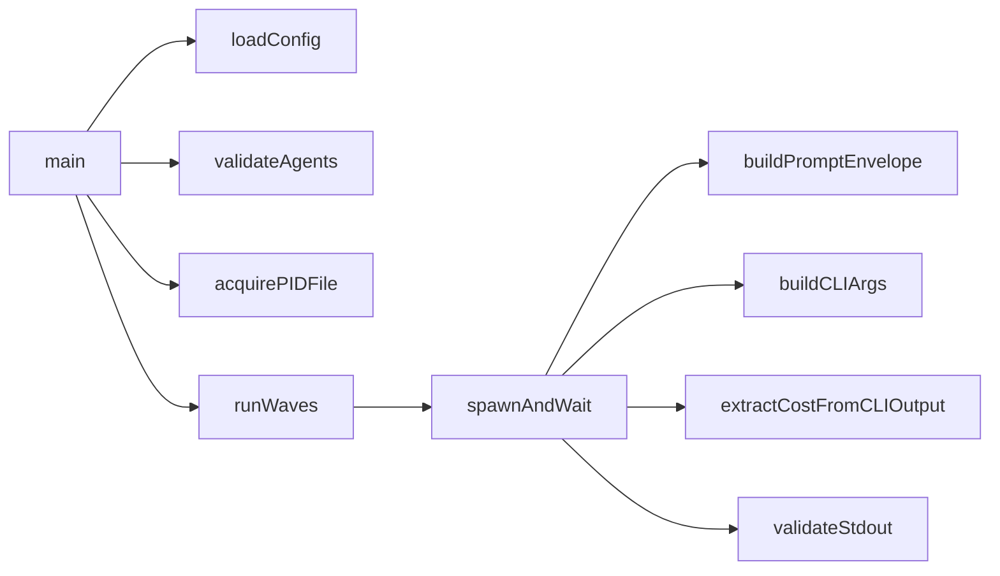

# Codebase Map: Implementation Plan

> **Feature**: `/codebase-map` - Language-agnostic codebase mapping with structured JSON and Mermaid architecture diagrams
> **Author**: Router + User collaborative design session
> **Date**: 2026-02-08
> **Status**: Draft (revised per staff-architect critical review 2026-02-08)

---

## 1. Executive Summary

`/codebase-map` is a new skill that produces structured, machine-readable maps of any codebase and synthesizes them into human-readable architecture documentation with Mermaid diagrams. It solves two problems:

1. **Initial onboarding**: Map a repo for the first time so agents (and humans) understand the structure
2. **Ongoing maintenance**: Incrementally update the map as the repo grows, keeping documentation in sync with code

The system uses a three-stage pipeline:
- **Stage 1**: A Go binary (`gogent-codebase-extract`) uses tree-sitter for deterministic, language-agnostic symbol extraction
- **Stage 2**: A Sonnet-tier LLM enriches the raw extraction with semantic information (descriptions, classifications, architectural roles)
- **Stage 3**: The same LLM synthesizes dependency graphs, module boundaries, and Mermaid diagrams into an `ARCHITECTURE.md`

The skill runs as a **fork skill** - isolated from the main conversation, producing file artifacts that persist across sessions.

---

## 2. Architecture Overview

### 2.1 Pipeline

```
┌─────────────────────────────────┐
│  /codebase-map (fork skill)     │
│  agent: general-purpose         │
│  model: sonnet                  │
│                                 │
│  ┌───────────────────────────┐  │
│  │ Stage 1: EXTRACT          │  │
│  │ gogent-codebase-extract   │  │
│  │ (Go binary + tree-sitter) │  │
│  │ Deterministic, fast       │  │
│  │ Output: raw JSON          │  │
│  └─────────┬─────────────────┘  │
│            │                    │
│  ┌─────────▼─────────────────┐  │
│  │ Stage 2: ENRICH           │  │
│  │ LLM reads raw JSON        │  │
│  │ Adds: descriptions,       │  │
│  │   module_identity,        │  │
│  │   complexity, roles       │  │
│  │ Output: enriched JSON     │  │
│  └─────────┬─────────────────┘  │
│            │                    │
│  ┌─────────▼─────────────────┐  │
│  │ Stage 3: SYNTHESIZE       │  │
│  │ LLM reads all modules     │  │
│  │ Generates: Mermaid graphs │  │
│  │   dependency trees,       │  │
│  │   ARCHITECTURE.md         │  │
│  └───────────────────────────┘  │
└─────────────────────────────────┘
```

### 2.2 Component Table

| Component | Type | Language | Tier | Purpose |
|-----------|------|----------|------|---------|
| `gogent-codebase-extract` | Go binary | Go | N/A (deterministic) | Tree-sitter symbol extraction |
| `/codebase-map` | Fork skill | YAML + prompt | Sonnet | Pipeline orchestration |
| `.claude/codebase-map/*.json` | Data | JSON | N/A | Structured codebase map (agent-accessible) |
| `docs/codebase-architecture/{repo}/ARCHITECTURE.md` | Documentation | Markdown + Mermaid | N/A | Human-readable architecture (committed) |
| `docs/codebase-architecture/{repo}/diagrams/*.mmd` | Diagrams | Mermaid | N/A | Standalone diagram files |

### 2.3 Data Flow

```
Source Code (.go, .py, .ts, .R)
    │
    ▼ (tree-sitter parsing)
.claude/codebase-map/extract/{module}.json     ← Raw extraction (deterministic)
    │
    ▼ (LLM enrichment)
.claude/codebase-map/{module}.json             ← Enriched map (agent-consumable)
    │
    ▼ (LLM synthesis)
docs/codebase-architecture/{repo}/
    ├── ARCHITECTURE.md                         ← Human-readable overview
    ├── diagrams/
    │   ├── module-dependencies.mmd             ← Module dependency graph
    │   ├── {module}-classes.mmd                ← Type/class diagram per module
    │   └── {module}-callgraph.mmd              ← Call graph per module
    └── manifest.json                           ← Tracking metadata
```

---

## 3. Key Design Decisions

### 3.1 Tree-sitter for Language-Agnostic Extraction

**Decision**: Use tree-sitter via Go bindings for all symbol extraction.

**Rationale**: Tree-sitter provides a single binary that parses 100+ languages with the same API. This avoids building language-specific parsers (`go/ast`, Python `ast`, etc.) and ensures consistent output across all languages.

**Trade-off**: Tree-sitter queries are less precise than native AST libraries (e.g., `go/types` can resolve types that tree-sitter cannot). Accepted because precision is added in Stage 2 (LLM enrichment).

### 3.2 Fork Skill for Orchestration

**Decision**: `/codebase-map` runs as a fork skill with `context: fork` and `agent: general-purpose`.

**Rationale**:
- Self-contained pipeline that doesn't need conversation history
- Produces file artifacts, not conversational answers
- Potentially long-running (1+ minutes for large repos)
- Re-runnable anytime without setup

**Trade-off**: Loses multi-tier cost optimization (haiku for mapping, sonnet for synthesis both run at sonnet). Accepted because the Go binary does 90% of extraction work deterministically - LLM cost is modest.

### 3.3 Structured JSON Intermediate Format

**Decision**: Raw extraction and enriched maps stored as structured JSON in `.claude/codebase-map/`.

**Rationale**: Agents can read and use these files programmatically. When `go-pro` gets a task touching `internal/routing`, the relevant module map can be injected into context automatically.

### 3.4 Mermaid as Machine-Readable Diagram Standard

**Decision**: All diagrams output as Mermaid syntax (`.mmd` files embedded in ARCHITECTURE.md).

**Rationale**: Mermaid is renderable by GitHub, VS Code, Obsidian, and many other tools. It's text-based (diffable, committable) and supports class diagrams, flowcharts, and ER diagrams - all needed for architecture visualization. (Note: `beautiful-mermaid` at github.com/lukilabs/beautiful-mermaid is referenced as informational context for Mermaid rendering — it is NOT a dependency. Output is `.mmd` text files; rendering tools are optional consumer-side.)

### 3.5 Incremental by Default

**Decision**: Track file timestamps in `manifest.json`. On re-run, only re-extract files where `mtime > last_mapped_at`.

**Rationale**: Full repo mapping is expensive (tree-sitter parsing + LLM enrichment). Incremental updates make the tool practical for ongoing use.

---

## 4. Ticket Dependency Graph

```
Phase 0: Design & Evaluation
CM-001 (tree-sitter eval + CGo assessment)  ─────────┐
CM-002 (extraction schema)  ─────────────────────────┤
CM-003 (enrichment + output schemas)  ◄── CM-002     │
CM-004 (storage + incremental design)  ──────────────┤
                                                     │
Phase 1: Go Binary                                   │
CM-005a (CLI scaffolding + discovery)  ◄── CM-001, CM-002
CM-005b (tree-sitter + Go extraction)  ◄── CM-005a   │
CM-005c (output + manifest + tests)    ◄── CM-005b   │
CM-006a (TypeScript grammar)  ◄── CM-005c            │
CM-007 (call graph extraction)  ◄── CM-005c, CM-006a │
CM-008 (unit + integration tests)  ◄── CM-005c, CM-006a, CM-007
                                                     │
Phase 2: Skill & Agent                               │
CM-009 (fork skill)  ◄── CM-005c, CM-003             │
CM-010 (slash command + routing)  ◄── CM-009         │
CM-013 (smoke test on real repos)  ◄── CM-009        │
                                                     │
Phase 3: Incremental & Context                       │
CM-011 (incremental mapping)  ◄── CM-005c, CM-004   │
CM-012 (agent context injection)  ◄── CM-009         │
                                                     │
Phase 4: Multi-Language Expansion (deferred)         │
CM-006b (Python + R grammars)  ◄── CM-006a
```

**Key dependency changes from review:**
- CM-003 now depends on CM-002 (schema extension requires base schema)
- CM-005 split into CM-005a → CM-005b → CM-005c (review finding CR1)
- CM-006 split: CM-006a (TypeScript, Phase 1) + CM-006b (Python/R, Phase 4)
- CM-007 depends on CM-006a for non-Go call queries
- CM-012 depends on CM-009 (not CM-010 — reads enriched JSON directly)
- CM-013 added for manual smoke testing (review finding CR3)

---

## 5. Ticket List by Phase

### Phase 0: Design & Evaluation

#### CM-001: Evaluate Tree-sitter Go Bindings and Select Library

**Priority**: HIGH
**Blocked By**: none
**Effort**: 1 day

Evaluate `github.com/smacker/go-tree-sitter` vs `github.com/tree-sitter/go-tree-sitter`. Build proof-of-concept extracting Go function signatures from a test file. Select library based on API ergonomics, grammar availability, and maintenance status.

---

#### CM-002: Design Extraction JSON Schema

**Priority**: HIGH
**Blocked By**: none
**Effort**: 0.5 days

Define the raw output format of `gogent-codebase-extract`. Per-file JSON with symbol array. Fields: name, kind (function/method/type/interface/const/var), signature, params, returns, line range, exported, file path. Import graph. No semantic enrichment.

---

#### CM-003: Design Enrichment Schema, Mermaid Templates, and ARCHITECTURE.md Structure

**Priority**: HIGH
**Blocked By**: CM-002 (extraction schema must be finalized first)
**Effort**: 1 day

Extend extraction schema with LLM-generated fields: description, module_identity, complexity, is_entrypoint, architectural_role. Design Mermaid diagram templates for module dependencies (flowchart), type relationships (classDiagram), and call graphs (flowchart). Define ARCHITECTURE.md structure.

---

#### CM-004: Design Storage Layout and Incremental Strategy

**Priority**: MEDIUM
**Blocked By**: none
**Effort**: 0.5 days

Define `.claude/codebase-map/` directory layout, manifest.json schema for tracking file timestamps, and incremental update strategy using git-aware diffing.

---

### Phase 1: Go Binary Implementation

#### CM-005: Implement `gogent-codebase-extract` Core Binary + Go Language Support

**Priority**: CRITICAL
**Blocked By**: CM-001, CM-002
**Effort**: 5-7 days (revised from 3-5; includes CGo integration time if selected)

> **SPLIT** into CM-005a (scaffolding, 1d) → CM-005b (tree-sitter, 2-3d) → CM-005c (output/tests, 1d)

Main deliverable. Implement the Go binary with tree-sitter integration, file discovery, Go grammar support, and structured JSON output. This is the foundation all other tickets build on.

---

#### CM-006a: Add TypeScript Grammar Support (v1)

**Priority**: HIGH
**Blocked By**: CM-005c
**Effort**: 0.5-1 day

Add tree-sitter query patterns for TypeScript. Queries for functions, classes/types, methods, imports. Output matches extraction JSON schema. TypeScript is v1 scope alongside Go (primary use case for GOgent-Fortress).

#### CM-006b: Add Python and R Grammar Support (Phase 4, deferred)

**Priority**: MEDIUM
**Blocked By**: CM-006a
**Effort**: 1-1.5 days

Add tree-sitter query patterns for Python and R. Deferred to Phase 4 — uncertain benefit for GOgent-Fortress which is primarily Go + TypeScript.

---

#### CM-007: Implement Cross-Reference / Call Graph Extraction

**Priority**: HIGH
**Blocked By**: CM-005c, CM-006a (for non-Go call queries)
**Effort**: 1-2 days

Add call site detection via tree-sitter queries. Build `calls` and `called_by` fields per symbol. Resolve imports to connect cross-file references using per-module scoped symbol table (not global short-name indexing). This enables dependency graph generation in Stage 3.

---

#### CM-008: Unit Tests + Integration Tests for Extractor Binary

**Priority**: HIGH
**Blocked By**: CM-005c, CM-006a, CM-007
**Effort**: 1-2 days

Table-driven tests with known source files and expected extraction output. Per-language test fixtures. Edge cases: empty files, syntax errors, generated code, very large files. Includes three-stage pipeline integration test on fixture repo (5 files, 2 modules) and parse error reporting tests.

---

### Phase 2: Skill & Agent Integration

#### CM-009: Create `/codebase-map` Fork Skill

**Priority**: CRITICAL
**Blocked By**: CM-005c, CM-003
**Effort**: 2-3 days

Write the fork skill YAML and prompt. First step: validate `context: fork` with trivial test skill. Then orchestrate the full pipeline: run Go binary, read raw JSON, enrich with descriptions/classifications (with chunking for large modules — max 50 symbols per call), synthesize dependency graphs, generate Mermaid diagrams, write ARCHITECTURE.md. Support `$ARGUMENTS` for scope.

#### CM-013: Manual Smoke Test on Real Repos

**Priority**: HIGH
**Blocked By**: CM-009
**Effort**: 0.5 days

End-to-end manual validation on GOgent-Fortress and 1-2 other repos. Verifies extraction accuracy, enrichment quality, Mermaid rendering, and incremental mode.

---

#### CM-010: Register Agent in agents-index.json

**Priority**: MEDIUM
**Blocked By**: CM-009
**Effort**: 0.5 days

Add `codebase-mapper` to agents-index.json with triggers, tools, tier. Update CLAUDE.md dispatch table with new triggers.

---

### Phase 3: Incremental & Context Integration

#### CM-011: Git-Aware Incremental Mapping

**Priority**: MEDIUM
**Blocked By**: CM-005, CM-004
**Effort**: 1-2 days

Implement `manifest.json` tracking, `git diff --name-only` integration, partial re-extraction of changed files, merge strategy for updated modules.

---

#### CM-012: Agent Context Injection for Module Maps

**Priority**: LOW
**Blocked By**: CM-009 (reads enriched JSON directly, not via agent registration)
**Effort**: 1 day

When dispatching agents (e.g., `go-pro` for work on `internal/routing`), auto-inject the relevant module map from `.claude/codebase-map/enriched/` into agent context. Gated behind `GOGENT_CODEBASE_MAP_INJECT=1` feature flag (default OFF). Design the injection mechanism (convention-based).

---

## 6. Risk Register

| # | Risk | Likelihood | Impact | Mitigation | Ticket |
|---|------|-----------|--------|------------|--------|
| R-1 | Tree-sitter Go bindings are unmaintained or buggy | LOW | CRITICAL | CM-001 evaluates both libraries with PoC before committing | CM-001 |
| R-2 | Tree-sitter queries miss language-specific constructs | MEDIUM | MEDIUM | LLM enrichment (Stage 2) fills gaps; refine queries iteratively | CM-006 |
| R-3 | Call graph extraction inaccurate for dynamic languages | HIGH | MEDIUM | Accept best-effort for Python/R; document limitations | CM-007 |
| R-4 | Full repo map too slow for large repos (>10K files) | MEDIUM | HIGH | File filtering (.gitignore, vendor exclusion), parallelism in Go binary | CM-005 |
| R-5 | LLM enrichment produces inconsistent classifications | MEDIUM | LOW | Provide clear taxonomy in prompt; validate against schema | CM-009 |
| R-6 | Mermaid diagrams too large for big repos | HIGH | MEDIUM | Scope diagrams per module; aggregate view shows modules only, not symbols | CM-003 |
| R-7 | Fork skill context window exceeded for large repos | MEDIUM | HIGH | Chunk enrichment per module; synthesize incrementally | CM-009 |
| R-8 | R tree-sitter grammar is immature | MEDIUM | LOW | R is lowest-priority language; degrade gracefully | CM-006 |
| R-9 | Incremental merge corrupts existing enrichments | LOW | HIGH | Backup before merge; atomic write pattern | CM-011 |
| R-10 | Agent context injection adds too many tokens | MEDIUM | MEDIUM | Only inject summary, not full map; cap at 2K tokens per module | CM-012 |
| R-11 | Single binary with embedded CGo grammars → slow builds, large binary | MEDIUM | LOW | Accept for MVP. Evaluate WASM grammar loading as post-MVP option. | CM-005 |
| R-12 | `context: fork` may not be valid Claude Code feature | LOW | CRITICAL | CM-009 Step 0 validates with trivial test skill before building pipeline. | CM-009 |
| R-13 | LLM enrichment context overflow on large modules (200+ symbols) | MEDIUM | HIGH | Chunking strategy: max 50 symbols per call, 8K token budget. Sub-batch + merge. | CM-009 |

---

## 7. Timeline

| Phase | Tickets | Effort | Key Deliverable |
|-------|---------|--------|-----------------|
| 0 | CM-001, CM-002, CM-003, CM-004 | 3 days | All schemas finalized, library selected, CGo assessed |
| 1 | CM-005a/b/c, CM-006a, CM-007, CM-008 | 8-14 days | Working Go binary with Go + TypeScript support |
| 2 | CM-009, CM-010, CM-013 | 3-4 days | Working `/codebase-map` skill, smoke tested |
| 3 | CM-011, CM-012 | 2-3 days | Incremental updates + agent integration (behind feature flag) |
| 4 (deferred) | CM-006b | 1-1.5 days | Python + R language support |
| **Total (v1)** | **15 tickets** | **16-24 days** | **Go + TypeScript mapping, incremental, context injection** |

**Critical path**: CM-001 → CM-005a → CM-005b → CM-005c → CM-009 → CM-013

**Parallelizable work**:
- CM-006a, CM-007 can run in parallel after CM-005c
- CM-011 can start after CM-005c (doesn't need CM-009)
- CM-002, CM-004 can run in parallel in Phase 0 (CM-003 depends on CM-002)
- CM-013 can overlap with CM-010

---

## 8. Open Questions

1. **Tree-sitter query coverage**: How complete are tree-sitter queries for R? The `tree-sitter-r` grammar may lack query patterns for S4 classes and R6 methods. Need CM-001 to investigate.

2. **Maximum repo size**: What's the practical limit? 10K files? 50K? Need benchmarking in CM-005 to establish performance envelope.

3. **Diagram scoping**: For a repo with 50 modules, the module-dependency flowchart could be huge. Should we auto-cluster? Use Mermaid subgraphs? Need to decide in CM-003.

4. **beautiful-mermaid integration**: The library (github.com/lukilabs/beautiful-mermaid) renders Mermaid to SVG/ASCII. Should the skill also generate rendered output, or leave that to the user? Recommend: output `.mmd` files only; rendering is a separate concern.

5. **Vendor/generated code exclusion**: Need clear rules for what to skip. Default: respect `.gitignore`, skip `vendor/`, `node_modules/`, `__pycache__/`, files with `// Code generated` header.

6. **Multi-repo support**: The storage path is `docs/codebase-architecture/{repo_name}/`. How do we determine `repo_name`? Suggest: basename of git remote origin, or directory name as fallback.

7. **LLM enrichment cost**: For a repo with 30 modules, Stage 2 means ~30-50 LLM calls at Sonnet pricing ($0.50-$1.00). For 100 modules, cost could reach $2-$5. See CM-009 cost estimation table. Use `--no-enrich` for cost-free extraction only.

---

## Appendix A: Mermaid Diagram Types

| Diagram Type | Mermaid Syntax | Use Case |
|-------------|---------------|----------|
| Module dependencies | `graph TD` (flowchart) | Which modules depend on which |
| Type relationships | `classDiagram` | Struct fields, interface implementations, inheritance |
| Call graph | `graph LR` (flowchart) | Function call chains within a module |
| Import graph | `graph TD` (flowchart) | Package/module import relationships |

### Example: Module Dependency Graph



### Example: Type Relationship Diagram



### Example: Call Graph


